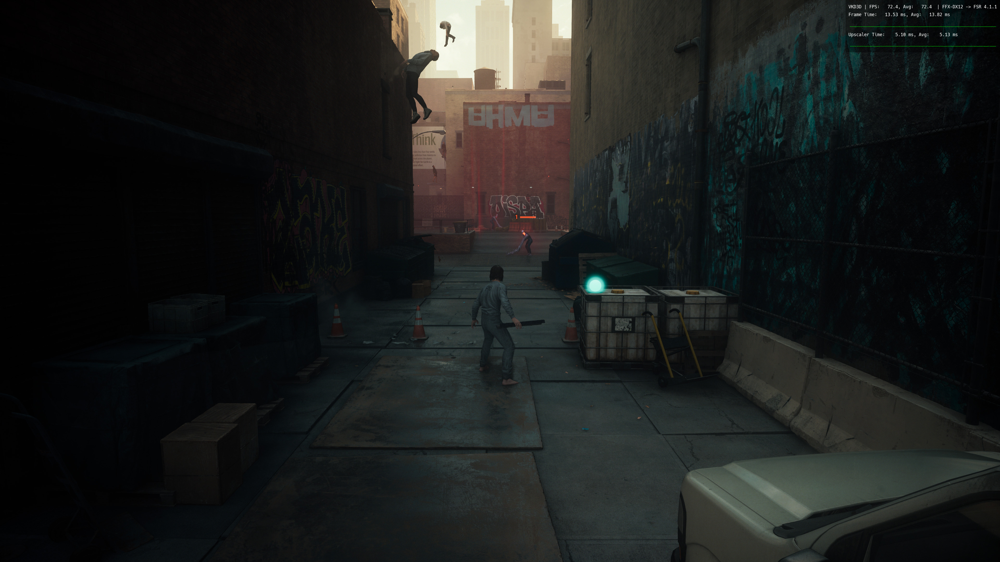
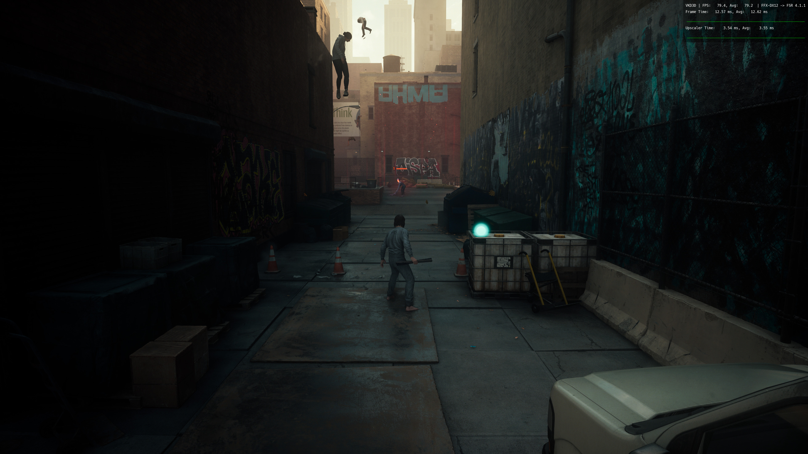

# fsr4-shader-performance-overrides

Makes AMD FSR 4.1.1 upscaling about 25 to 30% cheaper on Radeon RX 7000 graphics cards, on Linux
and Windows, by replacing two of FSR 4's compute shaders with faster ones. **The image is
unchanged, byte for byte.** Nothing in the game or in OptiScaler is modified.

## What's new: 2026-10-05, 10:16 EDT ([release `dll-2026-10-05`](https://github.com/zgauthier2000/fsr4-shader-performance-overrides/releases/tag/dll-2026-10-05))

- **A test build for RDNA2 and the Steam Deck: `test-rdna2-compact.zip`.** It is the RDNA2 build
  with a much smaller model pass 11 (4.7 KB of code on those chips instead of 21.4 KB), the same
  one the integrated-GPU build uses. The Steam Deck is both RDNA2 and integrated, so this is the
  build to try there, and it is untested on a Deck so far: please compare it with `test-rdna2.zip`
  and report the upscaler time of each. On a desktop RX 6750 XT it is 2% slower than
  `test-rdna2.zip` (2.14 ms against 2.10 ms at 1440p), so desktop RX 6000 cards should keep using
  `test-rdna2.zip`. [Details](docs/gpu-support.md#test-build-rdna2-with-the-compact-pass-11-2026-10-05).
- **The DLLs now say what they are.** OptiScaler shows `4.1.1-cyboman-r3` (RX 7000),
  `-ig` (integrated), `-r2` (RX 6000) or `-r2c` (the new test build) instead of `4.1.1`, so you can
  see that the patched DLL is the one loaded. All of them have AMD's GPU check lifted; none is for
  RX 9000 cards.
- **Results from testers on RX 6000 cards** (ten reports, five cards). The gain follows the output
  size: about 30% less upscaler time at 4K (RX 6900 XT: 3.79 ms to 2.57 ms in Ready or Not, 3.79 ms
  to 2.70 ms in Final Fantasy VII Rebirth), 19% at 3440x1440, and 1 to 11% at 1440p and 1080p.
  Radeon 780M with the integrated-GPU build: 5.15 ms to 5.04 ms.
  [All reports](docs/gpu-support.md#rdna2-needs-one-more-change-the-dot-products).
- **Linux: the prebuilt files do not fit every setup.** On one RX 6900 XT they give a darker image,
  while files built from that user's own shader dump are correct. `./check_prebuilt.sh` now tells
  you whether they fit yours, and [Making a shader dump](docs/shader-dump.md) walks through it. On
  RDNA2 the DLL is the simpler route and just as fast.
- **New research:** a [motion test](research/pruning#motion-test) that measures shimmer, and a
  measured look at a [community shader set](research/community-lossy-set) that trades image
  quality for more speed.

The main DLL for RX 7000 cards and the Linux files are unchanged since 2026-10-04.

## RDNA2 (RX 6000): shimmering in motion fixed (2026-10-04, 15:43 EDT)

FSR 4.1.1's INT8 model can be made to run on RDNA2, but there it shimmers in motion. A test build
from this repository fixes that: **`test-rdna2.zip`** in the [release `dll-2026-10-05`](https://github.com/zgauthier2000/fsr4-shader-performance-overrides/releases/tag/dll-2026-10-05)
(Windows DLL).

- **The cause is one instruction form in the postpass.** AMD's postpass adds each int8 dot
  product onto a running total inside the instruction. RDNA2's driver gets that form wrong. The
  build computes each product alone and adds it afterwards (960 places per shader). The number is
  the same, so on RDNA3 the image is still byte-for-byte AMD's.
- **Where the idea comes from:** the [fsr4xyz](https://github.com/the3rdparty1917/fsr4xyz)
  project's 4.1.1b DLL, which found this fix. The build here is an independent implementation of
  it on top of this repository's faster postpass and pass 11, in all 54 shader versions.
- **What else is in it:** AMD's GPU check is lifted (AMD's DLL offers this model only on desktop
  RDNA3).
- **What did not work:** keeping the postpass's history weight at 0.8 or more, a change that was
  suggested against the shimmering. It looks bad in motion, and its test
  builds have been removed from the release.

Speed reports from testers on five RX 6000 cards: about 30% less upscaler time at 4K output
(RX 6900 XT, 3.79 ms down to 2.57 and 2.70 ms in two games), 19% at 3440x1440, and 1 to 11% at
1440p and 1080p. Details:
[GPU support](docs/gpu-support.md#rdna2-needs-one-more-change-the-dot-products).

## What's new: 2026-10-04, 14:55 EDT (commit `9298321`)

Three changes today. The image is still byte-for-byte the same.

- **Every version of the two shaders is now covered, on Linux and Windows** (the DLL and add-on
  at 14:44 EDT, commit `c5bb214`; the Linux files at 14:55 EDT, commit `9298321`). AMD's DLL contains 48 versions of the postpass and 6 of pass 11, and which one
  a game uses depends on its output size, preset, exposure and colour-space setup. Until now only
  the 10 most common were replaced, so some games got no speedup. All 54 are replaced now, checked
  in all 48 combinations that select a different one. See [shader variants](docs/variants.md).
- **Model pass 11 writes its output in whole rows** (11:41 EDT, commit `ef57cf2`). It used to
  store one word at a time, the same sparse pattern that made AMD's postpass slow.
- **The postpass writes its images in solid 8x8 blocks** (12:58 EDT, commit `18e3ddd`) instead of
  two rows of 32 pixels at a time, which reads a little less again.

Together with the "phased" postpass from 2026-10-03, FSR 4 now reads about 31% less memory per
frame than with AMD's shaders.

<picture>
  <source media="(prefers-color-scheme: dark)" srcset="docs/img/memory-traffic-dark.svg">
  
</picture>

| Memory read per frame at 4K | AMD's shaders | This release |
|---|---|---|
| Postpass | 2,295 MB | 732 MB (792 MB before today) |
| Model pass 11 | 1,018 MB | 234 MB (739 MB before today) |
| Prepass | 1,712 MB | 1,712 MB |
| Other 11 model passes | 2,643 MB | 2,643 MB |
| **All passes** | **7,668 MB** | **5,321 MB (−31%)** |

- **Frame rate on an RX 7800 XT is the same as with the 2026-10-03 version** (108 FPS and about
  3.1 ms of upscaler time in Shadow of the Tomb Raider's benchmark, with or without today's
  changes): on that card this memory traffic was not what limited the passes. The changes are
  never slower, and they may help GPUs with less memory bandwidth, where they have not been
  measured yet.
- **To get it:** download the files again, or run `build_override.sh` again if you built your own.
  The patched DLL is in the [release `dll-2026-10-05`](https://github.com/zgauthier2000/fsr4-shader-performance-overrides/releases/tag/dll-2026-10-05).
- **Integrated GPUs:** still not recommended, but there is an experimental build to test; see
  [GPU support](docs/gpu-support.md#integrated-gpus-radeon-780m-and-similar).
- The figures are read requests between the GPU's cache and memory, counted in a standalone
  benchmark of each pass; each one includes about 200 MB that belongs to the measurement itself.
  Details: [research](research/postpass-and-prepass#memory-traffic-of-every-pass-and-pass-11s-stores).
  Earlier change: [the phased postpass](results/phased-postpass), 2026-10-03.

## What to expect

At 4K, FSR 4's upscaling time drops by **25 to 30%**, about 1 ms less GPU time per frame. When the
GPU is the limit, that is:

| Your frame rate at 4K | Gain |
|---|---|
| around 60 FPS | up to about +6% |
| around 100 FPS | up to about +11% |
| around 120 FPS | up to about +14% |

At 1440p output the upscaling time drops by 12 to 17% (0.2 to 0.3 ms per frame, measured with the
first version), a few percent of frame rate. If the CPU is the limit,
the frame rate does not change.

Measured on a Radeon RX 7800 XT, 4K output, FSR 4.1.1 Balanced:

| Game | FSR 4 time per frame | Frame rate |
|---|---|---|
| Rise of the Tomb Raider (built-in benchmark) | 4.30 → 3.02 ms (−30%) | 97.6 → 108.6 FPS (+11%) |
| Shadow of the Tomb Raider (built-in benchmark) | 4.16 → 3.12 ms (−25%) | 97 → 108 FPS (+11%) |

More games, 1440p and screenshots: [all results](docs/results.md).

### Where FSR 4's time goes now

Shadow of the Tomb Raider, 4K, Balanced, RX 7800 XT: **3.09 ms in total, down from 4.16 ms.**

| Part of FSR 4 | Time | Share | Room left |
|---|---|---|---|
| Model passes (12) | 1.86 ms | 60% | none found |
| Postpass (rewritten) | 0.63 ms | 20% | 0.05 ms at most |
| Prepass | 0.44 ms | 14% | a few hundredths of a millisecond |
| OptiScaler and dispatch overhead | 0.12 ms | 4% | outside the shaders |
| Two small shaders and gaps between passes | 0.04 ms | 1% | |

How this was measured, and everything that was tried on each part:
[How it works](docs/how-it-works.md).

## Will it work for me?

| GPU | Linux (Proton) | Windows |
|---|---|---|
| RX 7900, 7800, 7700, 7600 (desktop RDNA3) | yes, measured on an RX 7800 XT | yes, testers report large gains |
| Radeon 780M, 890M and other RDNA3 integrated GPUs | not the normal build (pass 11 is reported much slower there) | experimental `test-igpu.zip`: one report, 2% faster than fsr4xyz's `4.1.1b` on a 780M |
| RX 6000 (RDNA2) | experimental; check with `check_prebuilt.sh` first: the prebuilt files give one tester a wrong image in one game | experimental: `test-rdna2.zip` runs and fixes the shimmering; reported about 30% faster at 4K, 1 to 11% at 1440p and below |
| RX 9000 (RDNA4) | no: it runs a different FSR 4 ([open for someone to pick up](docs/rdna4.md)) | no, and do not install the DLL there |

You also need:

- a DirectX 12 game;
- FSR 4.1.1 with the INT8 model already running in it, for example through
  [OptiScaler](https://github.com/optiscaler/OptiScaler), with
  `amd_fidelityfx_upscaler_dx12.dll` version 4.1.1.2740.

Details for integrated GPUs and RDNA2: [GPU support](docs/gpu-support.md).

## Install

**On Linux, use the launch option, not the DLL.** It is the faster of the two: the rewritten
postpass takes 0.60 ms at 4K with the launch option against 0.67 ms with the patched DLL, because
Proton translates the DLL's shaders into slightly slower code.

### Linux: one launch option (recommended on Linux)

1. Download or clone this repository.
2. In Steam, add this to the game's launch options (keep anything already there in front of
   `%command%`):

   ```
   VKD3D_SHADER_OVERRIDE='Z:/path/to/fsr4-shader-performance-overrides/prebuilt' %command%
   ```

   `Z:` is how Proton sees your Linux root, so `Z:/home/you/...` is `/home/you/...`.

**The game must be using AMD's original DLL.** The launch option does nothing with the patched DLL
from this repository (or any other modified one) installed, because the files are matched to AMD's
shaders. If you installed the patched DLL earlier, put `amd_fidelityfx_upscaler_dx12.dll.orig` back
first. OptiScaler then shows FSR as plain `4.1.1`; the launch option does not change the name, so
the upscaler time is how you tell it applied.

**The prebuilt files do not fit every setup.** They were made and checked on an RX 7000 desktop
card. On one tester's setup (an RX 6900 XT) Proton lays the same shaders out differently, and the
prebuilt files give a darker picture there. Whenever the image looks off, build your own files:
[Linux guide](docs/linux.md#building-your-own). `./check_prebuilt.sh <dump folder>` tells you whether
the prebuilt files fit.

This covers every output size, preset and way a game can set FSR 4.1.1 up. If it does not get
faster: [Linux guide](docs/linux.md).

### Windows: replace one DLL

This also works under Proton, but on Linux the launch option above is faster.

1. Download `amd_fidelityfx_upscaler_dx12.dll` from the
   [release](https://github.com/zgauthier2000/fsr4-shader-performance-overrides/releases/tag/dll-2026-10-05).
2. In the game folder, rename the existing `amd_fidelityfx_upscaler_dx12.dll` (often next to
   OptiScaler) to `amd_fidelityfx_upscaler_dx12.dll.orig`. It must be version 4.1.1.2740.
3. Put the downloaded DLL in its place.

OptiScaler then lists FSR as **`4.1.1-cyboman-r3`** instead of `4.1.1`, which shows that the
patched DLL is the one in use. The test builds for other GPUs carry their own names:

| Build | Name shown | For |
|---|---|---|
| `amd_fidelityfx_upscaler_dx12.dll` | `4.1.1-cyboman-r3` | desktop RDNA3 (RX 7000) |
| `test-igpu.zip` | `4.1.1-cyboman-ig` | RDNA3 integrated GPUs (experimental) |
| `test-rdna2.zip` | `4.1.1-cyboman-r2` | RDNA2 (RX 6000) |
| `test-rdna2-compact.zip` | `4.1.1-cyboman-r2c` | RDNA2 and Steam Deck, test build with a smaller pass 11 ([details](docs/gpu-support.md#test-build-rdna2-with-the-compact-pass-11-2026-10-05)) |

All of them have AMD's GPU check lifted (AMD's DLL offers this FSR 4 model only on desktop RDNA3), so
each starts on any GPU. **Do not use them on RX 9000 (RDNA4) cards:** those run a different FSR 4
model, and with the check lifted both models report support.

It is AMD's DLL with the two shaders swapped and the name changed. Details, and how to build it yourself:
[`dll/`](dll). There is also a ReShade add-on that does the same without touching the DLL:
[`windows/`](windows).

### Check that it worked

Open OptiScaler's overlay and compare the upscaler time with and without the change, standing at
the same spot. **In some games that number is only reliable with the frame rate uncapped.** At 4K
it should drop by roughly 1 ms.

With the patched DLL, also check that the FSR version shown is `4.1.1-cyboman-r3`; if it still
says `4.1.1`, the game is loading AMD's DLL from somewhere else.

If nothing changes, check that the game really runs FSR 4.1.1 with AMD's DLL version 4.1.1.2740;
other versions have different shaders. See [shader variants](docs/variants.md).

### Undo

Remove the launch option, or put the original DLL back.

## Good to know

- **Nothing else changes.** No game files are edited, and the output was compared byte for byte
  with AMD's at 4K, 1440p and 1080p.
- **Game and OptiScaler updates** can put the original DLL back; the launch option keeps working.
- **Online games:** this changes the shaders the game renders with. Use your own judgement in
  games with anti-cheat.
- **Linux:** do not set `RADV_PERFTEST=cswave32` for a game that runs FSR 4; it adds about 1.1 ms.

## More

| Page | What is in it |
|---|---|
| [All results](docs/results.md) | every game measured, benchmark pages with screenshots |
| [Linux guide](docs/linux.md) | requirements, building your own files, troubleshooting |
| [Making a shader dump](docs/shader-dump.md) | step by step, for reporting a wrong image or a missing speedup on Linux |
| [GPU support](docs/gpu-support.md) | Windows, integrated GPUs, the RDNA2 build and its shimmering fix |
| [Shader variants](docs/variants.md) | which versions of FSR 4's shaders are covered, and what to do if your game's is not |
| [How it works](docs/how-it-works.md) | what the two rewrites do, where the time goes, what else was tried |
| [RDNA4](docs/rdna4.md) | what is known about the FP8 model on RX 9000 cards; open for anyone who can test on one |
| [Research](research) | the probes, data and scripts behind all of it |

## Example images

Before



After



## Credits and licence

The postpass rewrite is adapted from `tools/fsr4cap/postpass_lds.py` in
[bbport](https://github.com/deadinside28/bloodborne_pc), a native Linux port of Bloodborne whose
author found the slow store pattern and wrote the original rewrite for that project's own FSR 4.1.1
runtime. This repository ports it to the shaders vkd3d-proton generates, so it works in ordinary
games.

The scripts are licensed under the GNU GPL v2 or later, like the project they derive from. See
[LICENSE](LICENSE). The prebuilt shaders are modified versions of AMD's, distributed under the same
licence together with AMD's notice; see [`prebuilt/NOTICE.md`](prebuilt/NOTICE.md). Not affiliated
with or endorsed by AMD.
