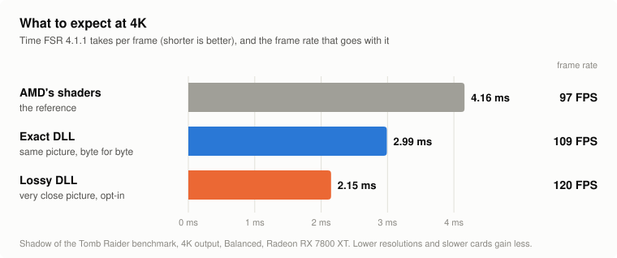
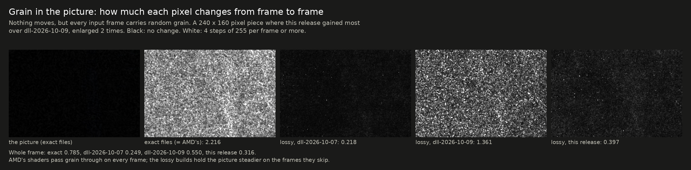

# fsr4-shader-performance-overrides

Makes AMD FSR 4.1.1 upscaling faster on Radeon graphics cards, on Windows and Linux, by replacing
FSR 4's slowest shaders with faster ones. One file to swap, nothing else in the game changes.

## Quick start

> [!WARNING]
> **Never use this in online games or in any game with anti-cheat.** These are modified game files. Anti-cheat
> software can treat a changed DLL or changed shaders as tampering, and that can get an account banned. Use it in
> single-player games only.

**1. Download the zip for your graphics card.**

| Your graphics card | Download |
|---|---|
| A Radeon **RX 7000 or RX 6000** graphics card: the name has "RX" and a four-digit number, such as RX 7800 XT or RX 6700 XT. This includes gaming laptops with their own RX chip (RX 7700S, RX 6700M and the like) | **[fsr4.1.1-cyboman.zip](https://github.com/zgauthier2000/fsr4-shader-performance-overrides/releases/latest/download/fsr4.1.1-cyboman.zip)** |
| **Graphics built into the processor:** most laptops, mini PCs and handhelds. The name is "Radeon Graphics" or "Radeon" with a three-digit number, such as Radeon 780M or 890M; also the Steam Deck | **[fsr4.1.1-igpu-cyboman.zip](https://github.com/zgauthier2000/fsr4-shader-performance-overrides/releases/latest/download/fsr4.1.1-igpu-cyboman.zip)** |
| Radeon RX 9000 | not for these cards: they run a different FSR 4. Do not install it there. |

Not sure which you have? In Windows, open Task Manager, go to Performance and look at the GPU's name; on a
laptop with two, the RX one is the one games use.

**2. Choose a version.** Each zip holds two folders with one file each:

| Folder | Speed | Picture |
|---|---|---|
| `exact` | faster than AMD's | **the same as AMD's, byte for byte** |
| `lossy` | faster again | very close to AMD's, but not the same. Read `WARNING.txt` in that folder first |

If you are not sure, take `exact`.

**3. Put the file in the game's folder.** The game must already run FSR 4.1.1, for example through
[OptiScaler](https://github.com/optiscaler/OptiScaler).

1. Find `amd_fidelityfx_upscaler_dx12.dll` in the game's folder (often next to OptiScaler) and
   rename it to `amd_fidelityfx_upscaler_dx12.dll.orig`. It must be version 4.1.1.2740.
2. Copy the `amd_fidelityfx_upscaler_dx12.dll` from the folder you chose into its place.

This works on Windows and, under Proton, on Linux. Linux users can instead use
[one launch option](#linux-a-launch-option-instead-of-the-dll) and leave the DLL alone.

**4. Check that it worked.** Open OptiScaler's overlay in the game. The FSR version reads
`4.1.1-cyboman` (or `4.1.1-lossy-cyboman`; with the other zip `4.1.1-igpu-cyboman` or
`4.1.1-igpu-lossy-cyboman`), and the upscaler time is lower than before.

**To undo it,** delete the file and rename the `.orig` file back.

## What to expect

<picture>
  <source media="(prefers-color-scheme: dark)" srcset="docs/img/quickstart-dark.svg">
  
</picture>

- **The gain depends on the output resolution.** It is largest at 4K. At 1440p and 1080p the exact
  DLL gains little, sometimes nothing you can measure; the lossy DLL still helps there, because it
  skips work instead of only doing the same work faster.
- **It depends on your graphics chip, too.** The numbers here are from one card, a Radeon RX 7800 XT. Testers with
  RX 7000 and RX 6000 cards report about 30% less FSR 4 time at 4K; at 1440p and below, RX 6000 cards gain only a
  few percent. On graphics built into the processor the reports so far show a couple of percent. On GeForce and Intel
  Arc nothing has been measured, and a gain is not certain there. [Results by graphics chip](docs/results.md#by-gpu-type).
- **It only shows when the graphics card is the limit.** If the processor limits your frame rate,
  the frame rate does not change.
- **The exact DLL cannot change the picture.** Its output was compared with AMD's byte for byte at
  720p, 1080p, 1440p, 4K and 5K, in still and moving scenes. One intended exception: on RX 6000 cards under
  Windows, AMD's own file shows ghosting, and the exact DLL carries the fix, so its picture differs from AMD's there.
- **The lossy DLL trades a little accuracy for speed.** It runs FSR 4's neural network on every
  other frame and carries its result along with the picture's motion in between. Measured
  differences and comparison crops: [exact and lossy compared](docs/exact-vs-lossy.md). What the
  alternating cost means for frame caps and V-Sync: [frame pacing](docs/frame-pacing.md).

One card, one game, as an example of the best case: a Radeon RX 7800 XT, Shadow of the Tomb Raider's benchmark, 4K
output, FSR 4.1.1 Balanced. Your card and your game will give other numbers:

| | FSR 4 time per frame | Frame rate | Picture |
|---|---|---|---|
| AMD's shaders | 4.16 ms | 97 FPS | the reference |
| Exact | 2.99 ms (−28%) | 109 FPS (+12%) | identical |
| Lossy | 2.15 ms (−48%) | 120 FPS (+24%) | still picture within 0.3 dB of AMD's |

More games and resolutions: [all results](docs/results.md).

> [!NOTE]
> **Two settings where you will see little or no gain:**
> - **FSR's debug view (the overlay that draws FSR's watermark and debug panels).** The faster shaders do not cover the
>   debug versions of FSR's last pass, so AMD's own slow one runs and most of the gain is gone. Switch the debug view off
>   to measure or to play.
> - **Ultra Performance mode.** The lossy DLL does not skip frames there, so it is no faster than the exact DLL. The
>   exact DLL's own gain still applies.

## New in this release

> ### Help test it: the timing kit
> **[Download the Windows timing kit](https://github.com/zgauthier2000/fsr4-shader-performance-overrides/releases/download/timing-kit-2026-10-05/fsr4-timing-kit-windows.zip)** (experimental, 150 MB, updated 2026-10-10): unpack, double-click
> `fsr4time.exe`, wait about seven minutes. It times FSR 4 with AMD's shaders and with these DLLs on
> your graphics card, shows which DLLs give the same picture on your machine, and offers to send
> the result. **The first reports from Windows are in, from eight graphics cards; every further
> card helps.**
> - **Both kits now carry this release's lossy files.** If you ran an earlier kit, please download again.
> - **RX 6000 owners:** AMD's own shaders show ghosting on these cards under Windows. The kit has two
>   extra reference DLLs and prints a fingerprint of each picture, so your run tells us whether the
>   exact DLL gives the corrected picture there.
> - **Not only Radeon:** the DLLs should run on any graphics chip whose driver supports DirectX 12 with
>   Shader Model 6.6, which includes GeForce and Intel Arc.
> - **Linux and the Steam Deck:** [the Linux kit](timing-kit), updated the same day. It now times the lossy
>   build's first pass, and its check that the model passes give AMD's output was blind before and is fixed.
>
> [What the kits do](timing-kit#windows-experimental)

**The technical pages behind this release:**

- [Shimmer after the previous release: two causes](research/frame-skip#shimmer-reported-after-release-dll-2026-10-09-two-causes): grain let through by the particle test, and bright flat areas on the unfolded network; how each was found and what the fix costs
- [Exact and lossy compared](docs/exact-vs-lossy.md): every measurement of the lossy DLL against AMD's, with pictures of the shimmer in the last three releases
- [Weight folding](research/lossy): the earlier experiment that the first-layer change comes from
- [The timing kits](timing-kit): what the Linux and Windows kits measure, and how to read their summaries

### Less shimmer in the lossy DLL (release `dll-2026-10-10`)

Testers of the previous release reported more shimmer than before. Two causes were found in the
test rig, and both are fixed in the lossy DLL. **The exact DLL is unchanged.**

- **Film grain and noisy surfaces.** The test that lets sparks through on skipped frames also let
  grain through. It is now less sensitive.
- **Bright, flat areas at rest** (sky, walls). With the neural network back to AMD's arithmetic,
  frame skip made such areas move more than with AMD's shaders. Merging a few of the smallest
  weights in the network's first layer brings that back to AMD's level.

| Measured in the test rig at 4K, lower is steadier | AMD's shaders | `dll-2026-10-07` | `dll-2026-10-09` | This release |
|---|---|---|---|---|
| Change per frame at rest, worst piece of the picture | 0.126 | 0.111 | 0.157 | 0.109 |
| Change per frame at rest, fine detail | 0.110 | 0.109 | 0.109 | 0.101 |
| Change per frame with grain in the picture | 0.785 | 0.249 | 0.550 | 0.316 |
| Fine stripes on a moving object, change per frame | 2.039 | 0.953 | 0.784 | 0.778 |
| Tiny fast sparks shown on skipped frames | 83% | 16% | 77% | 76% |
| Still picture against the true image | 44.33 dB | 43.68 dB | 44.12 dB | 44.06 dB |

How much each pixel changes from frame to frame when nothing moves, in the piece of the test
picture where the previous release was worst (black is steady):


The same with grain in every frame, in the piece where this release gained most:



- **Speed is unchanged:** 2.37 ms against 2.38 ms for the whole upscaler at 4K (timing kit, RX 7800 XT under Proton).
- **What got worse:** large, soft glowing particles show more of a seam on skipped frames
  (error around them 2.8 against 1.7 in the rig; AMD's shaders 0.7), and the still picture is
  0.06 dB further from AMD's.
- **An unexpected find:** merging a few of the smallest weights in the network's first layer makes flat areas as steady as with AMD's shaders, at a cost of about 0.05 dB in a still picture and no measurable change in speed. Why it works is not yet understood.
  [How the two causes were found](research/frame-skip#shimmer-reported-after-release-dll-2026-10-09-two-causes).

Earlier releases, including `dll-2026-10-09` (particles on skipped frames, two downloads instead of eight): [changelog](docs/changelog.md).

## Will it work for me?

| Graphics card | Which zip | Status |
|---|---|---|
| RX 7900, 7800, 7700, 7600 (desktop RDNA3) | `fsr4.1.1-cyboman.zip` | measured here on an RX 7800 XT; testers report large gains on Windows |
| RX 6000 (RDNA2) | `fsr4.1.1-cyboman.zip` | runs, and includes the fix for the shimmering these cards show with AMD's file; about 30% at 4K, a few percent at 1440p and below (tester reports) |
| Radeon 780M, 890M and other integrated graphics, Steam Deck | `fsr4.1.1-igpu-cyboman.zip` | experimental: few reports, small gains |
| RX 9000 (RDNA4) | none | no: a different FSR 4 runs there ([open for someone to pick up](docs/rdna4.md)) |
| Any other graphics chip: Nvidia GeForce, Intel Arc and Intel integrated graphics, older Radeon | `fsr4.1.1-cyboman.zip`; for a chip built into the processor try `fsr4.1.1-igpu-cyboman.zip` first | **should run, untested.** FSR 4.1.1's shaders are ordinary DirectX 12 compute shaders: they need Shader Model 6.6 with 8-bit integer dot products, 16-bit types and wave operations, which current drivers from all three makers provide. Users report the DLLs running on a GeForce laptop and on an Arc A770. Nothing has been measured there: the rewrites were made for Radeon chips, so they may or may not be faster than AMD's shaders, and "same picture" has only been verified on Radeon. A [timing-kit](timing-kit#windows-experimental) result tells both |

You also need a DirectX 12 game in which FSR 4.1.1 already runs, with
`amd_fidelityfx_upscaler_dx12.dll` version 4.1.1.2740.

Both DLLs have AMD's graphics-card check lifted (AMD's own file offers this FSR 4 only on desktop
RX 7000 cards), so they start on any card whose driver can run the shaders: DirectX 12 with Shader
Model 6.6. That is also why they must not go on an RX 9000 card, where a different FSR 4 would
then start as well.

If the first zip is slower than AMD's file on a small RX 6000 card, try the second one: it differs
only in one shader that is built smaller. Details: [GPU support](docs/gpu-support.md).

## Linux: a launch option instead of the DLL

On Linux you can leave AMD's DLL in place and give the game the replacement shaders directly.

1. Download or clone this repository.
2. In Steam, add this to the game's launch options (keep anything already there in front of
   `%command%`):

   ```
   VKD3D_SHADER_OVERRIDE='Z:/path/to/fsr4-shader-performance-overrides/prebuilt' %command%
   ```

   `Z:` is how Proton sees your Linux root, so `Z:/home/you/...` is `/home/you/...`. For the lossy
   version use the folder `prebuilt-lossy` instead, after reading the `WARNING.txt` in it.

- **The game must be using AMD's original DLL.** The launch option does nothing while a DLL from
  this project is installed, because the files are matched to AMD's shaders.
- **The version name does not change** with the launch option; OptiScaler shows plain `4.1.1`.
  The upscaler time is how you tell it applied.
- **The prebuilt files do not fit every setup.** They were made on an RX 7000 desktop card. On
  one tester's RX 6900 XT, Proton laid the same shaders out differently and the picture came out
  darker. If the picture looks wrong, build your own files:
  [Linux guide](docs/linux.md#building-your-own). `./check_prebuilt.sh <dump folder>` tells you
  whether the prebuilt files fit.

If it does not get faster: [Linux guide](docs/linux.md).

## More about the files

Each DLL is AMD's own file with the rewritten shaders swapped in and the version name changed.
How that is done, and how to build it yourself: [`dll/`](dll). There is also a ReShade add-on
that does the same without touching the DLL: [`windows/`](windows).

**In some games OptiScaler's upscaler time is only reliable with the frame rate uncapped.** If
nothing changes at all, check that the game really runs FSR 4.1.1 with AMD's DLL version
4.1.1.2740; other versions have different shaders. See [shader variants](docs/variants.md).

## Good to know

- **Nothing else changes.** No game files are edited, and the output was compared byte for byte
  with AMD's at 4K, 1440p and 1080p.
- **Game and OptiScaler updates** can put the original DLL back; the launch option keeps working.
- **Never in online games or games with anti-cheat.** This changes the shaders the game renders with, and anti-cheat
  software can treat that as tampering. Single-player games only.
- **Linux:** do not set `RADV_PERFTEST=cswave32` for a game that runs FSR 4; it adds about 1.1 ms.

## More

| Page | What is in it |
|---|---|
| [All results](docs/results.md) | every game measured, benchmark pages with screenshots |
| [Linux guide](docs/linux.md) | requirements, building your own files, troubleshooting |
| [Making a shader dump](docs/shader-dump.md) | step by step, for reporting a wrong image or a missing speedup on Linux |
| [Timing kit](timing-kit) | a download for Linux and the Steam Deck that times every FSR 4 pass on your GPU, no game needed (new; five GPUs so far) |
| [GPU support](docs/gpu-support.md) | which download fits which GPU, integrated GPUs, RX 6000 cards and their shimmering fix |
| [Shader variants](docs/variants.md) | which versions of FSR 4's shaders are covered, and what to do if your game's is not |
| [How it works](docs/how-it-works.md) | what the rewrites do, where the time goes, what else was tried |
| [Exact and lossy compared](docs/exact-vs-lossy.md) | what the lossy DLL changes in the picture, with measurements and crops |
| [Frame pacing with the lossy builds](docs/frame-pacing.md) | what the alternating upscaler time means for frame caps, V-Sync, latency and overlay readings |
| [RDNA4](docs/rdna4.md) | what is known about the FP8 model on RX 9000 cards; open for anyone who can test on one |
| [Earlier releases](docs/changelog.md) | what each release changed, newest first |
| [Research](research) | the probes, data and scripts behind all of it |


## Star History

<a href="https://www.star-history.com/?repos=zgauthier2000%2Ffsr4-shader-performance-overrides&type=date&legend=top-left">
 <picture>
   <source media="(prefers-color-scheme: dark)" srcset="https://api.star-history.com/chart?repos=zgauthier2000/fsr4-shader-performance-overrides&type=date&theme=dark&legend=top-left" />
   <source media="(prefers-color-scheme: light)" srcset="https://api.star-history.com/chart?repos=zgauthier2000/fsr4-shader-performance-overrides&type=date&legend=top-left" />
   
 </picture>
</a>

## Credits and license

The postpass rewrite is adapted from `tools/fsr4cap/postpass_lds.py` in
[bbport](https://github.com/deadinside28/bloodborne_pc), a native Linux port of Bloodborne whose
author found the slow store pattern and wrote the original rewrite for that project's own FSR 4.1.1
runtime. This repository ports it to the shaders vkd3d-proton generates, so it works in ordinary
games.

The scripts are licensed under the GNU GPL v2 or later, like the project they derive from. See
[LICENSE](LICENSE). The prebuilt shaders are modified versions of AMD's, distributed under the same
license together with AMD's notice; see [`prebuilt/NOTICE.md`](prebuilt/NOTICE.md). Not affiliated
with or endorsed by AMD.

This repository is maintained independently. If this project has provided value to you, and you want to help support the author, consider formalizing your support with a voluntary micro-donation:

<a href="https://www.buymeacoffee.com/cyboman" target="_blank"></a>
