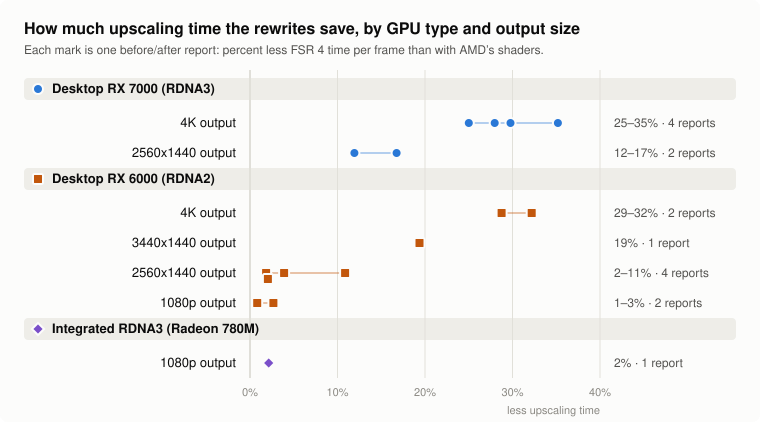

# fsr4-shader-performance-overrides

Makes AMD FSR 4.1.1 upscaling about 25 to 30% cheaper on Radeon RX 7000 graphics cards, on Linux
and Windows, by replacing FSR 4's slowest compute shaders with faster ones. **The image is
unchanged, byte for byte.** Nothing in the game or in OptiScaler is modified.

<picture>
  <source media="(prefers-color-scheme: dark)" srcset="docs/img/overview-dark.svg">
  
</picture>

Details: [how it works](docs/how-it-works.md), [results](docs/results.md),
[exact and lossy builds compared](docs/exact-vs-lossy.md).

> **New: a timing kit for testers (2026-10-05).** A 9 MB download that times every FSR 4 pass on
> your GPU, with AMD's shaders and this project's side by side. It runs on Linux and on a Steam
> Deck in desktop mode, needs no game, installs nothing, takes about 20 minutes on a desktop card (`bash run.sh`; `bash run.sh postpass` is a two-minute version), and can send its results to the project
> when it finishes (it asks first). The goal of sending this data is to further optimize this
> project, and with it FSR 4's performance, for your GPU. Reports from RX 6000 cards, integrated
> GPUs and the Steam Deck are what it is for. So far it has run on an RX 7800 XT, a Steam
> Machine, an RX 6700M, an RX 6800 XT and an RX 6600 ([results](timing-kit/RESULTS.md)).
> [Instructions](timing-kit) · [Download](https://github.com/zgauthier2000/fsr4-shader-performance-overrides/releases/tag/timing-kit-2026-10-05)

## Coming soon: slightly faster main files, and lossy builds that no longer shimmer at rest

Both are built and checked, and not released yet. Nothing below is in a download today.

- **Main files (AMD's image, byte for byte): about 2% faster.** The prepass and the postpass were
  rewritten again. In Shadow of the Tomb Raider's benchmark (4K Balanced, RX 7800 XT, Linux
  files) the upscaler time is 2.99 ms, against 3.05 ms with the current release and 4.16 ms with
  AMD's shaders; 109 FPS as before.

  | 4K, RX 7800 XT | AMD's shaders | Current release | Coming |
  |---|---|---|---|
  | Prepass | 0.494 ms | 0.447 ms | 0.434 ms |
  | Postpass | 2.20 ms | 0.667 ms | 0.644 ms |

  **Image quality: 100% of AMD's.** Not close to it but the same picture: the new Linux files
  give AMD's output byte for byte in 28 of 28 comparisons, and the five new DLLs in 53 of 53
  against AMD's DLL (run under Proton).
- **Lossy test builds: shimmer at rest down to AMD's level.** On the frames that skip the model,
  where the picture is not moving, nothing is taken from the new frame.

  | Test rig, 4K Balanced | AMD's shaders | Current release | Coming | Coming, against AMD's |
  |---|---|---|---|---|
  | Shimmer at rest on fine detail (lower is steadier) | 0.110 | 0.119 | 0.109 | within 1% (current release: 8% more) |
  | Still picture against the true image | 44.31 dB | 43.74 dB | 43.60 dB | within 1.6%; 9% more error |
  | Panning scene: background | 49.27 dB | 48.60 dB | 48.60 dB | within 1.4%; 8% more error |
  | Panning scene: thin railing | 41.82 dB | 40.73 dB | 40.75 dB | within 2.6%; 13% more error |
  | Panning scene: just-uncovered areas | 34.48 dB | 33.96 dB | 34.21 dB | within 0.8%; 3% more error |
  | Still camera, objects moving: thin railing | 42.20 dB | 40.60 dB | 40.60 dB | within 3.8%; 20% more error |
  | Still camera, objects moving: just-uncovered areas | 32.62 dB | 30.77 dB | 30.85 dB | within 5.4%; 23% more error |

  "Within x%" compares the quality scores (PSNR, in dB). dB is a logarithmic scale, so the last
  column also gives the same gap as error: how much further the picture is from the true image
  than AMD's is.

  **Image quality:** in this test scene the quality scores are within 1 to 3% of AMD's with the
  camera panning or at rest, and within 4 to 5% in the hardest case measured (thin things and
  just-uncovered areas with the camera still and objects moving). Against the current release:
  steadier at rest for 0.14 dB on the still picture, and in motion the same or slightly better. **Speed:** the same as the current release (2.07 ms against
  2.06 ms in Shadow of the Tomb Raider, one run each). The lossy builds will also carry the new
  prepass and postpass; with those they have not been timed in a game yet. The lossy builds
  still change the image and stay opt-in.
- **Not known yet:** what any of this does on Windows. All timings are from Linux, and the DLLs
  have only been run under Proton.
- More: [the two rewrites](research/postpass-and-prepass#two-ideas-from-a-community-set-rebuilt-here-2026-10-07) ·
  [the lossy change, with a comparison image](docs/exact-vs-lossy.md#in-testing-less-shimmer-at-rest) ·
  [how it was found](research/frame-skip#in-testing-nothing-from-the-new-frame-at-rest)

## What's new: 2026-10-06, release 6 ([release `dll-2026-10-06.6`](https://github.com/zgauthier2000/fsr4-shader-performance-overrides/releases/tag/dll-2026-10-06.6))

- **The lossy test builds are steadier and sharper in motion, and slightly faster.** Three changes,
  all on the frames that skip the model:
  - the reused model result now follows the picture's motion, to the pixel, instead of staying
    where it was a frame ago. This is what steadies thin lines while the camera moves;
  - pixels that a moving object has just uncovered take the new frame alone;
  - the last layers of the network, which sit in the postpass, are no longer rerun: the frame
    that runs the model saves their result and the skipped frame reads it back. That pays for the
    two changes above and a little more.

  | Moving test scene, 4K Balanced | AMD's shaders | Release 5 | Release 6 |
  |---|---|---|---|
  | Background against the true image | 49.27 dB | 47.68 dB | 48.60 dB |
  | Thin railing against the true image | 41.82 dB | 39.84 dB | 40.73 dB |
  | Areas a moving object has just uncovered | 34.48 dB | 32.04 dB | 33.96 dB |
  | Fine stripes on a moving block, frame-to-frame change (lower is steadier) | 2.04 | 1.66 | 0.95 |
  | Thin railing, frame-to-frame change against AMD's, as if at 30 / 60 / 90 / 120 FPS | 1 | 2.32 / 1.55 / 1.73 / 1.64 times | 1.16 / 1.04 / 0.99 / 1.14 times |

  One figure is worse: in the first scene release 5 happened to hold the railing steadier than
  AMD's (0.66 against 0.91), and release 6 is back near AMD's (1.02). Nothing changes at rest:
  still scenes are byte-identical to release 5.

  Speed, Shadow of the Tomb Raider's benchmark (4K Balanced, RX 7800 XT, Linux files, one run
  each): 2.06 ms and 18893 frames, against 2.11 ms and 18850 with release 5; 122 FPS both.
  [How it works](research/frame-skip#following-the-pictures-motion-release-dll-2026-10-066).
  Overview: [exact and lossy builds compared](docs/exact-vs-lossy.md).

  > **WARNING: the lossy builds change the image.** They are not the same as the main files or
  > AMD's DLL. The picture is slightly softer, and frame times alternate between a shorter and a
  > longer frame.
- **How it was checked:** the four lossy DLLs give byte-identical output to the Linux files in the
  test rig, in moving and still scenes. The DLLs were run under Proton only, and their speed on
  Windows has not been measured.
- **Files:** the five `test-lossy…` files are replaced (the DLLs are about 6 MB larger); names in
  OptiScaler stay the same, so say which release you used. The main DLL and the other test builds
  are unchanged.

## Earlier on 2026-10-06: release 5 (`dll-2026-10-06.5`)

- **The lossy test builds shimmer much less, at the same speed.** With frame skip, a skipped frame
  used to mix the new frame in with a weight the model had chosen one frame earlier. It now leans
  on the reprojected history instead and takes very little from the new frame, except where the
  model had asked for it.

  | Test scene, 4K Balanced | AMD's shaders | Release 4 | Release 5 |
  |---|---|---|---|
  | Flicker at rest on fine detail (lower is steadier) | 0.110 | 0.146 (+33%) | 0.119 (+8%) |
  | Fine stripes in motion, frame-to-frame change | 2.04 | 2.16 | 1.66 |
  | Still picture against the true image | 44.31 dB | 43.98 dB | 43.74 dB |
  | Areas a moving object has just uncovered | 34.48 dB | 33.13 dB | 32.04 dB |

  Speed is unchanged: 122 FPS and 2.11 ms in Shadow of the Tomb Raider's benchmark (4K Balanced,
  RX 7800 XT), against 122 FPS and 2.09 ms.
  [How it works, and what else was tried](research/frame-skip#leaning-on-the-history-on-skipped-frames-release-dll-2026-10-065).
  Overview: [exact and lossy builds compared](docs/exact-vs-lossy.md).

  > **WARNING: the lossy builds change the image.** They are not the same as the main files or
  > AMD's DLL. The picture is slightly softer, the edge behind a moving object is one frame
  > behind, and frame times alternate between a shorter and a longer frame.
- **Files:** the five `test-lossy…` files are replaced; names in OptiScaler stay the same, so say
  which release you used. The main DLL and the other test builds are unchanged.

## Earlier on 2026-10-06: release 4 (`dll-2026-10-06.4`)

- **The lossy test builds smear much less behind moving objects.** With frame skip, a skipped
  frame reuses a model result that still says "keep the history" where something has just been
  uncovered. On those frames the history is now limited to the colour range of the new frame's
  samples around each pixel.

  | Moving test scene, 4K Balanced: just-uncovered areas against AMD's shaders | Release 3 | Release 4 |
  |---|---|---|
  | as if at 30 FPS | −12.4 dB | −4.9 dB |
  | as if at 60 FPS | −5.7 dB | −0.9 dB |
  | as if at 120 FPS | −2.8 dB | +1.0 dB |

  Flicker at rest and the still picture are unchanged, and so is speed: all the skipped-frame
  work now sits in a branch that frames running the model do not take.
  [How it works and what was measured](research/frame-skip#history-clamp-on-skipped-frames-release-dll-2026-10-064).
  New page: [exact and lossy builds compared](docs/exact-vs-lossy.md).

  > **WARNING: the lossy builds change the image.** They are not the same as the main files or
  > AMD's DLL. With frame skip, fine detail such as distant objects still shimmers more than
  > with AMD's DLL (about 30% more frame-to-frame change at rest in tests), and frame times
  > alternate between a shorter and a longer frame.
- **Files:** the five `test-lossy…` files are replaced; names in OptiScaler stay the same, so say
  which release you used. The main DLL and the other test builds are unchanged.

## Earlier on 2026-10-06: release 3 (`dll-2026-10-06.3`)

- **Fixed in the lossy test builds: dark bands at the screen edge.** A tester saw black bars flash
  at the edges while turning the camera in Final Fantasy VII Rebirth. With frame skip, when the
  camera started to turn on a skipped frame, the strip that scrolled in was shown at about a
  tenth of its brightness for that one frame. The lossy builds of releases `dll-2026-10-06` and
  `.2` have this; if you use one, update. In the test scene the strip is now at full brightness,
  and nothing else changes. [How it was found and fixed](research/frame-skip#dark-bands-at-the-screen-edge-fixed-in-release-dll-2026-10-063).
- **Files:** the five `test-lossy…` files are replaced; names in OptiScaler stay the same. The main
  DLL and the other test builds, which give AMD's image, never had the problem and are unchanged.

## Earlier on 2026-10-06: release 2 (`dll-2026-10-06.2`)

- **Less shimmer in the lossy test builds.** A tester reported shimmer on distant objects with
  frame skip, and measurement confirmed it: at rest, fine detail changed about 55% more from frame
  to frame than with AMD's shaders. The cause is that a skipped frame reuses a model result worked
  out for the previous frame's camera jitter. The builds now carry the previous jitter over and
  lower the new frame's weight where its nearest sample has moved away.

  | Test scene, 4K Balanced (lossy build) | AMD's shaders | Before | Now |
  |---|---|---|---|
  | Frame-to-frame change at rest, fine detail (lower is steadier) | 0.110 | 0.172 (+56%) | 0.145 (+32%) |
  | Still picture against the true image | 44.31 dB | 43.75 dB | 44.04 dB |
  | Moving scene, areas just uncovered | 34.48 dB | 30.09 dB | 29.17 dB |

  About half of the extra flicker is gone, not all of it. Speed is unchanged (2.09 ms, 122 FPS
  in the benchmark below). [What was tried and how it works](research/frame-skip#reducing-the-shimmer).

  > **WARNING: the lossy builds change the image.** They are not the same as the main files or
  > AMD's DLL. With frame skip, fine detail such as distant objects still shimmers more than
  > with AMD's DLL (about 30% more frame-to-frame change at rest in tests); where the picture
  > has just changed the upscaler is one frame behind; and frame times alternate between a
  > shorter and a longer frame.
- **Files:** the five `test-lossy…` files are replaced; the names shown in OptiScaler stay the
  same, so say which release you used. The main DLL and the other test builds are carried over
  unchanged.

## Earlier on 2026-10-06: release `dll-2026-10-06`

- **The lossy test builds now skip the model on every other frame.** FSR 4's model is about 60%
  of its time. The lossy builds now run it on alternate frames and reuse its last result in
  between. In Shadow of the Tomb Raider's benchmark at 4K Balanced on an RX 7800 XT:

  | | Upscaler time | Average FPS |
  |---|---|---|
  | AMD's shaders | 4.16 ms | 97 |
  | Main files (AMD's image, byte for byte) | 3.05 ms | 109 |
  | Lossy test build, as it was | 2.91 ms | 111 |
  | Lossy test build, with frame skip | 2.09 ms | 122 |

  It turns itself off in Ultra Performance. The main files are unchanged.
  [How it works, what it costs, and the frame-time caveat](research/frame-skip).
- **Files:** `test-lossy.zip` (desktop RX 7000), `test-lossy-rdna2.zip`, `test-lossy-rdna2-compact.zip`,
  `test-lossy-igpu.zip` and `test-lossy-linux.zip` are replaced; the names shown in OptiScaler stay
  the same. The other files are carried over unchanged from release `dll-2026-10-05.4`.

## Earlier: 2026-10-05, release `dll-2026-10-05.4`

- **New names in OptiScaler, same shaders.** The GPU tag now comes before "cyboman", so it is
  readable in OptiScaler's closed dropdown and in screenshots:

  | Build | Shows as | Before |
  |---|---|---|
  | main DLL (desktop RX 7000) | `4.1.1-r3-cyboman` | `4.1.1-cyboman-r3` |
  | `test-rdna2.zip` | `4.1.1-r2-cyboman` | `4.1.1-cyboman-r2` |
  | `test-rdna2-compact.zip` | `4.1.1-r2c-cyboman` | `4.1.1-cyboman-r2c` |
  | `test-igpu.zip` | `4.1.1-ig-cyboman` | `4.1.1-cyboman-ig` |
  | `test-lossy.zip` | `4.1.1-r3-lossy-cyboman` | `4.1.1-cyboman-lossy` |
  | `test-lossy-rdna2.zip` | `4.1.1-r2-lossy-cyboman` | `4.1.1-cyboman-r2-lossy` |
  | `test-lossy-rdna2-compact.zip` | `4.1.1-r2c-lossy-cyboman` | `4.1.1-cyboman-r2c-lossy` |
  | `test-lossy-igpu.zip` | `4.1.1-ig-lossy-cyboman` | `4.1.1-cyboman-ig-lossy` |

  Only the name differs from release `dll-2026-10-05.3`: the exact builds still give AMD's image
  byte for byte and the lossy ones the same output as before. If you are sending screenshots,
  please use these builds.
- **A new RDNA2 test build for 1080p: `test-rdna2-hybrid.zip`** (`4.1.1-r2h-cyboman`). The first
  timing-kit result from an RX 6000-series card showed this project's postpass 35% faster than
  AMD's at 4K but 15% slower at 1080p. The hybrid build keeps AMD's postpass at 1080p output and
  below and uses the rewrite above that. RX 6000 owners at 1080p: please compare it with
  `test-rdna2.zip`. [Details](docs/gpu-support.md#test-build-rdna2-hybrid-2026-10-05).

## Earlier on 2026-10-05 (release `dll-2026-10-05.3`): lossy test builds and the timing kit

- **An opt-in test build that is NOT bit-exact: `test-lossy.zip` (Windows DLL) and
  `test-lossy-linux.zip` (Linux override folder).**

  > **WARNING: this build changes the image.** It is not the same as the main DLL or the prebuilt
  > folder, and not the same as AMD's DLL. Everything else in this repository produces AMD's image
  > byte for byte; this does not. Use it only if you want to try it, and use the main files if you
  > want AMD's image.

  It removes part of the arithmetic in nine of FSR 4's model passes. On an RX 7800 XT in Shadow
  of the Tomb Raider's benchmark at 4K Balanced the upscaler time goes from 3.05 ms (main files)
  to 2.91 ms, and 109 to 111 FPS; no difference was visible there. In the test scenes it costs
  0.3 to 0.7 dB of accuracy at every output size, and fine repeating patterns are 17 to 31% less
  steady in motion at 1440p output. For desktop RX 7000 cards; shows as `4.1.1-r3-lossy-cyboman`.
  [Measurements, tools and what to watch for](research/lossy#the-opt-in-test-build-2026-10-05).
- **Lossy builds for other GPUs too:** `test-lossy-rdna2.zip` (RX 6000),
  `test-lossy-rdna2-compact.zip` (RDNA2 and Steam Deck) and `test-lossy-igpu.zip` (RDNA3
  integrated GPUs). Each is the exact build for that GPU with the same lossy model passes, and
  **the same warning applies: they change the image.** None has been run on the hardware it is
  for yet; please report the upscaler time against the exact build for your GPU, and what you see.
- **A timing kit for testers (new, barely tested):** a 9 MB download that times every FSR 4 pass
  on your GPU under Linux or on a Steam Deck in desktop mode, with AMD's shaders and ours side by
  side. No game is needed. It has run on an RX 7800 XT, a Steam Machine and an RX 6700M so far ([results](timing-kit/RESULTS.md)); reports from RX 6000 cards,
  integrated GPUs and the Deck are what it is for. [Instructions](timing-kit).
- **`test-rdna2-taps.zip` is withdrawn.** Testers saw no improvement from it on RDNA2.
  `test-rdna2.zip` remains the build for RX 6000 cards.

## Earlier on 2026-10-05, 17:05 EDT (release `dll-2026-10-05.3`)

- **The prepass is rewritten too, with AMD's image still byte for byte.** The prepass prepares
  the model's input in blocks of four pixels. In AMD's shader the four threads of a block each
  compute partial sums, exchange them 32 times, and then one of them rounds and stores everything
  while three wait. Now each thread fetches the other three pixels' inputs once and computes a
  quarter of the result on its own. The prepass takes 10% less time: 0.50 ms down to 0.45 ms at 4K
  on an RX 7800 XT, about 1.7% of FSR 4's time.
- **In the DLLs now:** all 90 versions of the prepass (it varies with a game's depth, motion-vector
  and colour options). The DLLs replace 183 shaders. The main DLL was checked in 24 combinations
  covering all output-size classes and six option sets; every one is identical to AMD's.
- **On Linux:** the prebuilt folder has all 90 prepass versions as well since 19:05 EDT (189 files
  in all), checked in 48 combinations of output size and options, every one identical to AMD's.
  Download the folder again to get them. `build_override.sh` also rewrites the prepass of whatever
  game you dump.

## Earlier on 2026-10-05, 14:10 EDT (release `dll-2026-10-05.2`)

- **The other model passes get a small exact speedup too.** Until now two shaders were rewritten
  (the postpass and model pass 11). Two more rewrites now apply to the rest of the model: the
  rounding and clamping between layers is done with the clamp first, and each pass's
  floating-point output scaling is done in integers. Both give exactly the same numbers. On Linux
  that is 0.05 ms less at 4K (about 1.6% of FSR 4's time on an RX 7800 XT); the DLL gets the
  second rewrite only, about half of that.
- **Still byte for byte AMD's image.** Checked in all 48 combinations with the Linux files and in
  all six size and model classes with each DLL.
- **More files:** `prebuilt/` has 99 (48 postpass, 6 pass 11, 45 other model passes); the DLLs
  replace 93 shaders. Update by downloading again; nothing else changes.

## Earlier on 2026-10-05, 10:16 EDT ([release `dll-2026-10-05.3`](https://github.com/zgauthier2000/fsr4-shader-performance-overrides/releases/tag/dll-2026-10-05.3))

- **A test build for RDNA2 and the Steam Deck: `test-rdna2-compact.zip`.** It is the RDNA2 build
  with a much smaller model pass 11 (4.7 KB of code on those chips instead of 21.4 KB), the same
  one the integrated-GPU build uses. The Steam Deck is both RDNA2 and integrated, so this is the
  build to try there, and it is untested on a Deck so far: please compare it with `test-rdna2.zip`
  and report the upscaler time of each. On a desktop RX 6750 XT it is 2% slower than
  `test-rdna2.zip` (2.14 ms against 2.10 ms at 1440p), so desktop RX 6000 cards should keep using
  `test-rdna2.zip`. [Details](docs/gpu-support.md#test-build-rdna2-with-the-compact-pass-11-2026-10-05).
- **A second RDNA2 test build, `test-rdna2-taps.zip`,** was added at 12:40 EDT and has since been
  withdrawn: testers saw no improvement from it.
  [Details](docs/gpu-support.md#withdrawn-rdna2-with-the-postpasss-reads-unbranched-2026-10-05).
- **The DLLs now say what they are.** OptiScaler shows `4.1.1-r3-cyboman` (RX 7000),
  `4.1.1-ig-cyboman` (integrated), `4.1.1-r2-cyboman` (RX 6000) or `4.1.1-r2c-cyboman` (the new
  test build) instead of `4.1.1` (in releases before `dll-2026-10-05.4` the tag came last, as in
  `4.1.1-cyboman-r3`), so you can
  see that the patched DLL is the one loaded. Every build except the `test-lossy` ones produces AMD's image byte for byte. All of them have AMD's GPU check lifted; none is for
  RX 9000 cards.
- **Results from testers on RX 6000 cards** (ten reports, five cards). The gain follows the output
  size: about 30% less upscaler time at 4K (RX 6900 XT: 3.79 ms to 2.57 ms in Ready or Not, 3.79 ms
  to 2.70 ms in Final Fantasy VII Rebirth), 19% at 3440x1440, and 1 to 11% at 1440p and 1080p.
  Radeon 780M with the integrated-GPU build: 5.15 ms to 5.04 ms.
  [All reports](docs/gpu-support.md#rdna2-needs-one-more-change-the-dot-products).
- **Linux: the prebuilt files do not fit every setup.** On one RX 6900 XT they give a darker image,
  while files built from that user's own shader dump are correct. `./check_prebuilt.sh` now tells
  you whether they fit yours, and [Making a shader dump](docs/shader-dump.md) walks through it. On
  RDNA2 the DLL is the simpler route and just as fast.
- **New research:** a [motion test](research/pruning#motion-test) that measures shimmer, and a
  measured look at a [community shader set](research/community-lossy-set) that trades image
  quality for more speed.

The main DLL for RX 7000 cards and the Linux files are unchanged since 2026-10-04.

## RDNA2 (RX 6000): shimmering in motion fixed (2026-10-04, 15:43 EDT)

FSR 4.1.1's INT8 model can be made to run on RDNA2, but there it shimmers in motion. A test build
from this repository fixes that: **`test-rdna2.zip`** in the [release `dll-2026-10-06.6`](https://github.com/zgauthier2000/fsr4-shader-performance-overrides/releases/tag/dll-2026-10-06.6)
(Windows DLL).

- **The cause is one instruction form in the postpass.** AMD's postpass adds each int8 dot
  product onto a running total inside the instruction. RDNA2's driver gets that form wrong. The
  build computes each product alone and adds it afterwards (960 places per shader). The number is
  the same, so on RDNA3 the image is still byte-for-byte AMD's.
- **Where the idea comes from:** the [fsr4xyz](https://github.com/the3rdparty1917/fsr4xyz)
  project's 4.1.1b DLL, which found this fix. The build here is an independent implementation of
  it on top of this repository's faster postpass and pass 11, in all 54 shader versions.
- **What else is in it:** AMD's GPU check is lifted (AMD's DLL offers this model only on desktop
  RDNA3).
- **What did not work:** keeping the postpass's history weight at 0.8 or more, a change that was
  suggested against the shimmering. It looks bad in motion, and its test
  builds have been removed from the release.

Speed reports from testers on five RX 6000 cards: about 30% less upscaler time at 4K output
(RX 6900 XT, 3.79 ms down to 2.57 and 2.70 ms in two games), 19% at 3440x1440, and 1 to 11% at
1440p and 1080p. Details:
[GPU support](docs/gpu-support.md#rdna2-needs-one-more-change-the-dot-products).

## What's new: 2026-10-04, 14:55 EDT (commit `9298321`)

Three changes today. The image is still byte-for-byte the same.

- **Every version of the two shaders is now covered, on Linux and Windows** (the DLL and add-on
  at 14:44 EDT, commit `c5bb214`; the Linux files at 14:55 EDT, commit `9298321`). AMD's DLL contains 48 versions of the postpass and 6 of pass 11, and which one
  a game uses depends on its output size, preset, exposure and colour-space setup. Until now only
  the 10 most common were replaced, so some games got no speedup. All 54 are replaced now, checked
  in all 48 combinations that select a different one. See [shader variants](docs/variants.md).
- **Model pass 11 writes its output in whole rows** (11:41 EDT, commit `ef57cf2`). It used to
  store one word at a time, the same sparse pattern that made AMD's postpass slow.
- **The postpass writes its images in solid 8x8 blocks** (12:58 EDT, commit `18e3ddd`) instead of
  two rows of 32 pixels at a time, which reads a little less again.

Together with the "phased" postpass from 2026-10-03, FSR 4 now reads about 30% less memory per
frame than with AMD's shaders.

<picture>
  <source media="(prefers-color-scheme: dark)" srcset="docs/img/memory-traffic-dark.svg">
  
</picture>

Measured again on 2026-10-05 with everything the repository now ships (the prepass and the other
model-pass rewrites included). Those later rewrites save time by doing less arithmetic, and the
memory they read is unchanged, so the total is where it was (7,668 to 5,321 MB the day before).

| Memory read per frame at 4K | AMD's shaders | This release |
|---|---|---|
| Postpass | 2,291 MB | 732 MB |
| Model pass 11 | 984 MB | 233 MB |
| Prepass | 1,715 MB | 1,707 MB |
| Other 11 model passes | 2,649 MB | 2,645 MB |
| **All passes** | **7,639 MB** | **5,317 MB (−30%)** |

- **Frame rate on an RX 7800 XT is the same as with the 2026-10-03 version** (108 FPS and about
  3.1 ms of upscaler time in Shadow of the Tomb Raider's benchmark, with or without today's
  changes): on that card this memory traffic was not what limited the passes. The changes are
  never slower, and they may help GPUs with less memory bandwidth, where they have not been
  measured yet.
- **To get it:** download the files again, or run `build_override.sh` again if you built your own.
  The patched DLL is in the [release `dll-2026-10-06.6`](https://github.com/zgauthier2000/fsr4-shader-performance-overrides/releases/tag/dll-2026-10-06.6).
- **Integrated GPUs:** still not recommended, but there is an experimental build to test; see
  [GPU support](docs/gpu-support.md#integrated-gpus-radeon-780m-and-similar).
- The figures are read requests between the GPU's cache and memory, counted in a standalone
  benchmark of each pass; each one includes about 200 MB that belongs to the measurement itself.
  Details: [research](research/postpass-and-prepass#memory-traffic-of-every-pass-and-pass-11s-stores).
  Earlier change: [the phased postpass](results/phased-postpass), 2026-10-03.

## What to expect

At 4K, FSR 4's upscaling time drops by **25 to 30%**, about 1 ms less GPU time per frame. When the
GPU is the limit, that is:

| Your frame rate at 4K | Gain |
|---|---|
| around 60 FPS | up to about +6% |
| around 100 FPS | up to about +11% |
| around 120 FPS | up to about +14% |

At 1440p output the upscaling time drops by 12 to 17% (0.2 to 0.3 ms per frame, measured with the
first version), a few percent of frame rate. If the CPU is the limit,
the frame rate does not change.

Measured on a Radeon RX 7800 XT, 4K output, FSR 4.1.1 Balanced:

| Game | FSR 4 time per frame | Frame rate |
|---|---|---|
| Rise of the Tomb Raider (built-in benchmark) | 4.30 → 3.02 ms (−30%) | 97.6 → 108.6 FPS (+11%) |
| Shadow of the Tomb Raider (built-in benchmark) | 4.16 → 3.12 ms (−25%) | 97 → 108 FPS (+11%) |

More games, 1440p and screenshots: [all results](docs/results.md).

### Where FSR 4's time goes now

Shadow of the Tomb Raider, 4K, Balanced, RX 7800 XT: **3.09 ms in total, down from 4.16 ms.**

| Part of FSR 4 | Time | Share | Room left |
|---|---|---|---|
| Model passes (12) | 1.86 ms | 60% | none found |
| Postpass (rewritten) | 0.63 ms | 20% | 0.05 ms at most |
| Prepass | 0.44 ms | 14% | a few hundredths of a millisecond |
| OptiScaler and dispatch overhead | 0.12 ms | 4% | outside the shaders |
| Two small shaders and gaps between passes | 0.04 ms | 1% | |

How this was measured, and everything that was tried on each part:
[How it works](docs/how-it-works.md).

## Will it work for me?

<picture>
  <source media="(prefers-color-scheme: dark)" srcset="docs/img/gpu-gain-dark.svg">
  
</picture>

About 30% at 4K on both desktop generations; much less at lower resolutions, especially on
RX 6000 cards. The reports behind the chart: [results by GPU type](docs/results.md#by-gpu-type).

| GPU | Linux (Proton) | Windows |
|---|---|---|
| RX 7900, 7800, 7700, 7600 (desktop RDNA3) | yes, measured on an RX 7800 XT | yes, testers report large gains |
| Radeon 780M, 890M and other RDNA3 integrated GPUs | not the normal build (pass 11 is reported much slower there) | experimental `test-igpu.zip`: one report, 2% faster than fsr4xyz's `4.1.1b` on a 780M |
| RX 6000 (RDNA2) | experimental; check with `check_prebuilt.sh` first: the prebuilt files give one tester a wrong image in one game | experimental: `test-rdna2.zip` runs and fixes the shimmering; reported about 30% faster at 4K, 1 to 11% at 1440p and below |
| RX 9000 (RDNA4) | no: it runs a different FSR 4 ([open for someone to pick up](docs/rdna4.md)) | no, and do not install the DLL there |

You also need:

- a DirectX 12 game;
- FSR 4.1.1 with the INT8 model already running in it, for example through
  [OptiScaler](https://github.com/optiscaler/OptiScaler), with
  `amd_fidelityfx_upscaler_dx12.dll` version 4.1.1.2740.

Details for integrated GPUs and RDNA2: [GPU support](docs/gpu-support.md).

## Install

**On Linux, use the launch option, not the DLL.** It is the faster of the two: the rewritten
postpass takes 0.60 ms at 4K with the launch option against 0.67 ms with the patched DLL, because
Proton translates the DLL's shaders into slightly slower code.

### Linux: one launch option (recommended on Linux)

1. Download or clone this repository.
2. In Steam, add this to the game's launch options (keep anything already there in front of
   `%command%`):

   ```
   VKD3D_SHADER_OVERRIDE='Z:/path/to/fsr4-shader-performance-overrides/prebuilt' %command%
   ```

   `Z:` is how Proton sees your Linux root, so `Z:/home/you/...` is `/home/you/...`.

**The game must be using AMD's original DLL.** The launch option does nothing with the patched DLL
from this repository (or any other modified one) installed, because the files are matched to AMD's
shaders. If you installed the patched DLL earlier, put `amd_fidelityfx_upscaler_dx12.dll.orig` back
first. OptiScaler then shows FSR as plain `4.1.1`; the launch option does not change the name, so
the upscaler time is how you tell it applied.

**The prebuilt files do not fit every setup.** They were made and checked on an RX 7000 desktop
card. On one tester's setup (an RX 6900 XT) Proton lays the same shaders out differently, and the
prebuilt files give a darker picture there. Whenever the image looks off, build your own files:
[Linux guide](docs/linux.md#building-your-own). `./check_prebuilt.sh <dump folder>` tells you whether
the prebuilt files fit.

This covers every output size, preset and way a game can set FSR 4.1.1 up. If it does not get
faster: [Linux guide](docs/linux.md).

### Windows: replace one DLL

This also works under Proton, but on Linux the launch option above is faster.

1. Download `amd_fidelityfx_upscaler_dx12.dll` from the
   [release](https://github.com/zgauthier2000/fsr4-shader-performance-overrides/releases/tag/dll-2026-10-06.6).
2. In the game folder, rename the existing `amd_fidelityfx_upscaler_dx12.dll` (often next to
   OptiScaler) to `amd_fidelityfx_upscaler_dx12.dll.orig`. It must be version 4.1.1.2740.
3. Put the downloaded DLL in its place.

OptiScaler then lists FSR as **`4.1.1-r3-cyboman`** instead of `4.1.1`, which shows that the
patched DLL is the one in use. The test builds for other GPUs carry their own names:

| Build | Name shown | For |
|---|---|---|
| `amd_fidelityfx_upscaler_dx12.dll` | `4.1.1-r3-cyboman` | desktop RDNA3 (RX 7000) |
| `test-igpu.zip` | `4.1.1-ig-cyboman` | RDNA3 integrated GPUs (experimental) |
| `test-rdna2.zip` | `4.1.1-r2-cyboman` | RDNA2 (RX 6000) |
| `test-rdna2-compact.zip` | `4.1.1-r2c-cyboman` | RDNA2 and Steam Deck, test build with a smaller pass 11 ([details](docs/gpu-support.md#test-build-rdna2-with-the-compact-pass-11-2026-10-05)) |
| `test-rdna2-hybrid.zip` | `4.1.1-r2h-cyboman` | RDNA2 at 1080p output, test build: AMD's postpass at 1080p and below, the rewrite above ([details](docs/gpu-support.md#test-build-rdna2-hybrid-2026-10-05)) |
| `test-lossy.zip` | `4.1.1-r3-lossy-cyboman` | desktop RDNA3, **opt-in test build that changes the image** ([details](research/lossy#the-opt-in-test-build-2026-10-05)) |
| `test-lossy-rdna2.zip` | `4.1.1-r2-lossy-cyboman` | RDNA2, **changes the image** |
| `test-lossy-rdna2-compact.zip` | `4.1.1-r2c-lossy-cyboman` | RDNA2 and Steam Deck, **changes the image** |
| `test-lossy-igpu.zip` | `4.1.1-ig-lossy-cyboman` | RDNA3 integrated GPUs, **changes the image** |

All of them have AMD's GPU check lifted (AMD's DLL offers this FSR 4 model only on desktop RDNA3), so
each starts on any GPU. **Do not use them on RX 9000 (RDNA4) cards:** those run a different FSR 4
model, and with the check lifted both models report support.

It is AMD's DLL with the rewritten shaders swapped in and the name changed. Details, and how to build it yourself:
[`dll/`](dll). There is also a ReShade add-on that does the same without touching the DLL:
[`windows/`](windows).

### Check that it worked

Open OptiScaler's overlay and compare the upscaler time with and without the change, standing at
the same spot. **In some games that number is only reliable with the frame rate uncapped.** At 4K
it should drop by roughly 1 ms.

With the patched DLL, also check that the FSR version shown is `4.1.1-r3-cyboman`; if it still
says `4.1.1`, the game is loading AMD's DLL from somewhere else.

If nothing changes, check that the game really runs FSR 4.1.1 with AMD's DLL version 4.1.1.2740;
other versions have different shaders. See [shader variants](docs/variants.md).

### Undo

Remove the launch option, or put the original DLL back.

## Good to know

- **Nothing else changes.** No game files are edited, and the output was compared byte for byte
  with AMD's at 4K, 1440p and 1080p.
- **Game and OptiScaler updates** can put the original DLL back; the launch option keeps working.
- **Online games:** this changes the shaders the game renders with. Use your own judgement in
  games with anti-cheat.
- **Linux:** do not set `RADV_PERFTEST=cswave32` for a game that runs FSR 4; it adds about 1.1 ms.

## More

| Page | What is in it |
|---|---|
| [All results](docs/results.md) | every game measured, benchmark pages with screenshots |
| [Linux guide](docs/linux.md) | requirements, building your own files, troubleshooting |
| [Making a shader dump](docs/shader-dump.md) | step by step, for reporting a wrong image or a missing speedup on Linux |
| [Timing kit](timing-kit) | a download for Linux and the Steam Deck that times every FSR 4 pass on your GPU, no game needed (new; five GPUs so far) |
| [GPU support](docs/gpu-support.md) | Windows, integrated GPUs, the RDNA2 build and its shimmering fix |
| [Shader variants](docs/variants.md) | which versions of FSR 4's shaders are covered, and what to do if your game's is not |
| [How it works](docs/how-it-works.md) | what the two rewrites do, where the time goes, what else was tried |
| [RDNA4](docs/rdna4.md) | what is known about the FP8 model on RX 9000 cards; open for anyone who can test on one |
| [Research](research) | the probes, data and scripts behind all of it |

## Star History

<a href="https://www.star-history.com/?repos=zgauthier2000%2Ffsr4-shader-performance-overrides&type=date&legend=top-left">
 <picture>
   <source media="(prefers-color-scheme: dark)" srcset="https://api.star-history.com/chart?repos=zgauthier2000/fsr4-shader-performance-overrides&type=date&theme=dark&legend=top-left" />
   <source media="(prefers-color-scheme: light)" srcset="https://api.star-history.com/chart?repos=zgauthier2000/fsr4-shader-performance-overrides&type=date&legend=top-left" />
   
 </picture>
</a>
## Credits and licence

The postpass rewrite is adapted from `tools/fsr4cap/postpass_lds.py` in
[bbport](https://github.com/deadinside28/bloodborne_pc), a native Linux port of Bloodborne whose
author found the slow store pattern and wrote the original rewrite for that project's own FSR 4.1.1
runtime. This repository ports it to the shaders vkd3d-proton generates, so it works in ordinary
games.

The scripts are licensed under the GNU GPL v2 or later, like the project they derive from. See
[LICENSE](LICENSE). The prebuilt shaders are modified versions of AMD's, distributed under the same
licence together with AMD's notice; see [`prebuilt/NOTICE.md`](prebuilt/NOTICE.md). Not affiliated
with or endorsed by AMD.
