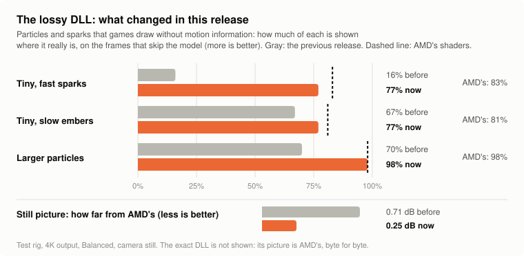
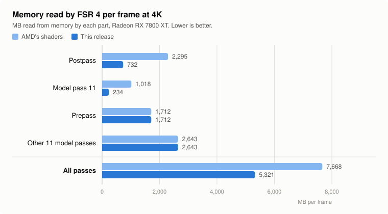

# Earlier releases

[Back to the front page](../README.md)

What each release up to `dll-2026-10-09` changed, newest first, as it was written at the time. The file names and build names in these entries are those of that release;
the current downloads are on the front page.

## 2026-10-09 ([release `dll-2026-10-09`](https://github.com/zgauthier2000/fsr4-shader-performance-overrides/releases/tag/dll-2026-10-09))

### The lossy DLL shows particles properly, and is closer to AMD's picture

*Written for `dll-2026-10-09`: "this release" below means that one. The particle picture is redrawn with each release and now shows the current lossy build, whose large particles have stronger seams.*

<picture>
  <source media="(prefers-color-scheme: dark)" srcset="img/lossy-improved-dark.svg">
  
</picture>

- **Particles, sparks and embers no longer flicker or move at half the frame rate.** Games draw
  them without telling FSR that they move, and the previous lossy DLL kept them where they had
  been, or dimmed them, on every other frame. Seen and fixed in Elden Ring and in the menu of
  Mafia: The Old Country.
- **The still picture is closer to AMD's.** The lossy DLL no longer simplifies the neural
  network's arithmetic; it only skips it on every other frame.
- **It costs about 2% of the previous lossy DLL's speed** (Shadow of the Tomb Raider, 4K: 120 FPS
  against 122; the exact DLL gives 109, AMD's shaders 97).

The same skipped frame with the previous release and with this one, enlarged five times:

Enlarged like this, this release's particles are a little blocky and have thin seams; at normal
size and in motion that was not visible in the games it was checked in. More comparisons, and
what the lossy DLL still does worse than AMD's: [exact and lossy compared](exact-vs-lossy.md).

### A possible speed-up on Windows, and how to help find out

Two things changed inside both DLLs, with the same picture as before:

- **The last pass writes all three of its images in ordered rows.** The previous DLL did that for
  two of them and left the third to AMD's scattered writes, the slow part of AMD's own shader.
- **The code our rewrites replaced is gone from the file.** The previous DLL left it in for the
  graphics driver to discard.

Both can make the DLLs faster on Windows, where AMD's own driver compiles these shaders. How much
depends on what that driver did with the leftover code and the scattered writes. The first
reports from Windows are in and differ a lot from card to card; more are needed. **That is what the [Windows timing kit](https://github.com/zgauthier2000/fsr4-shader-performance-overrides/releases/download/timing-kit-2026-10-05/fsr4-timing-kit-windows.zip) is for:** it times the DLLs on
your graphics card, and the previous release's too if you put its file into a folder of its own
under `dlls`.

What is known so far, from one RX 7800 XT on Linux with Proton:

| | Result |
|---|---|
| The last pass, timed alone | faster: 0.42 → 0.30 ms at 1440p; at 4K steady at 0.66 ms where it varied between 0.69 and 0.90 |
| The whole upscaler through the DLL, as a game runs it | the same as the previous DLL: 3.16 ms at 4K, 1.46 against 1.43 ms at 1440p |
| On Windows, any graphics card | not measured yet |

Proton's driver was already discarding the leftover code, so that machine cannot show what
Windows will do.

**Two downloads instead of eight.** One zip for Radeon RX 7000 and RX 6000 graphics cards, one for
graphics built into the processor; each holds the exact and the lossy DLL. The separate RX 6000
builds are gone: their fix is in both DLLs now. It cost nothing measurable here; on Windows with
an RX 7000 card that has not been measured either.

The technical pages behind that release:

- [Particles, sparks and embers on skipped frames](../research/frame-skip#content-without-motion-vectors-particles-sparks-embers-release-dll-2026-10-09): what went wrong, the three tests that fix it, what was tried and rejected, what it costs
- [Why weight folding was taken out](../research/lossy): the record of the experiment the lossy DLL no longer uses
- [The Windows DLL's last pass, and code left in the files](../research/postpass-and-prepass#the-windows-dlls-last-pass-and-code-left-in-the-files-release-dll-2026-10-09): what changed inside the DLLs, how it compiles for each chip, timed alone and as a whole upscaler
- [Which download for which graphics chip](gpu-support.md#which-download-dll-2026-10-09-and-later): how four builds became two, and the RX 6000 fix that is now in both
- [Frame pacing with the lossy DLL](frame-pacing.md): what the alternating frame cost means for frame caps, V-Sync and latency

## 2026-10-07 ([release `dll-2026-10-07`](https://github.com/zgauthier2000/fsr4-shader-performance-overrides/releases/tag/dll-2026-10-07))

- **The main files are a little faster, with the same image.** The prepass and the postpass
  were rewritten again:
  - **Prepass:** each of a quad's four threads now finishes one of the four words of the model's
    input, which takes 12 exchanges between threads instead of AMD's 32.
  - **Postpass:** its small network gets the integer rounding and clamping the model passes
    already had, and reads its nine neighbor cells without branches.

  | 4K, RX 7800 XT | AMD's shaders | Before | Now |
  |---|---|---|---|
  | Prepass | 0.494 ms | 0.447 ms | 0.434 ms |
  | Postpass | 2.20 ms | 0.667 ms | 0.644 ms |
  | Shadow of the Tomb Raider, 4K Balanced: upscaler time | 4.16 ms | 3.05 ms | 2.99 ms |

  Image quality is 100% of AMD's, not close to it but the same picture. The output is still AMD's, byte for byte: 28 of 28 comparisons with the Linux files and 44 of
  44 with the DLLs (run under Proton), over four output-size classes, render sizes from
  Ultra Performance to native, several option settings and a moving scene. Both ideas came from
  a community member's shader set and were rebuilt here from AMD's shaders
  ([details](../research/postpass-and-prepass#two-ideas-from-a-community-set-rebuilt-here-2026-10-07)).
  The timings are from Linux; what the DLLs gain on Windows has not been measured.
- **A ghost beside moving characters is fixed, in the lossy test builds.** With the camera turning
  fast around a third-person character, release 6 could show a second, broken outline of the
  character's edge, or of something thin like a rifle, a little way off in the background. The
  skipped frames' test for "this pixel was hidden a frame ago" looked for the object where the
  pixel's content used to be, and missed it when the object had itself moved. The prepass now
  records which surface was at each spot a frame ago, and the postpass looks it up.

  | Error where the object's old image would land, skipped frames, 8-bit steps | AMD's shaders | Release 6 | This release |
  |---|---|---|---|
  | Camera 40, object 6 pixels per frame: outline band | 0.50 | 1.44 | 0.48 |
  | Same: thin bars' old image | 0.33 | 1.32 | 0.38 |
  | Camera still, object 20 pixels per frame: thin bars' old image | 0.65 | 4.34 | 0.73 |

  The author no longer sees it in the game it was reported and reproduced in.
  [Details](../research/frame-skip#who-was-here-a-frame-ago-release-dll-2026-10-07).
- **If you use a lossy build of release 6 at 1080p output or below, update.** There the per-block
  motion was stored in overlapping places, and motion was less steady than in release 5
  (background frame-to-frame change 0.146 against AMD's 0.089; now 0.072). Larger outputs were
  not affected.
- **The lossy test builds no longer shimmer more than AMD's at rest.** On the frames that skip the
  model, where the picture is not moving, nothing is taken from the new frame. The small share
  that used to be mixed in was what made fine detail shimmer; the weight folding was not the
  cause.

  | Test rig, 4K Balanced | AMD's shaders | Release 6 | This release | This release, against AMD's |
  |---|---|---|---|---|
  | Shimmer at rest on fine detail (lower is steadier) | 0.110 | 0.119 | 0.109 | within 1% (release 6: 8% more) |
  | Still picture against the true image | 44.31 dB | 43.74 dB | 43.60 dB | within 1.6%; 9% more error |
  | Panning scene: thin railing | 41.82 dB | 40.73 dB | 41.12 dB | within 1.7%; 8% more error |
  | Panning scene: just-uncovered areas | 34.48 dB | 33.96 dB | 36.56 dB | 6% above; 21% less error |
  | Still camera, moving objects: thin railing | 42.20 dB | 40.60 dB | 40.99 dB | within 2.9%; 15% more error |
  | Still camera, moving objects: just-uncovered areas | 32.62 dB | 30.77 dB | 30.93 dB | within 5.2%; 21% more error |

  "Within x%" compares the quality scores (PSNR, in dB). dB is a logarithmic scale, so the last
  column also gives the same gap as error: how much further the picture is from the true image
  than AMD's is.

  Speed is unchanged: 2.05 ms and 18879 frames in Shadow of the Tomb Raider's benchmark (4K
  Balanced, RX 7800 XT, Linux files, one run each), against 2.06 ms and 18893 with release 6;
  122 FPS both. In
  that benchmark the author could see the difference: patterns that used to show on stairs were
  gone. One person's impression in one game.
  [How it was found](../research/frame-skip#nothing-from-the-new-frame-at-rest-release-dll-2026-10-07).
  Overview: [exact and lossy builds compared](exact-vs-lossy.md).

  > **WARNING: the lossy builds change the image.** They are not the same as the main files or
  > AMD's DLL. The picture is slightly softer, and frame times alternate between a shorter and a
  > longer frame.
- **What it costs:** 0.14 dB on the still picture, and something that changes without moving (a
  light, an animated surface with no motion vectors) updates on every other frame where nothing
  around it moves.
- **How it was checked:** the four lossy DLLs give byte-identical output to the Linux files in the
  test rig, in moving and still scenes. The DLLs were run under Proton only, and their speed on
  Windows has not been measured.
- **Files:** every file is replaced: the main DLL, the test builds, the lossy builds and the
  Linux prebuilt folder. Names in OptiScaler stay the same, so say which release you used. The
  lossy builds carry the new prepass and postpass too.
- **`test-rdna2-hybrid.zip` is gone.** The RDNA2 build that kept AMD's postpass at 1080p output
  did not prove useful (a tester found it no faster than the alternatives) and is no longer
  built. `test-rdna2.zip` and `test-rdna2-compact.zip` remain.

## 2026-10-06: release 6 (`dll-2026-10-06.6`)

- **The lossy test builds are steadier and sharper in motion, and slightly faster.** Three changes,
  all on the frames that skip the model:
  - the reused model result now follows the picture's motion, to the pixel, instead of staying
    where it was a frame ago. This is what steadies thin lines while the camera moves;
  - pixels that a moving object has just uncovered take the new frame alone;
  - the last layers of the network, which sit in the postpass, are no longer rerun: the frame
    that runs the model saves their result and the skipped frame reads it back. That pays for the
    two changes above and a little more.

  | Moving test scene, 4K Balanced | AMD's shaders | Release 5 | Release 6 |
  |---|---|---|---|
  | Background against the true image | 49.27 dB | 47.68 dB | 48.60 dB |
  | Thin railing against the true image | 41.82 dB | 39.84 dB | 40.73 dB |
  | Areas a moving object has just uncovered | 34.48 dB | 32.04 dB | 33.96 dB |
  | Fine stripes on a moving block, frame-to-frame change (lower is steadier) | 2.04 | 1.66 | 0.95 |
  | Thin railing, frame-to-frame change against AMD's, as if at 30 / 60 / 90 / 120 FPS | 1 | 2.32 / 1.55 / 1.73 / 1.64 times | 1.16 / 1.04 / 0.99 / 1.14 times |

  One figure is worse: in the first scene release 5 happened to hold the railing steadier than
  AMD's (0.66 against 0.91), and release 6 is back near AMD's (1.02). Nothing changes at rest:
  still scenes are byte-identical to release 5.

  Speed, Shadow of the Tomb Raider's benchmark (4K Balanced, RX 7800 XT, Linux files, one run
  each): 2.06 ms and 18893 frames, against 2.11 ms and 18850 with release 5; 122 FPS both.
  [How it works](../research/frame-skip#following-the-pictures-motion-release-dll-2026-10-066).
  Overview: [exact and lossy builds compared](exact-vs-lossy.md).

  > **WARNING: the lossy builds change the image.** They are not the same as the main files or
  > AMD's DLL. The picture is slightly softer, and frame times alternate between a shorter and a
  > longer frame.
- **How it was checked:** the four lossy DLLs give byte-identical output to the Linux files in the
  test rig, in moving and still scenes. The DLLs were run under Proton only, and their speed on
  Windows has not been measured.
- **Files:** the five `test-lossy…` files are replaced (the DLLs are about 6 MB larger); names in
  OptiScaler stay the same, so say which release you used. The main DLL and the other test builds
  are unchanged.

## 2026-10-06: release 5 (`dll-2026-10-06.5`)

- **The lossy test builds shimmer much less, at the same speed.** With frame skip, a skipped frame
  used to mix the new frame in with a weight the model had chosen one frame earlier. It now leans
  on the reprojected history instead and takes very little from the new frame, except where the
  model had asked for it.

  | Test scene, 4K Balanced | AMD's shaders | Release 4 | Release 5 |
  |---|---|---|---|
  | Flicker at rest on fine detail (lower is steadier) | 0.110 | 0.146 (+33%) | 0.119 (+8%) |
  | Fine stripes in motion, frame-to-frame change | 2.04 | 2.16 | 1.66 |
  | Still picture against the true image | 44.31 dB | 43.98 dB | 43.74 dB |
  | Areas a moving object has just uncovered | 34.48 dB | 33.13 dB | 32.04 dB |

  Speed is unchanged: 122 FPS and 2.11 ms in Shadow of the Tomb Raider's benchmark (4K Balanced,
  RX 7800 XT), against 122 FPS and 2.09 ms.
  [How it works, and what else was tried](../research/frame-skip#leaning-on-the-history-on-skipped-frames-release-dll-2026-10-065).
  Overview: [exact and lossy builds compared](exact-vs-lossy.md).

  > **WARNING: the lossy builds change the image.** They are not the same as the main files or
  > AMD's DLL. The picture is slightly softer, the edge behind a moving object is one frame
  > behind, and frame times alternate between a shorter and a longer frame.
- **Files:** the five `test-lossy…` files are replaced; names in OptiScaler stay the same, so say
  which release you used. The main DLL and the other test builds are unchanged.

## 2026-10-06: release 4 (`dll-2026-10-06.4`)

- **The lossy test builds smear much less behind moving objects.** With frame skip, a skipped
  frame reuses a model result that still says "keep the history" where something has just been
  uncovered. On those frames the history is now limited to the color range of the new frame's
  samples around each pixel.

  | Moving test scene, 4K Balanced: just-uncovered areas against AMD's shaders | Release 3 | Release 4 |
  |---|---|---|
  | as if at 30 FPS | −12.4 dB | −4.9 dB |
  | as if at 60 FPS | −5.7 dB | −0.9 dB |
  | as if at 120 FPS | −2.8 dB | +1.0 dB |

  Flicker at rest and the still picture are unchanged, and so is speed: all the skipped-frame
  work now sits in a branch that frames running the model do not take.
  [How it works and what was measured](../research/frame-skip#history-clamp-on-skipped-frames-release-dll-2026-10-064).
  New page: [exact and lossy builds compared](exact-vs-lossy.md).

  > **WARNING: the lossy builds change the image.** They are not the same as the main files or
  > AMD's DLL. With frame skip, fine detail such as distant objects still shimmers more than
  > with AMD's DLL (about 30% more frame-to-frame change at rest in tests), and frame times
  > alternate between a shorter and a longer frame.
- **Files:** the five `test-lossy…` files are replaced; names in OptiScaler stay the same, so say
  which release you used. The main DLL and the other test builds are unchanged.

## 2026-10-06: release 3 (`dll-2026-10-06.3`)

- **Fixed in the lossy test builds: dark bands at the screen edge.** A tester saw black bars flash
  at the edges while turning the camera in Final Fantasy VII Rebirth. With frame skip, when the
  camera started to turn on a skipped frame, the strip that scrolled in was shown at about a
  tenth of its brightness for that one frame. The lossy builds of releases `dll-2026-10-06` and
  `.2` have this; if you use one, update. In the test scene the strip is now at full brightness,
  and nothing else changes. [How it was found and fixed](../research/frame-skip#dark-bands-at-the-screen-edge-fixed-in-release-dll-2026-10-063).
- **Files:** the five `test-lossy…` files are replaced; names in OptiScaler stay the same. The main
  DLL and the other test builds, which give AMD's image, never had the problem and are unchanged.

## 2026-10-06: release 2 (`dll-2026-10-06.2`)

- **Less shimmer in the lossy test builds.** A tester reported shimmer on distant objects with
  frame skip, and measurement confirmed it: at rest, fine detail changed about 55% more from frame
  to frame than with AMD's shaders. The cause is that a skipped frame reuses a model result worked
  out for the previous frame's camera jitter. The builds now carry the previous jitter over and
  lower the new frame's weight where its nearest sample has moved away.

  | Test scene, 4K Balanced (lossy build) | AMD's shaders | Before | Now |
  |---|---|---|---|
  | Frame-to-frame change at rest, fine detail (lower is steadier) | 0.110 | 0.172 (+56%) | 0.145 (+32%) |
  | Still picture against the true image | 44.31 dB | 43.75 dB | 44.04 dB |
  | Moving scene, areas just uncovered | 34.48 dB | 30.09 dB | 29.17 dB |

  About half of the extra flicker is gone, not all of it. Speed is unchanged (2.09 ms, 122 FPS
  in the benchmark below). [What was tried and how it works](../research/frame-skip#reducing-the-shimmer).

  > **WARNING: the lossy builds change the image.** They are not the same as the main files or
  > AMD's DLL. With frame skip, fine detail such as distant objects still shimmers more than
  > with AMD's DLL (about 30% more frame-to-frame change at rest in tests); where the picture
  > has just changed the upscaler is one frame behind; and frame times alternate between a
  > shorter and a longer frame.
- **Files:** the five `test-lossy…` files are replaced; the names shown in OptiScaler stay the
  same, so say which release you used. The main DLL and the other test builds are carried over
  unchanged.

## 2026-10-06: release `dll-2026-10-06`

- **The lossy test builds now skip the model on every other frame.** FSR 4's model is about 60%
  of its time. The lossy builds now run it on alternate frames and reuse its last result in
  between. In Shadow of the Tomb Raider's benchmark at 4K Balanced on an RX 7800 XT:

  | | Upscaler time | Average FPS |
  |---|---|---|
  | AMD's shaders | 4.16 ms | 97 |
  | Main files (AMD's image, byte for byte) | 3.05 ms | 109 |
  | Lossy test build, as it was | 2.91 ms | 111 |
  | Lossy test build, with frame skip | 2.09 ms | 122 |

  It turns itself off in Ultra Performance. The main files are unchanged.
  [How it works, what it costs, and the frame-time caveat](../research/frame-skip).
- **Files:** `test-lossy.zip` (desktop RX 7000), `test-lossy-rdna2.zip`, `test-lossy-rdna2-compact.zip`,
  `test-lossy-igpu.zip` and `test-lossy-linux.zip` are replaced; the names shown in OptiScaler stay
  the same. The other files are carried over unchanged from release `dll-2026-10-05.4`.

## 2026-10-05, release `dll-2026-10-05.4`

- **New names in OptiScaler, same shaders.** The GPU tag now comes before "cyboman", so it is
  readable in OptiScaler's closed dropdown and in screenshots:

  | Build | Shows as | Before |
  |---|---|---|
  | main DLL (desktop RX 7000) | `4.1.1-r3-cyboman` | `4.1.1-cyboman-r3` |
  | `test-rdna2.zip` | `4.1.1-r2-cyboman` | `4.1.1-cyboman-r2` |
  | `test-rdna2-compact.zip` | `4.1.1-r2c-cyboman` | `4.1.1-cyboman-r2c` |
  | `test-igpu.zip` | `4.1.1-ig-cyboman` | `4.1.1-cyboman-ig` |
  | `test-lossy.zip` | `4.1.1-r3-lossy-cyboman` | `4.1.1-cyboman-lossy` |
  | `test-lossy-rdna2.zip` | `4.1.1-r2-lossy-cyboman` | `4.1.1-cyboman-r2-lossy` |
  | `test-lossy-rdna2-compact.zip` | `4.1.1-r2c-lossy-cyboman` | `4.1.1-cyboman-r2c-lossy` |
  | `test-lossy-igpu.zip` | `4.1.1-ig-lossy-cyboman` | `4.1.1-cyboman-ig-lossy` |

  Only the name differs from release `dll-2026-10-05.3`: the exact builds still give AMD's image
  byte for byte and the lossy ones the same output as before. If you are sending screenshots,
  please use these builds.
- **A new RDNA2 test build for 1080p: `test-rdna2-hybrid.zip`** (`4.1.1-r2h-cyboman`). The first
  timing-kit result from an RX 6000-series card showed this project's postpass 35% faster than
  AMD's at 4K but 15% slower at 1080p. The hybrid build keeps AMD's postpass at 1080p output and
  below and uses the rewrite above that. RX 6000 owners at 1080p: please compare it with
  `test-rdna2.zip`. [Details](gpu-support.md#test-build-rdna2-hybrid-2026-10-05).

## 2026-10-05 (release `dll-2026-10-05.3`): lossy test builds and the timing kit

- **An opt-in test build that is NOT bit-exact: `test-lossy.zip` (Windows DLL) and
  `test-lossy-linux.zip` (Linux override folder).**

  > **WARNING: this build changes the image.** It is not the same as the main DLL or the prebuilt
  > folder, and not the same as AMD's DLL. Everything else in this repository produces AMD's image
  > byte for byte; this does not. Use it only if you want to try it, and use the main files if you
  > want AMD's image.

  It removes part of the arithmetic in nine of FSR 4's model passes. On an RX 7800 XT in Shadow
  of the Tomb Raider's benchmark at 4K Balanced the upscaler time goes from 3.05 ms (main files)
  to 2.91 ms, and 109 to 111 FPS; no difference was visible there. In the test scenes it costs
  0.3 to 0.7 dB of accuracy at every output size, and fine repeating patterns are 17 to 31% less
  steady in motion at 1440p output. For desktop RX 7000 cards; shows as `4.1.1-r3-lossy-cyboman`.
  [Measurements, tools and what to watch for](../research/lossy#the-opt-in-test-build-2026-10-05).
- **Lossy builds for other GPUs too:** `test-lossy-rdna2.zip` (RX 6000),
  `test-lossy-rdna2-compact.zip` (RDNA2 and Steam Deck) and `test-lossy-igpu.zip` (RDNA3
  integrated GPUs). Each is the exact build for that GPU with the same lossy model passes, and
  **the same warning applies: they change the image.** None has been run on the hardware it is
  for yet; please report the upscaler time against the exact build for your GPU, and what you see.
- **A timing kit for testers (new, barely tested):** a 9 MB download that times every FSR 4 pass
  on your GPU under Linux or on a Steam Deck in desktop mode, with AMD's shaders and ours side by
  side. No game is needed. It has run on an RX 7800 XT, a Steam Machine and an RX 6700M so far ([results](../timing-kit/RESULTS.md)); reports from RX 6000 cards,
  integrated GPUs and the Deck are what it is for. [Instructions](../timing-kit).
- **`test-rdna2-taps.zip` is withdrawn.** Testers saw no improvement from it on RDNA2.
  `test-rdna2.zip` remains the build for RX 6000 cards.

## 2026-10-05, 17:05 EDT (release `dll-2026-10-05.3`)

- **The prepass is rewritten too, with AMD's image still byte for byte.** The prepass prepares
  the model's input in blocks of four pixels. In AMD's shader the four threads of a block each
  compute partial sums, exchange them 32 times, and then one of them rounds and stores everything
  while three wait. Now each thread fetches the other three pixels' inputs once and computes a
  quarter of the result on its own. The prepass takes 10% less time: 0.50 ms down to 0.45 ms at 4K
  on an RX 7800 XT, about 1.7% of FSR 4's time.
- **In the DLLs now:** all 90 versions of the prepass (it varies with a game's depth, motion-vector
  and color options). The DLLs replace 183 shaders. The main DLL was checked in 24 combinations
  covering all output-size classes and six option sets; every one is identical to AMD's.
- **On Linux:** the prebuilt folder has all 90 prepass versions as well since 19:05 EDT (189 files
  in all), checked in 48 combinations of output size and options, every one identical to AMD's.
  Download the folder again to get them. `build_override.sh` also rewrites the prepass of whatever
  game you dump.

## 2026-10-05, 14:10 EDT (release `dll-2026-10-05.2`)

- **The other model passes get a small exact speedup too.** Until now two shaders were rewritten
  (the postpass and model pass 11). Two more rewrites now apply to the rest of the model: the
  rounding and clamping between layers is done with the clamp first, and each pass's
  floating-point output scaling is done in integers. Both give exactly the same numbers. On Linux
  that is 0.05 ms less at 4K (about 1.6% of FSR 4's time on an RX 7800 XT); the DLL gets the
  second rewrite only, about half of that.
- **Still byte for byte AMD's image.** Checked in all 48 combinations with the Linux files and in
  all six size and model classes with each DLL.
- **More files:** `prebuilt/` has 99 (48 postpass, 6 pass 11, 45 other model passes); the DLLs
  replace 93 shaders. Update by downloading again; nothing else changes.

## 2026-10-05, 10:16 EDT ([release `dll-2026-10-05.3`](https://github.com/zgauthier2000/fsr4-shader-performance-overrides/releases/tag/dll-2026-10-05.3))

- **A test build for RDNA2 and the Steam Deck: `test-rdna2-compact.zip`.** It is the RDNA2 build
  with a much smaller model pass 11 (4.7 KB of code on those chips instead of 21.4 KB), the same
  one the integrated-GPU build uses. The Steam Deck is both RDNA2 and integrated, so this is the
  build to try there, and it is untested on a Deck so far: please compare it with `test-rdna2.zip`
  and report the upscaler time of each. On a desktop RX 6750 XT it is 2% slower than
  `test-rdna2.zip` (2.14 ms against 2.10 ms at 1440p), so desktop RX 6000 cards should keep using
  `test-rdna2.zip`. [Details](gpu-support.md#test-build-rdna2-with-the-compact-pass-11-2026-10-05).
- **A second RDNA2 test build, `test-rdna2-taps.zip`,** was added at 12:40 EDT and has since been
  withdrawn: testers saw no improvement from it.
  [Details](gpu-support.md#withdrawn-rdna2-with-the-postpasss-reads-unbranched-2026-10-05).
- **The DLLs now say what they are.** OptiScaler shows `4.1.1-r3-cyboman` (RX 7000),
  `4.1.1-ig-cyboman` (integrated), `4.1.1-r2-cyboman` (RX 6000) or `4.1.1-r2c-cyboman` (the new
  test build) instead of `4.1.1` (in releases before `dll-2026-10-05.4` the tag came last, as in
  `4.1.1-cyboman-r3`), so you can
  see that the patched DLL is the one loaded. Every build except the `test-lossy` ones produces AMD's image byte for byte. All of them have AMD's GPU check lifted; none is for
  RX 9000 cards.
- **Results from testers on RX 6000 cards** (ten reports, five cards). The gain follows the output
  size: about 30% less upscaler time at 4K (RX 6900 XT: 3.79 ms to 2.57 ms in Ready or Not, 3.79 ms
  to 2.70 ms in Final Fantasy VII Rebirth), 19% at 3440x1440, and 1 to 11% at 1440p and 1080p.
  Radeon 780M with the integrated-GPU build: 5.15 ms to 5.04 ms.
  [All reports](gpu-support.md#rdna2-needs-one-more-change-the-dot-products).
- **Linux: the prebuilt files do not fit every setup.** On one RX 6900 XT they give a darker image,
  while files built from that user's own shader dump are correct. `./check_prebuilt.sh` now tells
  you whether they fit yours, and [Making a shader dump](shader-dump.md) walks through it. On
  RDNA2 the DLL is the simpler route and just as fast.
- **New research:** a [motion test](../research/pruning#motion-test) that measures shimmer, and a
  measured look at a [community shader set](../research/community-lossy-set) that trades image
  quality for more speed.

The main DLL for RX 7000 cards and the Linux files are unchanged since 2026-10-04.

## RDNA2 (RX 6000): shimmering in motion fixed (2026-10-04, 15:43 EDT)

FSR 4.1.1's INT8 model can be made to run on RDNA2, but there it shimmers in motion. A test build
from this repository fixes that: **`test-rdna2.zip`** in the [release `dll-2026-10-07`](https://github.com/zgauthier2000/fsr4-shader-performance-overrides/releases/tag/dll-2026-10-07)
(Windows DLL).

- **The cause is one instruction form in the postpass.** AMD's postpass adds each int8 dot
  product onto a running total inside the instruction. RDNA2's driver gets that form wrong. The
  build computes each product alone and adds it afterwards (960 places per shader). The number is
  the same, so on RDNA3 the image is still byte-for-byte AMD's.
- **Where the idea comes from:** the [fsr4xyz](https://github.com/the3rdparty1917/fsr4xyz)
  project's 4.1.1b DLL, which found this fix. The build here is an independent implementation of
  it on top of this repository's faster postpass and pass 11, in all 54 shader versions.
- **What else is in it:** AMD's GPU check is lifted (AMD's DLL offers this model only on desktop
  RDNA3).
- **What did not work:** keeping the postpass's history weight at 0.8 or more, a change that was
  suggested against the shimmering. It looks bad in motion, and its test
  builds have been removed from the release.

Speed reports from testers on five RX 6000 cards: about 30% less upscaler time at 4K output
(RX 6900 XT, 3.79 ms down to 2.57 and 2.70 ms in two games), 19% at 3440x1440, and 1 to 11% at
1440p and 1080p. Details:
[GPU support](gpu-support.md#rdna2-needs-one-more-change-the-dot-products).

## 2026-10-04, 14:55 EDT (commit `9298321`)

Three changes today. The image is still byte-for-byte the same.

- **Every version of the two shaders is now covered, on Linux and Windows** (the DLL and add-on
  at 14:44 EDT, commit `c5bb214`; the Linux files at 14:55 EDT, commit `9298321`). AMD's DLL contains 48 versions of the postpass and 6 of pass 11, and which one
  a game uses depends on its output size, preset, exposure and color-space setup. Until now only
  the 10 most common were replaced, so some games got no speedup. All 54 are replaced now, checked
  in all 48 combinations that select a different one. See [shader variants](variants.md).
- **Model pass 11 writes its output in whole rows** (11:41 EDT, commit `ef57cf2`). It used to
  store one word at a time, the same sparse pattern that made AMD's postpass slow.
- **The postpass writes its images in solid 8x8 blocks** (12:58 EDT, commit `18e3ddd`) instead of
  two rows of 32 pixels at a time, which reads a little less again.

Together with the "phased" postpass from 2026-10-03, FSR 4 now reads about 30% less memory per
frame than with AMD's shaders.

<picture>
  <source media="(prefers-color-scheme: dark)" srcset="img/memory-traffic-dark.svg">
  
</picture>

Measured again on 2026-10-05 with everything the repository now ships (the prepass and the other
model-pass rewrites included). Those later rewrites save time by doing less arithmetic, and the
memory they read is unchanged, so the total is where it was (7,668 to 5,321 MB the day before).

| Memory read per frame at 4K | AMD's shaders | This release |
|---|---|---|
| Postpass | 2,291 MB | 732 MB |
| Model pass 11 | 984 MB | 233 MB |
| Prepass | 1,715 MB | 1,707 MB |
| Other 11 model passes | 2,649 MB | 2,645 MB |
| **All passes** | **7,639 MB** | **5,317 MB (−30%)** |

- **Frame rate on an RX 7800 XT is the same as with the 2026-10-03 version** (108 FPS and about
  3.1 ms of upscaler time in Shadow of the Tomb Raider's benchmark, with or without today's
  changes): on that card this memory traffic was not what limited the passes. The changes are
  never slower, and they may help GPUs with less memory bandwidth, where they have not been
  measured yet.
- **To get it:** download the files again, or run `build_override.sh` again if you built your own.
  The patched DLL is in the [release `dll-2026-10-07`](https://github.com/zgauthier2000/fsr4-shader-performance-overrides/releases/tag/dll-2026-10-07).
- **Integrated GPUs:** still not recommended, but there is an experimental build to test; see
  [GPU support](gpu-support.md#integrated-gpus-radeon-780m-and-similar).
- The figures are read requests between the GPU's cache and memory, counted in a standalone
  benchmark of each pass; each one includes about 200 MB that belongs to the measurement itself.
  Details: [research](../research/postpass-and-prepass#memory-traffic-of-every-pass-and-pass-11s-stores).
  Earlier change: [the phased postpass](../results/phased-postpass), 2026-10-03.
