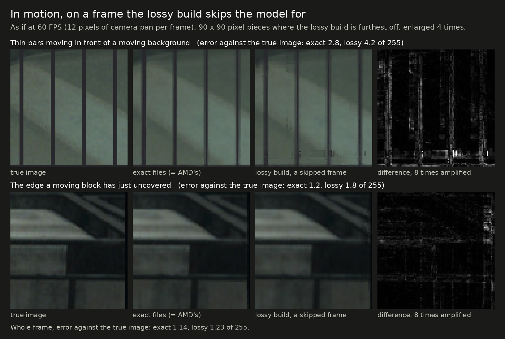

# Exact and lossy builds: how they differ

[Back to the README](../README.md)

## In short

- **Exact:** the same picture as AMD's, byte for byte, in less time. Nothing to weigh up; it is the default.
- **Lossy:** faster again, because it runs FSR 4's neural network on every other frame only. The picture is very close to
  AMD's but not the same.
- **What you would notice with lossy, if anything:** slightly softer fine detail in a still view, and edges of fast-moving
  things a little rougher for a frame. Sparks and embers, which releases before `dll-2026-10-09` got wrong, are handled now.
- **Which to pick:** exact if you are unsure or use frame generation at a low frame rate; lossy if you run at a high frame
  rate and want more.

<picture>
  <source media="(prefers-color-scheme: dark)" srcset="img/explain-skip-dark.svg">
  
</picture>

## The two kinds in detail

This project ships two kinds of faster FSR 4.1.1 shaders. They get their speed in different ways,
and only one of them keeps AMD's picture.

- **The exact files** (the `exact` DLL in each download and the `prebuilt` Linux folder) do the
  same arithmetic as AMD's shaders, organized so the GPU gets through it faster. The output is
  AMD's image, byte for byte.
- **The lossy files** (the `lossy` DLL in each download and the `prebuilt-lossy` Linux folder)
  are the exact files plus one thing: they run FSR 4's model on every other frame only.

> **The lossy builds change the image.** They are opt-in experiments, not the same as the main
> files and not the same as AMD's DLL.

This page describes the builds of release `dll-2026-10-10`. Up to release `dll-2026-10-07` the lossy
builds also simplified the model's arithmetic in several layers (weight folding). They no longer do,
except for a light form of it in the first layer, which keeps flat areas steady. The history of
the skipped-frame handling is on the [frame-skip page](../research/frame-skip).

<picture>
  <source media="(prefers-color-scheme: dark)" srcset="img/exact-vs-lossy-dark.svg">
  
</picture>

The figure is made by [`img/make_exact_vs_lossy.py`](img/make_exact_vs_lossy.py).

## At a glance

| | Exact files | Lossy test builds |
|---|---|---|
| Image | AMD's, byte for byte | close to AMD's, not the same |
| How the time is saved | same work, done more efficiently | less work |
| Upscaler time, Shadow of the Tomb Raider, 4K Balanced (AMD's: 4.16 ms) | 2.99 ms | 2.15 ms |
| Upscaler time, Rise of the Tomb Raider, 4K Balanced (AMD's: 4.29 ms) | 2.97 ms (the previous exact files) | 2.05 ms (an earlier lossy release) |
| Frame times | even | alternate between a shorter and a longer frame |
| Checked how | output compared with AMD's, byte for byte | measured against the true image and against AMD's output |
| Tested on | several GPUs and games ([results](results.md)) | one RDNA3 card by the author, on Linux: the benchmark above, Elden Ring and the menu of Mafia: The Old Country; testers with earlier releases |
| Files | `exact/` in each zip, `prebuilt/` | `lossy/` in each zip, `prebuilt-lossy/` |

All timings on this page are from a Radeon RX 7800 XT on Linux.

## How the exact files get faster

Nothing is removed. Each rewrite computes exactly the values AMD's shader computes and changes
only how the work is laid out for the GPU.

| Part of FSR 4 | What changes | Why it is faster |
|---|---|---|
| Postpass | each thread's pixels are collected and written out in contiguous blocks, one image at a time; its small network rounds and clamps in integers and reads its neighbor cells without branches | AMD's version writes single pixels scattered over three images, which is slow on these GPUs; the rest is fewer instructions per thread |
| Model pass 11 | constants made visible to the compiler; each row's results stored together | fewer registers per thread, so more threads run at once; far fewer separate writes |
| Other model passes | the final scaling and clamping done in integers where that gives the same result | fewer instructions per thread |
| Prepass | each of a quad's four threads finishes one of the four output words | 12 exchanges between threads instead of 32, and the rounding and storing spread over four threads |

Every rewrite is verified by running the whole upscaler and comparing its output with AMD's, byte
for byte, across output sizes, presets and option combinations. A rewrite that differs in a
single byte is not shipped as exact. Details: [how it works](how-it-works.md).

The limit of this approach is the model itself. Its twelve passes are about 60% of FSR 4's time
and are almost pure arithmetic, already running near what the hardware can do. With the work
unchanged there is little left to gain there.

## How the lossy builds get faster

They contain everything the exact files do, plus one change that gives up exactness.

### Mostly gone: less arithmetic in the model (weight folding)

Up to release `dll-2026-10-07` the lossy builds also dropped the smallest weights in four model
passes and rounded more simply in five. With the model running on every other frame only, that
saved about 0.07 ms per frame on average (1% of the frame rate in the benchmark above) and cost
about 0.35 dB in a still picture and nearly all of the loss on a moving background. It was taken
out in release `dll-2026-10-09`. Release `dll-2026-10-10` put a small part back, for another reason: with 2 of the
first pass's 36 weight groups merged into their neighbors, bright flat areas at rest are as steady as with
AMD's shaders, where without it frame skip made them move more
([how that was found](../research/frame-skip#shimmer-reported-after-release-dll-2026-10-09-two-causes)). It costs about
0.05 dB in a still picture, and why it works is not yet understood. The record of the folding experiment:
[the lossy track](../research/lossy).

### The model runs on every other frame (frame skip)

On alternate frames the twelve model passes return immediately, and the postpass reuses the
model's result from the frame before, which is still in memory. The last layers of the network
sit in the postpass; their result is saved by the frame that runs the model and read back on the
skipped frame, so they are not rerun either.

- **What it saves:** about 0.85 ms on average. A skipped frame takes about
  1.3 ms, a normal one about 3.0 ms.
- **What it costs:** the reused result is one frame old, so a skipped frame cannot be trusted to
  mix the new frame in properly. What it does instead is described next.

Details: [frame skip](../research/frame-skip).

### What a skipped frame does instead, and five repairs

All of this acts on skipped frames only. Frames that run the model are not touched.

A skipped frame leans on the history: it shows the previous picture moved along with the scene,
and takes very little from the new frame (the new frame's weight is squared, so a typical 7%
becomes about 0.5%), except where the model had asked for the new frame.

**The reused result follows the picture** (new in release `dll-2026-10-06.6`). The prepass stores
the motion and the nearest depth of each 4x4 block of output pixels. The postpass takes the
model's result for each pixel from where that pixel's content was a frame ago, to the pixel.
Earlier releases reused the result where it was, which made thin things shimmer while the camera
moved.

**Where the picture is at rest, nothing is taken from the new frame** (new in release
`dll-2026-10-07`). "At rest" means the motion stored for the pixel's block is zero and nothing
looked at around it (3 and 8 cells to each side) moves differently. The small share of the new
frame that skipped frames used to mix in was what made fine detail shimmer more than with AMD's
shaders while nothing moved.

**Content that changes without motion vectors is taken from the new frame** (new in release
`dll-2026-10-09`). Games draw particles, sparks and embers without telling FSR that they move.
The rest rule froze them on every skipped frame, and the reused result, worked out when that
spot was empty, told the postpass to keep the old picture. Three tests now find such pixels, at
rest and in motion; the one that matters most compares the nearest sample of the new frame with
the previous picture's pixels right around it. A sample is one point of the scene, so for
unchanged content it lies within their range however fine the detail, and a spark that was not
there a frame ago does not.

Five repairs keep the rest honest (the fifth is the one just described):

| Problem with a reused result | Repair in the builds |
|---|---|
| **Shimmer on fine detail.** The reused result was worked out for the previous frame's camera jitter, so it gives too much weight to the new frame in pixels whose nearest sample has moved away. | The previous jitter is carried over to the skipped frame, and the new frame's weight is lowered where its nearest sample is now farther from the pixel. |
| **A dark band at the screen edge** for one frame when the camera starts to turn. The strip that scrolls in has no history, and the reused result still says "mostly history". | Where the history is far darker than the new frame, the new frame is used alone. The band is gone in the test scene. |
| **A smear behind moving objects.** Where something has just been uncovered, the reused result keeps a history that is out of date. | The history is limited to the color range of the new frame's samples around the pixel. |
| **What is left of that smear.** The color limit cannot tell an outdated history from a valid one of a similar color. | A pixel whose content was hidden a frame ago behind something nearer that moves differently takes the new frame alone. Since release `dll-2026-10-07` this is looked up exactly: the prepass records which surface was at each spot a frame ago. Release `dll-2026-10-06.6` guessed where the object was, and left a second outline beside characters when the camera turned fast around them. |

## What the lossy builds cost, measured

> **Updated for release `dll-2026-10-10`,** which changed the lossy build again: less shimmer on grain and on bright flat
> areas. The "Lossy" column and the pictures are this release's. [What changed and why](../research/frame-skip#shimmer-reported-after-release-dll-2026-10-09-two-causes).

Test scene at 4K Balanced. "Lossy" is the release build: frame skip on AMD's model with its first pass lightly folded, motion following, the rest rule and the repairs.
"Release `dll-2026-10-07`" is an earlier lossy build, which folded weights in six of the model's layers; the current one does so lightly in the first layer only.

| | AMD's (= exact files) | Release `dll-2026-10-07` | Lossy | Lossy, against AMD's |
|---|---|---|---|---|
| Still picture against the true image | 44.31 dB | 43.60 dB | 44.06 dB | within 0.6%; 6% more error |
| Thin vertical / horizontal detail in the still picture | 27.09 / 28.23 dB | 25.89 / 27.64 dB | 26.29 / 27.99 dB | 0.8 / 0.25 dB below |
| Flicker at rest on fine detail (lower is steadier) | 0.110 | 0.109 | 0.101 | 8% less |
| Frame-to-frame change on thin vertical detail at rest | 0.364 | 0.380 | 0.352 | 3% less |
| Moving scene: background | 49.27 dB | 48.61 dB | 48.72 dB | within 1.1%; 14% more error |
| Moving scene: thin railing | 41.82 dB | 41.12 dB | 41.30 dB | within 1.2%; 13% more error |
| Moving scene: areas a moving object has just uncovered | 34.48 dB | 36.56 dB | 36.45 dB | 6% above; 36% less error |
| Still camera, objects moving: thin railing | 42.20 dB | 40.99 dB | 41.11 dB | within 2.6%; 29% more error |
| Still camera, objects moving: just-uncovered areas | 32.62 dB | 30.93 dB | 31.98 dB | within 2.0%; 16% more error |
| Revealed strip when a pan starts on a skipped frame | 100% of true brightness | 100% | 99 to 100% | the same |

The pan-start row was measured on the build without the particle tests; they do not act on that strip's test.

"Within x%" compares the quality scores (PSNR, in dB). dB is a logarithmic scale, so the last
column also gives the same gap as error: how much further the picture is from the true image than
AMD's is. The exact files are 100% of AMD's in every row: the same bytes.

- **Fine detail at rest shimmers slightly less than with AMD's shaders** (0.101 against 0.110), and so
  does thin vertical detail alone (3% less; it was 4% more in release `dll-2026-10-09`).
- **The still picture is about 0.25 dB less accurate** (0.7 dB in release `dll-2026-10-07`): running
  the model on half the frames builds the picture from half the jitter positions.
- **Just-uncovered areas score above AMD's in the panning scene** (36.45 against 34.48 dB) and
  about 0.6 dB below with the camera still and objects moving.
- **Beside moving objects, most cases are at AMD's level; two are not.** On the measure of what
  is left where an object's previous image would land (8-bit steps, skipped frames):

  | Camera / objects (pixels per frame at 4K) | AMD's | Lossy | |
  |---|---|---|---|
  | 12,6 / −6,6 | 0.85 | 0.87 | level |
  | 12,6 / 6,−6 | 1.07 | 1.08 | level |
  | still camera / 8,0 | 1.07 | 1.05 | level |
  | still camera / 6,−6 | 1.74 | 1.91 | 10% more |
  | still camera / −6,6 | 4.01 | 4.63 | 15% more: a sliver one or two pixels wide beside the trailing edge |
  | −16,4 / 8,0 (fast pan against the object's motion) | 3.11 | 5.14 | 65% more |

  In the last case nothing is left behind: the strip is recognized and shown from the new frame,
  which alone is less accurate there than AMD's model output (a build that shows only the new
  frame on skipped frames scores 5.24). In the still-camera cases the motion is stored once per
  4x4 pixels, and a pixel in a cell whose corner is on the object takes the object's motion.
  See the [frame-skip page](../research/frame-skip#who-was-here-a-frame-ago-release-dll-2026-10-07).
- **Particles without motion vectors** (bright dots drawn into the picture only; share of each
  one shown where it truly is, on skipped frames; frames that run the model show 82 to 98%):

  | | AMD's | Release `dll-2026-10-07` behavior | Lossy |
  |---|---|---|---|
  | Tiny and fast, camera still | 83% | 16% | 77% |
  | Tiny and fast, slow pan | 83% | 34% | 78% |
  | Tiny and fast, fast pan | 83% | 9% | 80% |
  | Tiny and slow, camera still | 81% | 67% | 77% |
  | Large and fast, camera still | 98% | 70% | 98% |

  The middle column is the same build with the three tests switched off. Small sparks stay a
  few percent dimmer on skipped frames than with AMD's shaders.
- **The moving background is about 0.4 dB less accurate.**
- **Frame times alternate.** With a frame cap or normal V-Sync the average is what counts. With
  low-latency modes or unbuffered V-Sync the longer frames can miss.
  [What that means in practice](frame-pacing.md).

## What the difference looks like

Pieces of the test rig's 4K output with three builds side by side: the exact files, the lossy
build of release `dll-2026-10-07` and this release's lossy build (`dll-2026-10-10`); the two shimmer
pictures also show release `dll-2026-10-09`, whose shimmer this release fixes. The exact files
give the same bytes as AMD's shaders, so their panels are also AMD's picture. **These are the
places where the builds differ most, enlarged;** over a whole frame the differences are far
smaller, and each caption gives the whole-frame figure. The places are picked by the script from
the data, not by hand: [`img/make_comparison_crops.py`](img/make_comparison_crops.py).

**At rest.** The largest difference in a still frame is on thin structures. Over the whole frame
this release differs from the exact files by 0.11 of 255 on average, release `dll-2026-10-07` by 0.14;
at the spot where that release was furthest off, 0.66 against 0.71.

**Shimmer at rest.** How much each pixel changes between consecutive frames when nothing moves.
The piece shown is the one where a lossy build is furthest above the exact files. Release
`dll-2026-10-09` read 0.157 of 255 per frame there, against 0.126 for the exact files: with frame
skip on AMD's unchanged network, bright flat areas (the wall and sky in this piece) moved more
from a skipped frame to the next full one. This release reads 0.109, below the exact files and
level with release `dll-2026-10-07` (0.111). The change that did it is small: a few of the smallest
weights in the network's first layer are merged into their neighbors. Over the whole frame:
exact 0.037, `dll-2026-10-07` 0.033, `dll-2026-10-09` 0.036, this release 0.030.

**Grain in the picture.** The same still scene with random grain added to every input frame, as a
game with film grain or noisy reflections gives FSR. AMD's shaders pass the grain on, so their
picture changes most. The lossy builds hold the picture steadier on the frames they skip, but in
release `dll-2026-10-09` the test that lets sparks through also let grain through, and the picture
changed more than twice as much as in the release before (0.550 of 255 per frame over the whole
frame, against 0.249). This release reads 0.316. The piece shown is the one where it gained most.
The grain is synthetic, at one strength; stronger grain would still get through.

**In motion, on a skipped frame.** Camera panning as if at 60 FPS. Thin bars in front of a moving
background are where frame skip is weakest: in both lossy panels the bars are a little rougher
(error 3.0 of 255 in this release, 3.1 in release `dll-2026-10-07`, 2.4 with the exact files). The edge a
moving block has just uncovered is the same in both lossy builds (1.3 against 1.0). Whole frame,
the error against the true image is 1.19 of 255 in this release and in release `dll-2026-10-07`, and
1.14 with the exact files.

**Particles without motion vectors, on a skipped frame.** This is where the lossy builds before
and since release `dll-2026-10-09` differ most. Games draw sparks and embers into the picture without telling FSR that they move.
Release `dll-2026-10-07` kept them where they had been a frame ago, or showed them dimmed, on every
other frame; since `dll-2026-10-09` they are taken from the new frame.

- **In place, not yet clean.** In this release's panels the sparks are a little blocky and the
  larger particles have seams across them. The seams on large soft particles are stronger than in
  release `dll-2026-10-09` (error around large particles 2.8 against 1.7 over the whole scene): that is the price of the grain fix. Neighboring pixels are judged one by one, and
  some take the new frame while the one beside them keeps part of the old picture. At normal
  size and in motion this was not visible in the two games it was checked in; enlarged five
  times on a still frame it is.
- The numbers behind this, for more kinds of particle and with the camera moving, are in
  [the table above](#what-the-lossy-builds-cost-measured).

**Ghosting beside moving objects.** A ghost is an object's image of a frame ago showing through
where the object no longer is. With frame skip the risk is on skipped frames, in the area an
object has just uncovered: the history there still shows the object, and it has to be thrown away.
The lossy build does that by looking up which surface was at each spot a frame ago.

The table below was made with the lossy build of release `dll-2026-10-07`, which introduced this
lookup. The image is redrawn with this release's lossy build: it shows no second outline and no
extra bars. In the railing piece its error is 0.95 of 255 against 0.74 for the exact files, as high
as the old release's, but it sits on the two real bars, not beside them; that figure was 0.82 in
`dll-2026-10-07` and has been 0.92 to 0.95 since the folding was taken out in `dll-2026-10-09`.
Cases measured with this release, including two that are not at AMD's level, are in [the section above](#what-the-lossy-builds-cost-measured).

The table gives the error against the true image, on skipped frames, exactly where an object's
old image would land if the history were shown unchanged. "Outline" is the object's edge,
"thin bars" the 3-pixel bars of the railing. 8-bit steps; lower is better.

| Camera / objects (pixels per frame at 4K) | Area | AMD's (= exact files) | Lossy | Lossy, against AMD's |
|---|---|---|---|---|
| 40,0 / 6,0 (fast pan, object drifting) | outline | 0.50 | 0.48 | level |
| 40,0 / 6,0 | thin bars | 0.33 | 0.38 | 15% more |
| 40,0 / 14,0 | outline | 0.75 | 0.77 | 3% more |
| 40,0 / 14,0 | thin bars | 0.55 | 0.67 | 22% more |
| 40,0 / −10,4 | thin bars | 0.57 | 0.66 | 16% more |
| 30,12 / 3,−5 (diagonal pan) | outline | 0.54 | 0.53 | level |
| 30,12 / 3,−5 | thin bars | 0.54 | 0.58 | 7% more |
| still camera / 20,0 (fast object) | outline | 1.39 | 1.34 | level |
| still camera / 20,0 | thin bars | 0.65 | 0.73 | 12% more |
| 12,6 / −6,6 (the standard moving scene) | thin bars | 0.77 | 0.86 | 12% more |

- **No second image in these ten cases.** The lossy build is within 0.12 of an 8-bit step of
  AMD's shaders. These are errors of well under one step of 255: nothing to see.
- **For comparison, release `dll-2026-10-06.6`** scored 1.1 to 3.8 on the outlines and 1.3 to
  4.3 on the thin bars in the same cases, two to seven times AMD's, and that was visible: a
  broken second outline beside a character while the camera turned fast around them. It guessed
  where the object was instead of looking it up.
- **Limits.** The record works in blocks of 4x4 output pixels and whole pixels of motion, and it
  relies on the game's motion vectors and depth. Where a game gives none for an object (some
  particles and transparent things), nothing is recorded for it. Some prepass versions have no
  depth search; there the lookup is off. One synthetic scene at six motion settings; the author
  also no longer sees the ghost in the game it was reported and recorded in.

## Speed side by side

| Benchmark, 4K Balanced, RX 7800 XT | AMD's shaders | Exact files | Lossy |
|---|---|---|---|
| Shadow of the Tomb Raider: upscaler time | 4.16 ms | 2.99 ms (−28%) | 2.15 ms (−48%) |
| Shadow of the Tomb Raider: average FPS | 97 | 109 | 120 |
| Rise of the Tomb Raider: upscaler time | 4.29 ms | 2.97 ms (−31%) | 2.05 ms (−52%) * |
| Rise of the Tomb Raider: overall score | 97.67 FPS | 109.61 FPS | 122.34 FPS * |

\* The Rise of the Tomb Raider lossy run used the lossy build of release `dll-2026-10-06.3`, which
also folded weights; it has not been repeated. In Shadow of the Tomb Raider the previous lossy
release measured 2.05 ms and 122 FPS: taking the folding out cost about 0.07 ms and the particle
tests about 0.03 ms (single runs). The Rise of the Tomb Raider exact figure is from before the
prepass and postpass rewrites of release `dll-2026-10-07`.

The lossy figures are from the Linux files. The Windows DLLs carry
the same shaders (their output is byte-identical to the Linux files' in the test rig, under
Proton); their speed on Windows has not been measured.

Frame skip has not been timed on RDNA2 or on integrated graphics.

## Limits of the lossy builds

- **Frame skip depends on the game's camera jitter.** With the usual sequence, frames alternate
  strictly. A game with an unusual sequence may skip unevenly, and a game that passes no jitter
  never skips.
- **Frame skip is off in Ultra Performance** and on frames the game marks as a reset. In Ultra
  Performance the lossy build is the exact build.
- **Frame skip costs more at some real frame rates than others.** In the moving test scene at a
  fixed on-screen speed, just-uncovered areas are above AMD's at 60 and 120 FPS and about 1 dB
  below at 30 and 90, and thin structures 0.9 to 1.3 dB below at every rate
  ([by frame rate](../research/frame-skip#by-frame-rate)). The shimmer also
  alternates at half the real frame rate, so it is slower and easier to see (that part is
  reasoning, not a measurement). With frame generation on top of a low base rate, the exact
  build is the safer choice.
- **Thin free-standing things in motion are still the least accurate part** (0.9 to 1.3 dB below
  AMD's, see the image above), but no longer the least steady: bars moving against a different
  background change 1.0 to 1.2 times as much from frame to frame as with AMD's shaders, where
  release 5 was at 1.5 to 2.3 times.
- **A skipped frame trusts the game's motion vectors more than AMD's shaders do.** Where they are
  wrong, the reused result is taken from the wrong place. Where they are missing, the particle
  tests catch content that differs clearly from the previous picture; something that changes
  slowly and faintly without moving (a dim light fading, a subtle animated surface) can still
  update on every other frame.
- **Little testing.** The current build was run by the author in three games on one RDNA3 card,
  on Linux. Its Windows DLLs were only compared with the Linux files in the test rig, under
  Proton (identical output at 4K, 1440p and 1080p, moving scenes and particles). Nobody has
  run it on Windows, on RDNA2 or on integrated graphics yet.
- **Not tested above 4K output.** Outputs larger than 4K use a third set of shaders, in which the lossy build keeps its
  extra data at other positions. The exact files are verified there (5K); the lossy ones were checked in motion at 1080p,
  1440p and 4K only.

## Which to use

- **Use the exact files** if you want AMD's picture, if you use frame generation at a low base
  frame rate, or if you are unsure. They are the main files of this project.
- **Try a lossy build** if you run at a high real frame rate, want the extra speed, and accept
  a picture that is not AMD's. Look at distant fine detail while standing still and at the edges
  of moving objects; if either bothers you, go back to the exact build.

## Where to read more

- [How the exact rewrites work](how-it-works.md) and [all results](results.md)
- [The lossy track](../research/lossy): folding, rounding, what was tried and rejected
- [Frame skip](../research/frame-skip): the mechanism, each repair, results by frame rate, and what was tried and not shipped
- [GPU support](gpu-support.md): which build is for which GPU
