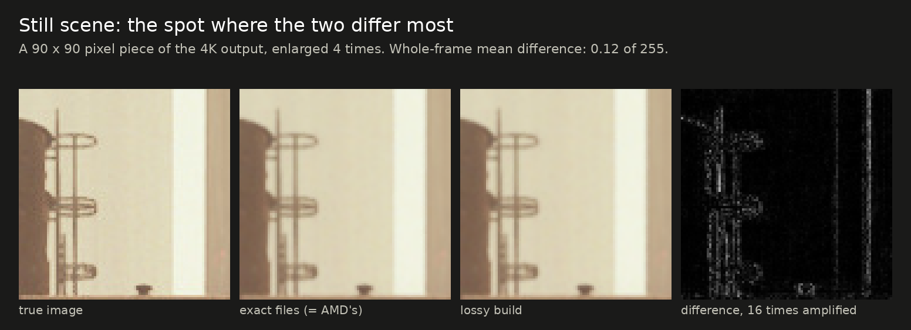
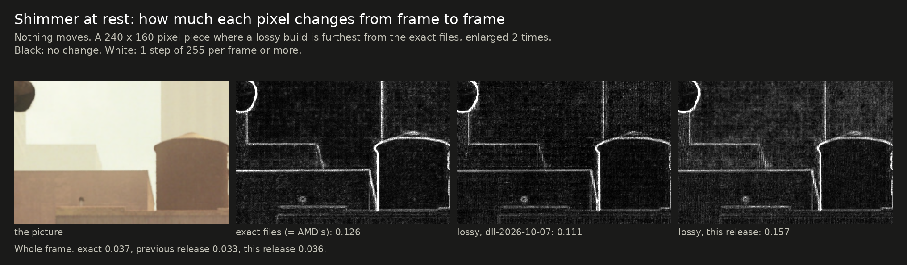

# Exact and lossy builds: how they differ

[Back to the README](../README.md)

This project ships two kinds of faster FSR 4.1.1 shaders. They get their speed in different ways,
and only one of them keeps AMD's picture.

- **The exact files** (the main DLL, the prebuilt Linux folder and the test builds for other
  GPUs) do the same arithmetic as AMD's shaders, organised so the GPU gets through it faster.
  The output is AMD's image, byte for byte.
- **The lossy test builds** (`test-lossy…`) start from the exact files and then do less work:
  they leave out part of the model's arithmetic and run the model on every other frame.

> **The lossy builds change the image.** They are opt-in experiments, not the same as the main
> files and not the same as AMD's DLL.

This page describes the builds of release `dll-2026-10-07`. Earlier lossy releases behaved
differently on skipped frames; their history is on the [frame-skip page](../research/frame-skip).

<picture>
  <source media="(prefers-color-scheme: dark)" srcset="img/exact-vs-lossy-dark.svg">
  
</picture>

The figure is made by [`img/make_exact_vs_lossy.py`](img/make_exact_vs_lossy.py).

## At a glance

| | Exact files | Lossy test builds |
|---|---|---|
| Image | AMD's, byte for byte | close to AMD's, not the same |
| How the time is saved | same work, done more efficiently | less work |
| Upscaler time, Shadow of the Tomb Raider, 4K Balanced (AMD's: 4.16 ms) | 2.99 ms | 2.05 ms |
| Upscaler time, Rise of the Tomb Raider, 4K Balanced (AMD's: 4.29 ms) | 2.97 ms (the previous exact files) | 2.05 ms (an earlier lossy release) |
| Frame times | even | alternate between a shorter and a longer frame |
| Checked how | output compared with AMD's, byte for byte | measured against the true image and against AMD's output |
| Tested on | several GPUs and games ([results](results.md)) | one RDNA3 card by the author (two games, the current release in one, on Linux), testers with earlier releases |
| Files | main DLL, `prebuilt/`, `test-rdna2…`, `test-igpu.zip` | `test-lossy…` only |

All timings on this page are from a Radeon RX 7800 XT on Linux.

## How the exact files get faster

Nothing is removed. Each rewrite computes exactly the values AMD's shader computes and changes
only how the work is laid out for the GPU.

| Part of FSR 4 | What changes | Why it is faster |
|---|---|---|
| Postpass | each thread's pixels are collected and written out in contiguous blocks, one image at a time; its small network rounds and clamps in integers and reads its neighbour cells without branches | AMD's version writes single pixels scattered over three images, which is slow on these GPUs; the rest is fewer instructions per thread |
| Model pass 11 | constants made visible to the compiler; each row's results stored together | fewer registers per thread, so more threads run at once; far fewer separate writes |
| Other model passes | the final scaling and clamping done in integers where that gives the same result | fewer instructions per thread |
| Prepass | each of a quad's four threads finishes one of the four output words | 12 exchanges between threads instead of 32, and the rounding and storing spread over four threads |

Every rewrite is verified by running the whole upscaler and comparing its output with AMD's, byte
for byte, across output sizes, presets and option combinations. A rewrite that differs in a
single byte is not shipped as exact. Details: [how it works](how-it-works.md).

The limit of this approach is the model itself. Its twelve passes are about 60% of FSR 4's time
and are almost pure arithmetic, already running near what the hardware can do. With the work
unchanged there is little left to gain there.

## How the lossy builds get faster

They contain everything the exact files do, plus two changes that give up exactness.

### 1. Less arithmetic in the model (weight folding)

Six of the model passes carry their weights as constants. In each, an output value is a sum of 36
small dot products. The lossy build drops the ones with the smallest weights and adds their
weights to a neighbouring one that is kept, so the sum changes little. It also simplifies how
intermediate values are rounded.

- **How much is dropped** was tuned pass by pass against a moving test scene: 4 of 36 in pass 1,
  18 in passes 5 and 10, 20 in pass 12. One step further in any of them made something visibly
  less steady, and pass 2 tolerates none.
- **What it saves:** about 0.14 ms on a frame that runs the model (measured as 3.05 to 2.91 ms
  before the prepass and postpass were rewritten again on 2026-10-07).
- **What it costs:** the still picture is about 0.6 dB less accurate, and fine repeating patterns
  can be less steady in motion, most at 1440p output.

Details: [the lossy track](../research/lossy).

### 2. The model runs on every other frame (frame skip)

On alternate frames the twelve model passes return immediately, and the postpass reuses the
model's result from the frame before, which is still in memory. The last layers of the network
sit in the postpass; their result is saved by the frame that runs the model and read back on the
skipped frame, so they are not rerun either.

- **What it saves:** about 0.85 ms on average. A skipped frame takes about
  1.2 ms, a normal one about 2.9 ms.
- **What it costs:** the reused result is one frame old, so a skipped frame cannot be trusted to
  mix the new frame in properly. What it does instead is described next.

Details: [frame skip](../research/frame-skip).

### What a skipped frame does instead, and four repairs

All of this acts on skipped frames only. Frames that run the model are not touched.

A skipped frame leans on the history: it shows the previous picture moved along with the scene,
and takes very little from the new frame (the new frame's weight is squared, so a typical 7%
becomes about 0.5%), except where the model had asked for the new frame.

**The reused result follows the picture** (new in release `dll-2026-10-06.6`). The prepass stores
the motion and the nearest depth of each 4x4 block of output pixels. The postpass takes the
model's result for each pixel from where that pixel's content was a frame ago, to the pixel.
Earlier releases reused the result where it was, which made thin things shimmer while the camera
moved.

**Where the picture is at rest, nothing is taken from the new frame** (new in release
`dll-2026-10-07`). "At rest" means the motion stored for the pixel's block is zero and nothing
looked at around it (3 and 8 cells to each side) moves differently. The small share of the new
frame that skipped frames used to mix in was what made fine detail shimmer more than with AMD's
shaders while nothing moved.

Four repairs keep the rest honest:

| Problem with a reused result | Repair in the builds |
|---|---|
| **Shimmer on fine detail.** The reused result was worked out for the previous frame's camera jitter, so it gives too much weight to the new frame in pixels whose nearest sample has moved away. | The previous jitter is carried over to the skipped frame, and the new frame's weight is lowered where its nearest sample is now farther from the pixel. |
| **A dark band at the screen edge** for one frame when the camera starts to turn. The strip that scrolls in has no history, and the reused result still says "mostly history". | Where the history is far darker than the new frame, the new frame is used alone. The band is gone in the test scene. |
| **A smear behind moving objects.** Where something has just been uncovered, the reused result keeps a history that is out of date. | The history is limited to the colour range of the new frame's samples around the pixel. |
| **What is left of that smear.** The colour limit cannot tell an outdated history from a valid one of a similar colour. | New in release `dll-2026-10-06.6`: a pixel whose content was hidden a frame ago behind something nearer that moves differently takes the new frame alone. |

## What the lossy builds cost, measured

Test scene at 4K Balanced. "Lossy" is the release build: folding, frame skip, motion following, the rest rule and the four repairs.

| | AMD's (= exact files) | Folding only | Lossy | Lossy, against AMD's |
|---|---|---|---|---|
| Still picture against the true image | 44.31 dB | 43.71 dB | 43.60 dB | within 1.6%; 9% more error |
| Flicker at rest on fine detail (lower is steadier) | 0.110 | 0.123 | 0.109 | within 1% |
| Moving scene: background | 49.27 dB | 48.67 dB | 48.60 dB | within 1.4%; 8% more error |
| Moving scene: thin railing | 41.82 dB | not measured | 40.75 dB | within 2.6%; 13% more error |
| Moving scene: areas a moving object has just uncovered | 34.48 dB | 34.89 dB | 34.21 dB | within 0.8%; 3% more error |
| Still camera, objects moving: thin railing | 42.20 dB | not measured | 40.60 dB | within 3.8%; 20% more error |
| Still camera, objects moving: just-uncovered areas | 32.62 dB | not measured | 30.85 dB | within 5.4%; 23% more error |
| Revealed strip when a pan starts on a skipped frame | 100% of true brightness | no frame skip | 100% | the same |

"Within x%" compares the quality scores (PSNR, in dB). dB is a logarithmic scale, so the last
column also gives the same gap as error: how much further the picture is from the true image than
AMD's is. The exact files are 100% of AMD's in every row: the same bytes.

- **Fine detail at rest shimmers no more than with AMD's shaders** (0.109 against 0.110). It was
  about 55% more with the first frame-skip build, about 30% up to release 4 and 8% in releases 5
  and 6. The cause was the skipped frames, not the folding: frame skip on the unfolded model
  shimmered just as much.
- **The still picture is about 0.7 dB less accurate:** 0.6 dB from the folding and 0.14 dB from
  the rest rule.
- **Just-uncovered areas are about 0.3 dB less accurate** in the panning scene, and about 1.8 dB
  with the camera still and objects moving. It was about 2.5 dB in
  release 5 and about 5 dB before the history clamp.
- **The moving background is about 0.7 dB less accurate,** nearly all of it from the folding; in
  release 5 frame skip cost a further 1 dB there.
- **Frame times alternate.** With a frame cap or normal V-Sync the average is what counts. With
  low-latency modes or unbuffered V-Sync the longer frames can miss.

## What the difference looks like

Pieces of the test rig's 4K output, exact files against the current lossy build. The exact files
give the same bytes as AMD's shaders, so their panels are also AMD's picture. **These are the
places where the two differ most, enlarged;** over a whole frame the differences are far smaller,
and each caption gives the whole-frame figure. The images are made by
[`img/make_comparison_crops.py`](img/make_comparison_crops.py) from rig output.

**At rest.** The largest difference in a still frame is on thin structures. Over the whole frame
the two differ by 0.14 of 255 on average.

**Shimmer at rest.** How much each pixel changes between consecutive frames when nothing moves.
In this piece, the worst for the lossy build, it changes 0.053 of 255 per frame against 0.040
(release 6: 0.064). Over the whole frame the lossy build changes less than the exact files (0.033
against 0.037), because flat areas are steadier; on fine detail alone the two are level.

**In motion, on a skipped frame.** Camera panning as if at 60 FPS. Thin bars in front of a moving
background are where frame skip is weakest: in the lossy panel the bars are rougher near the
bottom. The edge a moving block has just uncovered is slightly rougher. Whole frame, the error
against the true image is 1.19 of 255 against 1.14.

## Speed side by side

| Benchmark, 4K Balanced, RX 7800 XT | AMD's shaders | Exact files | Lossy |
|---|---|---|---|
| Shadow of the Tomb Raider: upscaler time | 4.16 ms | 2.99 ms (−28%) | 2.05 ms (−51%) |
| Shadow of the Tomb Raider: average FPS | 97 | 109 | 122 |
| Rise of the Tomb Raider: upscaler time | 4.29 ms | 2.97 ms (−31%) | 2.05 ms (−52%) * |
| Rise of the Tomb Raider: overall score | 97.67 FPS | 109.61 FPS | 122.34 FPS * |

\* The Rise of the Tomb Raider lossy run used the lossy build of release `dll-2026-10-06.3`; it
has not been repeated with the current one. In Shadow of the Tomb Raider the current release and
that one ran at nearly the same speed (2.05 and 2.09 ms). The Rise of the Tomb Raider exact figure is also
from before this release's faster prepass and postpass.

The lossy figures are from the Linux files. The Windows DLLs carry
the same shaders (their output is byte-identical to the Linux files' in the test rig, under
Proton); their speed on Windows has not been measured.

On RDNA2 at 1440p output, one tester measured only 1 to 2% from the folding alone; frame skip
has not been timed there.

## Limits of the lossy builds

- **Frame skip depends on the game's camera jitter.** With the usual sequence, frames alternate
  strictly. A game with an unusual sequence may skip unevenly, and a game that passes no jitter
  never skips.
- **Frame skip is off in Ultra Performance** and on frames the game marks as a reset. In Ultra
  Performance the lossy build does very little: that model's own passes are left exact.
- **Frame skip costs more at low real frame rates.** In the moving test scene at a fixed
  on-screen speed, just-uncovered areas are level with AMD's or better at 60 and 120 FPS and about
  2 dB below at 30 and 90, and thin structures 1.2 to 2.3 dB below
  ([by frame rate](../research/frame-skip#by-frame-rate)). The shimmer also
  alternates at half the real frame rate, so it is slower and easier to see (that part is
  reasoning, not a measurement). With frame generation on top of a low base rate, the exact
  build is the safer choice.
- **Thin free-standing things in motion are still the least accurate part** (1.2 to 2.3 dB below
  AMD's, see the image above), but no longer the least steady: bars moving against a different
  background change 1.0 to 1.2 times as much from frame to frame as with AMD's shaders, where
  release 5 was at 1.5 to 2.3 times.
- **A skipped frame trusts the game's motion vectors more than AMD's shaders do.** Where they are
  wrong or missing (some particles, transparent things), the reused result is taken from the
  wrong place, and where they say "not moving" a skipped frame shows no change at all, so
  something that changes without moving (a light, an animated surface) updates on every other
  frame. Not measured; the test rig's motion vectors are exact.
- **Little testing.** The current release was run by the author in one game on one RDNA3 card,
  on Linux; its Windows DLLs were only compared with the Linux files in the test rig, under
  Proton. Earlier lossy releases ran in two games and with a few testers. The edge-band fix has
  not been confirmed in the game it was reported in.

## Which to use

- **Use the exact files** if you want AMD's picture, if you use frame generation at a low base
  frame rate, or if you are unsure. They are the main files of this project.
- **Try a lossy build** if you run at a high real frame rate, want the extra speed, and accept
  a picture that is not AMD's. Look at distant fine detail while standing still and at the edges
  of moving objects; if either bothers you, go back to the exact build.

## Where to read more

- [How the exact rewrites work](how-it-works.md) and [all results](results.md)
- [The lossy track](../research/lossy): folding, rounding, what was tried and rejected
- [Frame skip](../research/frame-skip): the mechanism, each repair, results by frame rate, and what was tried and not shipped
- [GPU support](gpu-support.md): which build is for which GPU
