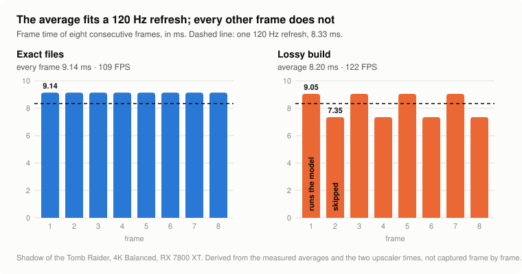

# Lossy builds: what alternating frame times mean in practice

[Back to the README](../README.md) · [Exact and lossy builds compared](exact-vs-lossy.md)

The lossy test builds run FSR 4's model on every other frame. So the upscaler does not take the
same time every frame: it alternates between a long frame and a short one. This page is about
what that does to frame pacing, frame caps, V-Sync, latency and the numbers an overlay shows.

It applies to the `test-lossy…` builds only. The exact files take the same time every frame.

## TL;DR

- **Uncapped, the average is what you get.** FPS counters, benchmarks and the gain over the exact
  files are all about the average, and that is real.
- **With a fixed refresh and no frame queue, plan for the long frame, not the average.** A frame
  rate the average reaches can still miss every other refresh.
- **The size of the swing is fixed in milliseconds,** about 1.7 ms on an RX 7800 XT at 4K. It is
  a small share of a frame at 60 FPS and a large one at 240.
- **Almost none of this page is measured frame by frame.** The two upscaler times and the
  averages are measured; the consequences are worked out from them and marked as such.

## The numbers it starts from

Shadow of the Tomb Raider's benchmark, 4K Balanced, Radeon RX 7800 XT, Linux:

| | Upscaler time | Average FPS |
|---|---|---|
| AMD's shaders | 4.16 ms every frame | 97 |
| Exact files | 2.99 ms every frame | 109 |
| Lossy build, a frame that runs the model | about 2.9 ms | |
| Lossy build, a skipped frame | about 1.2 ms | |
| Lossy build, average | 2.05 ms | 122 |

The rest of a frame (everything that is not FSR 4) is about 6.15 ms in this benchmark with both
builds. So a lossy frame is about 9.05 ms when the model runs and 7.35 ms when it is skipped:
**1.7 ms apart, 8.2 ms on average.** Those two per-frame figures are derived, not captured.

<picture>
  <source media="(prefers-color-scheme: dark)" srcset="img/frame-pacing-dark.svg">
  
</picture>

The figure is made by [`img/make_frame_pacing.py`](img/make_frame_pacing.py).

## How big the swing is at different frame rates

The 1.7 ms does not shrink when the frame rate goes up, because it is the model's time and
nothing else. As a share of the frame it grows:

| Average frame rate | Frame time | Each frame is off the average by |
|---|---|---|
| 30 FPS | 33.3 ms | 2.6% |
| 60 FPS | 16.7 ms | 5% |
| 90 FPS | 11.1 ms | 8% |
| 120 FPS | 8.3 ms | 10% |
| 144 FPS | 6.9 ms | 12% |
| 240 FPS | 4.2 ms | 20% |

This is arithmetic on the 1.7 ms measured on an RX 7800 XT at 4K Balanced. Two things change it:

- **A slower GPU or a larger output makes it bigger.** The swing is the time of the twelve model
  passes, about 60% of the exact files' upscaler time on that card. Where FSR 4 takes twice as
  long, expect about twice the swing. Not measured on other cards.
- **A smaller output makes it smaller,** for the same reason.

## What it means, case by case

**Uncapped, GPU-bound, variable refresh (VRR).** Each frame is shown for as long as it took, so
the display alternates between a slightly longer and a slightly shorter frame. The pattern
repeats every two frames, which is 60 times a second at 120 FPS. Whether that is visible has not
been tested here; the author has not noticed it at about 120 FPS.

**Uncapped, fixed refresh, no V-Sync.** Tearing as usual. The tear line moves in a two-frame
pattern instead of drifting evenly. Not tested.

**A frame cap below what the long frame can do.** Nothing alternates on screen: both kinds of
frame finish in time and the limiter spaces them evenly. The GPU simply idles a little longer
after a skipped frame. In the example above, a cap of 110 FPS or lower is in this case.

**A frame cap, or V-Sync, between the long frame's rate and the average.** This is the case to
understand. In the example the average is 122 FPS, but a frame that runs the model takes
9.05 ms, which is 110 FPS.

- **With a frame queue** (V-Sync with normal buffering, most limiters), a short frame finishes
  early and the next, long one starts early and uses the slack. Two frames take 16.4 ms and two
  120 Hz refreshes are 16.7 ms, so 120 FPS holds. The average is what counts.
- **Without a queue** (low-latency modes that start each frame as late as possible, V-Sync with
  no pre-rendered frames), every frame has to make its own refresh. The long frames miss by
  0.7 ms and the short ones do not. The result is a missed refresh on every other frame, which
  looks worse than a steady lower rate.

**What to do in that case:** cap at or below the long frame's rate (110 FPS in the example),
allow one queued frame, or use the exact files, which need 109 FPS worth of time on every frame
and never alternate.

**A frame cap you cannot reach on average.** The same as with any build: you are GPU-bound, see
the uncapped case.

## What it does to the numbers you read

- **Average FPS and average frame time** are right, and are what the benchmarks on this project
  report.
- **The upscaler time in OptiScaler's overlay flips** between about 1.2 and 2.9 ms from frame to
  frame; its average sits in between. A reading taken on a still screen, such as a benchmark's
  result page, is not typical of a scene in motion.
- **A frame-time graph shows a fine sawtooth.** That is this alternation, not stutter from
  somewhere else.
- **Lows rose with the average in the one benchmark measured.** Shadow of the Tomb Raider reports
  a GPU minimum of 106 FPS and a 95th percentile of 112 with the lossy build (average 127),
  against 96 and 101 with the exact files (average 114). A tool that takes "1% low" from single
  frame times will count the long frames, so expect lows to improve less than the average
  there. That has not been measured.

## Latency

A skipped frame reaches the screen about 1.7 ms sooner after it was started than a frame that
runs the model. So input lag alternates by that much, and averages about 0.9 ms less than with
the exact files. Both are small next to a whole frame, and neither has been measured.

## Frame generation

Not tested. Two things follow from how it works:

- Generated frames are placed between real ones on the assumption that real frames are evenly
  spaced. Here they are not quite, by the percentages in the table above for the **base** frame
  rate.
- Frame skip costs more image quality at a low real frame rate (see
  [the comparison page](exact-vs-lossy.md#limits-of-the-lossy-builds)), and frame generation is
  mostly used on top of a low base rate.

With frame generation on a base rate under about 60 FPS, the exact files are the safer choice.

## Power and heat

With a frame cap, the lossy build does less work per second than the exact files: half the frames
skip about 60% of FSR 4. That should show as lower GPU load at the same frame rate. Not measured.

## When frames do not alternate

- **Ultra Performance:** frame skip is off there, so every frame runs the model.
- **Frames the game marks as a reset** (a camera cut) always run the model.
- **Games with an unusual camera jitter sequence** may skip unevenly, because the build picks
  frames by the sign of the jitter. A game that passes no jitter never skips, and then the lossy
  build is only slightly faster than the exact files.

## Why it cannot be evened out

The obvious idea is to spread the model over two frames, half each. It does not work: the
model's input and its output share the same memory, so a frame cannot start a new run and still
have the last result to show. The time of a frame is either all of the model or none of it.

## Short version of the advice

- **Uncapped or VRR at a high frame rate:** use the lossy build if you accept its picture; the
  alternation is small.
- **V-Sync or a cap with low-latency settings:** set the cap for the long frame, or allow one
  queued frame.
- **Low base frame rate, with or without frame generation:** use the exact files.
- **If you see a regular fine stutter that the exact files do not have:** this is the likely
  cause. Lower the cap a little or switch to the exact files.
