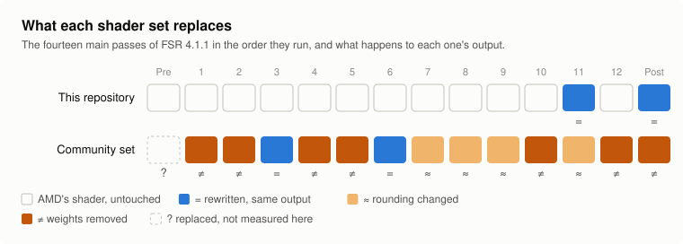
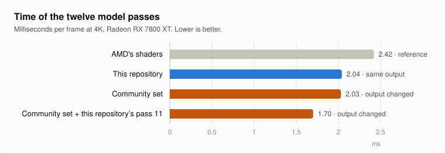
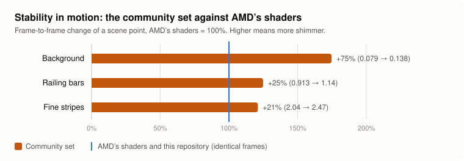

# Testing a community shader set that trades image quality for speed

[Back to the research index](../README.md)

## TL;DR

- A community member's shader set for RDNA2 replaces **all fourteen main passes** of FSR 4.1.1;
  this repository replaces two. Most of its extra speed comes from **removing part of the model's
  weights, which changes the image**.
- **Speed on an RX 7800 XT:** its twelve model passes take 2.03 ms, the same as this repository's
  set (2.04 ms; AMD's take 2.42 ms). Combined with this repository's pass 11 they would take
  1.70 ms, 0.34 ms less than what is shipped (about 0.4 ms with its pruned postpass as well).
- **Quality at rest:** a small loss, 0.7 dB against the true image.
- **Quality in motion:** less stable than AMD's shaders. Frame-to-frame change is 75% higher on
  the background and 20 to 25% higher on thin detail. This repository's shaders stay identical to
  AMD's, frame for frame.
- **Its bit-exact parts gain nothing on RDNA3.** They may on RDNA2, which could not be measured
  here. Its prepass is 12% faster and changes the image only minutely, but it is not bit-exact.
- **Update, 2026-10-07:** the same member sent a later set that keeps AMD's image. It is
  byte-identical to AMD's in every comparison run here, and its prepass and postpass are slightly
  faster than this repository's (about 0.03 ms at 4K on an RX 7800 XT). See
  [the later exact set](#a-later-set-that-keeps-amds-image-2026-10-07).
- **Outcome:** nothing from it goes into the main files. The lossy direction is worth pursuing as
  an opt-in extra, but that needs the set's source and per-pass tuning against the motion test;
  see [what would help](#what-would-help-to-take-this-further).

<picture>
  <source media="(prefers-color-scheme: dark)" srcset="img/what-is-replaced-dark.svg">
  
</picture>

For the community set's postpass, the diagram shows the version that writes exposure, which has
weights removed; its other postpass file only removes branches and gives unchanged output.

## Background

On 2026-10-05 a community member, VALKKKS, shared a fork of this project aimed at RDNA2 under
Linux: a write-up ("v45") and a zip of override files ("v42-b", 17 `.spv` files). Their write-up
reports FSR 4.1.1 going from 3.13 ms to 2.34 ms on a Radeon RX 6700M at 2560x1440. The fork is
not online at the time of writing, so this page records what was tested here, from the files
alone. **None of those files are in this repository,** and nothing from this page is shipped. The figures
are made by [`img/make_figures.py`](img/make_figures.py).

The set replaces the prepass, all twelve model passes and the postpass (this repository replaces
the postpass and model pass 11). It mixes two kinds of change:

- **Bit-exact rewrites:** the always-zero z coordinate folded on every pass, loops unrolled where
  the result stays small, the postpass's nine neighbourhood reads done without branches, and
  integer forms of the rounding code.
- **Changes to the result:** weights removed from six model passes and from the postpass (each
  removed weight is added to a neighbouring one, so sums are preserved), and rounding half up
  instead of half to even.

## Speed and exactness, pass by pass

Radeon RX 7800 XT, standalone benchmark at 4K output, 500 dispatches per pass, the model's real
weights loaded. "Differs" counts output bytes that are not AMD's; it says how widespread the change
is, not how large.

| Pass | AMD | Community set | Output |
|---|---|---|---|
| 1 | 0.292 ms | 0.241 ms | differs (69% of bytes) |
| 2 | 0.292 ms | 0.243 ms | differs (88%) |
| 3 | 0.051 ms | 0.051 ms | identical |
| 4 | 0.140 ms | 0.102 ms | differs (92%) |
| 5 | 0.140 ms | 0.111 ms | differs (89%) |
| 6 | 0.049 ms | 0.045 ms | identical |
| 7 | 0.116 ms | 0.110 ms | differs (3%) |
| 8 | 0.116 ms | 0.109 ms | differs (2%) |
| 9 | 0.177 ms | 0.174 ms | differs (4%) |
| 10 | 0.139 ms | 0.107 ms | differs (85%) |
| 11 | 0.615 ms | 0.565 ms | differs (3%) |
| 12 | 0.293 ms | 0.174 ms | differs (96%) |
| All twelve | 2.42 ms | 2.03 ms | |

<picture>
  <source media="(prefers-color-scheme: dark)" srcset="img/model-pass-time-dark.svg">
  
</picture>

- Only passes 3 and 6 are bit-exact, and together they save 0.004 ms on this card.
- The small differences (passes 7, 8, 9, 11) are the rounding change; the large ones are the
  removed weights.
- Their pass 11 takes 0.565 ms here; this repository's takes 0.23 ms and is exact. With AMD's other
  eleven passes and this repository's pass 11 the total is 2.04 ms, so on an RX 7800 XT the whole
  community set lands where the shipped files already are.
- Their pruned passes with this repository's pass 11 would total about 1.70 ms.

Postpass, 4K:

| File | Community set | This repository | Output |
|---|---|---|---|
| Basic version (`683038df6272d4db`), branches removed | 0.622 ms | 0.601 ms | identical |
| Exposure-writing version (`4d657fb0eed077d6`), weights removed | 0.603 ms | 0.691 ms | differs (about half the pixels) |

Both are built on this repository's phased postpass. The branch removal was also rebuilt here from
the write-up ([`postpass_taps.py`](../postpass-and-prepass/postpass_taps.py)): bit-exact over a
full 4K frame, and 3% slower on the RX 7800 XT (0.617 to 0.622 ms against 0.600 ms). The write-up
reports it 10% faster on the RX 6700M (581 to 525 microseconds at 1440p), so it may be worth having
on RDNA2; that has not been measured here.

Prepass (`5d9ed7b71cbbcfd0`, the version used with inverted depth), 4K, added 2026-10-05:

| | AMD | Community set | Output |
|---|---|---|---|
| Standalone benchmark (constant colour, depth and motion) | 0.495 ms | 0.434 ms (12% less) | identical |
| AMD's whole pipeline, random inputs, 4K and 1440p output | | | differs |
| AMD's whole pipeline, the moving test scene | | | differs: 93% of pixels, 55.8 dB against AMD's frames, single pixels by up to 72 of 255 |

So the prepass is not bit-exact either, although the write-up lists its changes as exact. The
standalone benchmark's inputs are too uniform to show it; varied inputs do. The file has fewer
divisions (18 to 9), fewer float additions and fewer quad swaps than AMD's, which fits shared
reciprocals and regrouped sums: the same value mathematically, not the same bits. In the moving
scene the difference has no measurable effect: 30.51 dB against the true image (AMD's 30.50) and
the same frame-to-frame change to three decimals. It is the mildest of the set's lossy changes,
worth about 0.06 ms at 4K on an RX 7800 XT.

Not tested: the border shaders, which are in the write-up but not in the zip.

## Image quality: still scene

The rig of [`../pruning`](../pruning): 32 frames, Balanced to 4K, no motion, sharpening off, PSNR in
sRGB.

| Shader set | Against AMD's output | Against the true image | Largest pixel error (of 255) |
|---|---|---|---|
| AMD's | | 44.31 dB | |
| This repository's | identical | 44.31 dB | 0 |
| Community set, all files | 56.1 dB | 43.62 dB | 64 |
| Same, with this repository's pass 11 | 56.1 dB | 43.61 dB | 72 |
| Only the six pruned model passes | 55.7 dB | 43.54 dB | 71 |
| Only the pruned postpass | 61.7 dB | 44.19 dB | 41 |
| Only the passes with the rounding change (7, 8, 9, 11) | 67.8 dB | 44.31 dB | 22 |

At rest the set loses about 0.7 dB against the true image, nearly all of it from the pruned model
passes. Compared with the plain pruning tried in [`../pruning`](../pruning) (10% of weights: 0.07 ms
for 0.47 dB), folding the removed weights into their neighbours buys about five times the time for
similar damage.

## Image quality: motion

The moving scene described in [`../pruning`](../pruning#motion-test): a panning background, a
moving block with fine stripes, and a moving railing of 3-pixel bars. "Change" is how much a point
of the scene changes between two consecutive output frames, in 8-bit steps; 0 would be perfectly
stable, and more means shimmer.

| Shader set | Against AMD's frames | Change: background | Change: railing bars | Change: fine stripes |
|---|---|---|---|---|
| AMD's | | 0.079 | 0.913 | 2.04 |
| This repository's | identical | 0.079 | 0.913 | 2.04 |
| Community set, all files | 45.3 dB | 0.138 | 1.140 | 2.47 |
| Same, with this repository's pass 11 | 45.3 dB | 0.137 | 1.144 | 2.47 |
| Only the six pruned model passes | 46.1 dB | 0.072 | 1.068 | 2.43 |
| Only the pruned postpass | 50.2 dB | 0.201 | 1.028 | 1.94 |
| Only the passes with the rounding change | 55.9 dB | 0.080 | 0.915 | 2.04 |

<picture>
  <source media="(prefers-color-scheme: dark)" srcset="img/motion-stability-dark.svg">
  
</picture>

- In motion the set is much further from AMD's output than at rest (45 dB against 56 dB).
- It is less stable: about 75% more frame-to-frame change on the background and 20 to 25% more on
  the railing and the stripes.
- The two pruned parts fail differently. The pruned model passes hurt thin detail and leave the
  background alone; the pruned postpass is what makes the background unstable (2.5 times AMD's
  figure on its own).
- The rounding change is harmless here.
- The error against the true image hardly moves (whole frame 30.5 to 30.2 dB), so an average
  quality figure would not have shown any of this.

This is one synthetic scene at one speed. It ranks shader sets; it does not say how visible the
difference is in a particular game.

## Which passes can be pruned cheaply

Added 2026-10-05. Each of the set's six pruned model passes on its own, then in growing
combinations, in the moving scene. Time saved is on an RX 7800 XT at 4K. AMD's shaders score:
whole frame 30.53 dB against the true image; frame-to-frame change 0.079 (background), 0.106
(block texture), 2.04 (fine stripes), 0.913 (railing bars).

| Pass alone | Time saved | Against AMD's frames | Whole frame vs true image | Change: background | texture | stripes | railing |
|---|---|---|---|---|---|---|---|
| 1 | 0.051 ms | 50.6 dB | 30.89 dB | 0.083 | 0.097 | 1.69 | 0.906 |
| 10 | 0.032 ms | 54.5 dB | 30.53 dB | 0.073 | 0.107 | 2.12 | 0.921 |
| 5 | 0.029 ms | 52.6 dB | 30.38 dB | 0.083 | 0.115 | 2.42 | 0.876 |
| 2 | 0.049 ms | 53.9 dB | 30.46 dB | 0.106 | 0.110 | 2.16 | 0.979 |
| 12 | 0.119 ms | 48.6 dB | 30.58 dB | 0.105 | 0.107 | 1.82 | 1.019 |
| 4 | 0.038 ms | 47.0 dB | 29.78 dB | 0.062 | 0.077 | 2.63 | 1.095 |

| Combination | Time saved | Whole frame vs true image | Change: background | texture | stripes | railing |
|---|---|---|---|---|---|---|
| AMD's shaders | | 30.53 dB | 0.079 | 0.106 | 2.04 | 0.913 |
| Passes 1, 10 | 0.08 ms | 30.90 dB | 0.077 | 0.097 | 1.73 | 0.900 |
| Passes 1, 10, 5 | 0.11 ms | 30.80 dB | 0.075 | 0.102 | 2.00 | 0.890 |
| Passes 1, 10, 5, 12 | 0.23 ms | 30.66 dB | 0.099 | 0.111 | 1.86 | 0.985 |
| Passes 1, 10, 5, 12, 2 | 0.28 ms | 30.64 dB | 0.103 | 0.106 | 2.09 | 1.022 |
| All six | 0.32 ms | 30.23 dB | 0.072 | 0.090 | 2.43 | 1.068 |

- **Passes 1, 10 and 5 can be pruned at the set's fractions without any figure getting worse than
  AMD's in this scene.** Together they save 0.11 ms, 3.6% of FSR 4's time at 4K. The output is
  not AMD's (about 50 dB from it), but nothing measured here says it is worse.
- **Pass 12 is where most of the time is (0.12 ms) and where the background starts to shimmer**
  (25 to 30% more frame-to-frame change). It is the pass to tune: a smaller removed fraction
  might keep most of the gain.
- **Pass 4 is the costliest for what it saves:** it lowers the error-free look of thin detail and
  the whole-frame figure by 0.75 dB for 0.04 ms. It should be left alone or pruned far less.
- These figures come from one synthetic scene. They rank the passes; they are not a promise about
  any game.

## A later set that keeps AMD's image (2026-10-07)

On 2026-10-07 the same community member sent a newer folder ("v80", 14 `.spv` files) with a note
describing it as the fastest set that does **not** change the image. According to the note it was
put together from the member's own run of this repository's [timing kit](../../timing-kit) on
their card at 2560x1440: for each pass, whichever file measured faster. **None of those files are
in this repository.**

**What is in it.** One output-size class only (1440p and 4K output):

| Passes | Whose |
|---|---|
| 1, 2, 4, 5, 10, 11, 12 | this repository's rewrites, lightly edited (fewer repeated reads) |
| 7, 8, 9 | their own |
| Prepass, two versions (`5d9ed7b71cbbcfd0`, `06bf58da86ed7bf9`) | their own |
| Postpass, two versions (`4d657fb0eed077d6`, `000fd316e19e1bfe`) | their own, built on this repository's phased postpass |

**Is it exact?** In everything run here, yes. AMD's whole pipeline with the folder as the
override, last 8 of 40 frames compared with AMD's shaders byte for byte:

| Scene | Output from render size | Option flags 0x0 | 0x8 | 0x28 |
|---|---|---|---|---|
| Still | 2560x1440 from 1707x960 | identical | identical | identical |
| Still | 3840x2160 from 2260x1272 | identical | identical | identical |
| Still | 2560x1440 from 2560x1440 | identical | identical | identical |
| Moving (the test scene, as if at 60 FPS) | 3840x2160 from 2260x1272 | identical | identical | identical |

- Flags 0x8 and 0x28 are the settings that select the set's two prepass versions and, between
  them, both of its postpass versions; a shader dump confirmed that those files were the ones in
  use.
- This matters because the earlier set's prepass looked exact in a standalone benchmark and was
  not (see above). This one is identical in the moving scene, where that one differed in 93% of
  pixels.
- Not checked: other render sizes within the class, other option combinations, and the member's
  note that eight passes of an earlier folder of theirs were exact only for the model's real
  weights (those are not in this folder).

**Is it faster?** A little, in two passes. Radeon RX 7800 XT, this repository's timing kit, each
pair timed in both slot orders (the tool favours its first slot by about 0.02 ms):

| Pass | AMD's | This repository's | The later set |
|---|---|---|---|
| Prepass, 4K | 0.49 ms | 0.445 ms | 0.432 ms |
| Postpass, 4K | 2.20 ms | 0.667 ms | 0.649 ms |
| Passes 7, 8, 9, 4K | 0.135 / 0.134 / 0.181 ms | 0.135 / 0.131 / 0.177 ms | 0.132 / 0.131 / 0.182 ms |
| Passes 1, 2, 12, 4K | 0.300 / 0.299 / 0.299 ms | 0.287 / 0.290 / 0.287 ms | 0.287 / 0.290 / 0.287 ms |
| Pass 11, 4K | 0.61 ms | 0.198 ms | 0.198 ms |
| Prepass, 1440p | 0.214 ms | 0.204 ms | 0.199 ms |
| Postpass, 1440p | 0.85 ms | 0.31 ms | 0.29 to 0.30 ms |

- **Total gain over this repository's files: about 0.03 ms at 4K** (0.013 ms in the prepass,
  0.017 ms in the postpass), roughly 1% of what is left of FSR 4's time. About 0.02 ms at 1440p.
- **Passes 7, 8 and 9 are level** with this repository's on this card. The member's note reports
  them 5 to 6% faster on their card (0.095 against 0.101 ms).
- The member's own figures at 1440p, from their note: 3.41 ms for AMD's shaders, 2.96 ms for this
  repository's, 2.94 ms for their mix.

**How it differs inside** (from the compiled files):

| | AMD's | This repository's | The later set |
|---|---|---|---|
| Prepass: exchanges between neighbouring threads | 32 | 44 | 12 |
| Prepass: memory reads | 130 | 194 | 86 |
| Postpass: memory reads | 121 | 234 | 132 |
| Postpass: branches | 15 | 42 | 33 |

Fewer exchanges in the prepass and a tidier postpass on the same store rewrite. Both ideas were
then rebuilt in this repository's own tools, for every version: the prepass at 0.434 ms and the
postpass at 0.644 ms at 4K, byte-identical to AMD's. See the
[postpass and prepass page](../postpass-and-prepass#two-ideas-from-a-community-set-rebuilt-here-2026-10-07).
They are not in the released files yet; they come with the next release (2.99 ms against
3.05 ms in Shadow of the Tomb Raider with the exact files).

**Limits of the folder.** It holds 14 of the shaders FSR 4.1.1 can use; this repository's prebuilt
folder holds 191. Other output-size classes and option combinations fall back to AMD's shaders for
what is not covered. The member's note reaches the same conclusion as this project about what is
left: with AMD's image unchanged there is little more to gain, and going lower means changing the
image.

## Where this stands

- **Nothing here goes into the main files.** They keep AMD's image byte for byte; the exact parts
  of the community set do not gain on RDNA3, and the rest changes the image.
- **The lossy direction is real, though.** About 0.4 ms on an RX 7800 XT (roughly 13% of the
  upscaler time that is left) for a loss that is small at rest and measurable in motion.

## What would help to take this further

1. **The source.** Only compiled files were shared. The scripts that fold the weights and choose
   which to remove are what could be reviewed, measured per pass and maintained; they are also
   needed to cover the other 47 postpass versions and the Windows DLL. This repository's scripts
   are GPL, and work derived from them is welcome back under the same terms.
2. **Exact and lossy changes as separate files.** With every pass carrying both, the exact gains
   cannot be measured on their own. An exact-only build of each pass would show what is free.
3. **Per-pass limits set by measurement.** The limits were chosen by eye in one game. The motion
   test gives a number to tune against: raise the removed fraction of one pass at a time and keep
   it while the frame-to-frame change stays within a chosen margin of AMD's. On the figures above,
   the postpass pruning is the first thing to drop.
4. **More scenes, and real ones.** One synthetic scene is thin evidence. The best input would be
   frames captured from a game (colour, motion vectors, depth, jitter), which the test program
   could replay.
5. **Numbers from RDNA2.** Everything here was timed on an RX 7800 XT, where the store rewrites
   already take most of the available gain. The set was made for RDNA2: per-pass timings there,
   exact changes separate from lossy ones, are what would show whether an RDNA2-specific build of
   the exact parts (branch removal, size-limited unrolling) is worth shipping.
6. **A clear label if it is ever offered.** A lossy set would have to be opt-in, in its own
   folder, and visibly different, for example through its own version name in the DLL
   (`dll/patch_upscaler_dll.py --name`), so that nobody takes it for the exact one.
