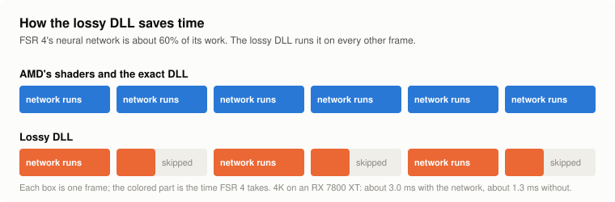
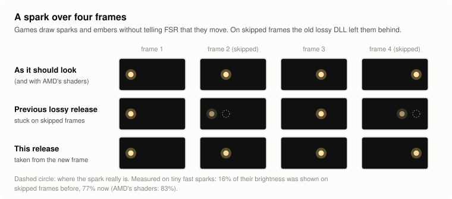

# Frame skip: running the model every other frame

[Back to the research index](../README.md) · [Exact and lossy builds compared](../../docs/exact-vs-lossy.md)

> **This changes the image.** It is part of the opt-in lossy test builds only. Everything in the
> main files still produces AMD's image byte for byte.

## In short

<picture>
  <source media="(prefers-color-scheme: dark)" srcset="../../docs/img/explain-skip-dark.svg">
  
</picture>

- **What it is:** FSR 4 uses a small neural network to decide, for every pixel, how much of the new frame to mix into the
  picture it has built up. That network is more than half of FSR 4's work. The lossy DLL runs it on every other frame only.
- **What happens on the frames in between:** the last answer is reused, moved along with the picture's motion, and the
  picture leans almost entirely on what was already there.
- **What it gains:** about a quarter of the frame rate over AMD's shaders at 4K on an RX 7800 XT (120 against 97 FPS), about
  a tenth over the exact DLL.
- **What it costs:** the picture is no longer exactly AMD's. A still picture is slightly less accurate, strips that a moving
  object has just uncovered are less sharp for a frame, and frame times alternate between a long and a short frame.
- **What this page is:** the full record, release by release, of what went wrong with that idea and how each problem was
  measured and repaired. The newest repair, for [particles](#content-without-motion-vectors-particles-sparks-embers-release-dll-2026-10-09),
  is the one in the current release.

## The details

FSR 4's model, twelve passes, is about 60% of its time. Frame skip runs it on every other frame.
On the frames in between, the postpass uses the model's output from the frame before.

**Since release `dll-2026-10-06.2`** the builds also carry a correction for the shimmer this
causes on fine detail: it roughly halves the extra flicker, at no cost in speed. See
[Reducing the shimmer](#reducing-the-shimmer). **Release `dll-2026-10-06.3`** fixes dark bands
that flashed at the screen edge when the camera started to turn; see
[Dark bands at the screen edge](#dark-bands-at-the-screen-edge-fixed-in-release-dll-2026-10-063).
**Release `dll-2026-10-06.4`** adds a [history clamp](#history-clamp-on-skipped-frames-release-dll-2026-10-064)
that removes most of the smear behind moving objects. **Release `dll-2026-10-06.5`**
[leans on the history](#leaning-on-the-history-on-skipped-frames-release-dll-2026-10-065) on
skipped frames: shimmer at rest close to AMD's and steadier lines in motion, at the same speed.
**Release `dll-2026-10-06.6`** makes the reused result
[follow the picture's motion](#following-the-pictures-motion-release-dll-2026-10-066), gives
just-uncovered pixels the new frame, and no longer reruns the network's last layers on skipped
frames: thin things in motion about as steady as AMD's, slightly faster. **Release `dll-2026-10-07`** takes
[nothing from the new frame at rest](#nothing-from-the-new-frame-at-rest-release-dll-2026-10-07),
which brings shimmer at rest to AMD's level. The tables before the
first of those sections describe frame skip without any of this.

## Result

Shadow of the Tomb Raider's benchmark, 4K Balanced, Radeon RX 7800 XT, Linux launch option:

| | Upscaler time (average) | Average FPS | GPU minimum / 95th percentile |
|---|---|---|---|
| AMD's shaders | 4.16 ms | 97 | |
| Main files (exact) | 3.05 ms | 109 | 95 / 100 FPS |
| Lossy test build | 2.91 ms | 111 | 97 / 102 FPS |
| Lossy with frame skip | 2.09 ms | 122 | 106 / 112 FPS |

That is half of AMD's upscaler time. A skipped frame's upscaler time reads 1.26 ms, a normal one
about 2.9 ms. No difference from the lossy build was visible in that run.
(That run used the first version of the change, which decided and marked skipped frames the
same way but had no reset or render-size check.) With the shimmer correction the same benchmark
reads the same: 2.09 ms, 122 FPS.

## What it costs

Still scene and moving scene at 4K Balanced, as on the [lossy page](../lossy):

| | AMD's | Lossy | Lossy with frame skip |
|---|---|---|---|
| Still scene against the true image | 44.31 dB | 43.71 dB | 43.75 dB |
| Moving scene: background | 49.27 dB | 48.67 dB | 47.46 dB |
| railing | 41.82 dB | 41.73 dB | 40.27 dB |
| areas a moving object has just uncovered | 34.48 dB | 34.89 dB | 30.09 dB |
| Frame-to-frame change: background | 0.079 | 0.079 | 0.091 |
| fine stripes | 2.04 | 1.95 | 2.51 |
| railing bars | 0.913 | 0.948 | 0.823 |

- **At rest the final picture is as accurate, but fine detail flickers more** (next table). The
  table above compares one finished frame with the true image, which does not show flicker; an
  earlier version of this page concluded from it that a still picture costs nothing. A tester
  then reported shimmer on distant objects, and measuring frame-to-frame change confirmed it.
- **In motion the loss is where the picture changed since the frame before:** areas just uncovered
  by a moving object are 4 dB less accurate, the background about 1 dB. The model's output is one
  frame old there.

**Flicker at rest.** A completely still scene; how much two consecutive output frames differ, in
8-bit steps (0 would be a perfectly steady picture). "Fine detail" is the tenth of the pixels with
the strongest edges, "flat" the half with the weakest.

| Output, preset | | All | Fine detail | Flat areas |
|---|---|---|---|---|
| 4K Balanced | AMD's | 0.037 | 0.110 | 0.020 |
| | exact files with frame skip | 0.053 | 0.176 (+60%) | 0.025 |
| | lossy, no frame skip | 0.034 | 0.123 (+12%) | 0.015 |
| | lossy with frame skip | 0.047 | 0.172 (+56%) | 0.018 |
| 1440p Balanced | AMD's | 0.042 | 0.130 | 0.022 |
| | exact files with frame skip | 0.060 | 0.206 (+58%) | 0.028 |
| | lossy, no frame skip | 0.046 | 0.162 (+25%) | 0.021 |
| | lossy with frame skip | 0.053 | 0.202 (+55%) | 0.022 |
| 1440p Quality | AMD's | 0.035 | 0.117 | 0.017 |
| | lossy with frame skip | 0.046 | 0.170 (+45%) | 0.019 |

- **Frame skip makes fine detail about 55 to 60% less steady at rest,** with or without the
  weight folding. Flat areas hardly change. Distant objects are fine detail: this is the shimmer
  that was reported.
- **Why:** the model's result depends on where the frame's jitter put the samples. On a skipped
  frame the postpass uses a result worked out for the previous frame's jitter, so on edges and
  thin features every second frame is combined slightly wrongly, and the picture alternates
  between two states.

Still scene at other sizes and presets (against the true image, dB):

| Output, preset | AMD's | Lossy | Lossy with frame skip |
|---|---|---|---|
| 4K Quality | 44.47 | 44.07 | 44.11 |
| 4K Performance | 43.90 | 43.23 | 42.77 |
| 4K Ultra Performance | 41.38 | 41.39 | 41.39 (frame skip is off there) |
| 1440p Balanced | 42.86 | 42.41 | 42.30 |
| 1080p Quality | 42.61 | 42.34 | 42.28 |
| 1080p native | 43.13 | 43.15 | 43.23 |
| 5K Quality | 47.73 | 47.28 | 47.34 |

## Reducing the shimmer

**Shifting the reused result does not work.** The first idea was to read the model's result
displaced by the jitter difference between the two frames. Tried in whole cells (2x2 output
pixels, the granularity the postpass reads at), in both directions, it made fine-detail flicker
far worse: 0.176 became 0.44 to 0.49. The model's result is tied to the picture's content, and
moving it misaligns it.

**Jitter mismatch is the cause, though.** A test rule that skips only frames whose jitter equals
that of the frame before, run with a jitter list that repeats every entry, gave 0.124 against
AMD's 0.110 with the same list: nearly all of the extra flicker was gone.

**Where it enters.** For each output pixel the postpass

- resamples the current frame from nine render pixels around it, with a kernel whose shape comes
  from the model and whose position uses the current frame's jitter (so that part is right on a
  skipped frame too);
- mixes `a x history + (1 - a) x resampled`, with `a` from the model.

On a skipped frame `a` is the one worked out for the frame before, whose samples fell elsewhere.
A pixel that had a sample on it then, and so a low `a`, takes as much of the new frame now, when
its nearest sample is farther away and the resampled color is less reliable.

**The correction.** On a skipped frame, with Dn and Dp the squared distance (in render pixels)
from the pixel to its nearest sample now and in the frame the model last ran for:

`(1 - a)` is multiplied by `1 - a x (1 - min(1, 2^(32 x (Dp - Dn))))`

- Where the nearest sample is as close as before or closer, nothing changes.
- Where it is farther, the new frame counts for less.
- The factor `a` leaves the model's decision alone where it wants little history, which is where
  a moving object has just uncovered something. Without it those areas lost another 2 dB.
- Frames that run the model are not touched: their values pass through bit for bit.

It is a damping rule, not a reconstruction of what the model would have said: AMD's own `a`
depends only weakly on the sample distance (its `1 - a` falls by about a third from the nearest
to the farthest sample).

**Result,** lossy build, same scenes as above:

| 4K Balanced | AMD's | Frame skip | Frame skip with the correction |
|---|---|---|---|
| Frame-to-frame change at rest, fine detail | 0.110 | 0.172 (+56%) | 0.145 (+32%) |
| Still scene against the true image | 44.31 dB | 43.75 dB | 44.04 dB |
| Moving scene: background | 49.27 dB | 47.46 dB | 47.80 dB |
| railing | 41.82 dB | 40.27 dB | 40.16 dB |
| areas a moving object has just uncovered | 34.48 dB | 30.09 dB | 29.17 dB |
| Frame-to-frame change in motion: background | 0.079 | 0.091 | 0.080 |
| fine stripes | 2.04 | 2.51 | 2.16 |
| railing bars | 0.913 | 0.823 | 0.746 |

Fine-detail change at rest at other sizes and presets:

| Output, preset | AMD's | Frame skip | With the correction |
|---|---|---|---|
| 4K Quality | 0.094 | 0.143 | 0.125 |
| 4K Performance | 0.115 | 0.188 | 0.143 |
| 1440p Balanced | 0.130 | 0.202 | 0.169 |
| 1440p Quality | 0.117 | 0.170 | 0.148 |
| 1080p Quality | 0.127 | 0.176 | 0.153 |
| 1080p Balanced | 0.139 | 0.213 | 0.176 |
| 5K Quality | 0.079 | 0.131 | 0.112 |

- **About half of the extra flicker is gone, not all of it.** The picture is also more accurate
  at rest and steadier in motion.
- **It costs about 1 dB in just-uncovered areas.**
- **Stronger settings exist:** a further constant factor of 0.5 on skipped frames reaches 0.133
  at 4K Balanced but loses another 1 dB in just-uncovered areas and on the railing. Taking
  nothing from the new frame on skipped frames reaches 0.108, below AMD's, and loses 5 dB there.
- **It costs no measurable time:** the postpass is 0.005 to 0.02 ms longer at 4K on an RX 7800 XT.

**Getting the previous jitter to the postpass.** The frame's constants hold only the current
jitter, the postpass cannot write to the working buffer, and the model passes do not see the
frame's constants at all. The working buffer has no spare cell either: at the largest size of a
class every cell is a tensor value or a border cell that a later pass reads as zero. So the
jitter travels in three steps on a frame that runs the model:

1. The prepass writes it into a cell near the end of the buffer, which nothing touches until
   pass 11 writes its output there.
2. The first thread of pass 11 copies it to the buffer's first cell: a corner border cell that
   no pass reads, and that the border clearing zeroes again afterwards.
3. The first thread of pass 12 copies it next to the mark. Pass 12 reads only pass 11's output,
   and nothing writes there again until pass 1 of the next frame that runs.

Two places that looked free were not: the cell next to the mark is part of pass 11's input while
pass 11 runs, and the lower part of the first region is part of the model's output that the
postpass reads. Both mistakes showed up as Ultra Performance output no longer matching bit for
bit. With the published postpasses in place, the carry-over alone changes no byte of output in
the six size and preset combinations tested.

## Dark bands at the screen edge (fixed in release `dll-2026-10-06.3`)

A tester saw black bars flash at the edges of the screen while turning the camera, with the lossy
builds and not with the exact one. Their video showed a band about 21 pixels wide on one edge for
a single frame.

**Cause.** When the camera starts to turn, a strip scrolls in at one edge that has no history: it
reprojects from outside the screen and reads as nearly black. On a frame that runs the model, the
model says "take the new frame" there. On a skipped frame the reused result is the one of the
frame before, when the camera was still, and says "mostly history": mostly black history plus a
few percent of the new frame is a dark band.

A pan that is already under way does not show it. The reused result then still has a
"take the new frame" strip at the edge, as wide as the new one, because the pan step has not
changed. That is why the moving test scene, which pans at a constant speed, never showed it, at
4 or at 20 pixels per frame. It takes a pan that starts, speeds up or changes direction on a
skipped frame.

**Reproduced** with a camera that is still for 35 frames and then moves 20 pixels sideways and 8
vertically per frame, starting on a skipped frame. Brightness of the newly revealed strips on
that frame, against the true image:

| | Side strip | Top or bottom strip |
|---|---|---|
| AMD's shaders | 100% | 99% |
| Lossy builds of releases `dll-2026-10-06` and `.2` | 10% | 17% |
| With the guard | 100% | 100% |

The same in the opposite direction and at 4K Balanced, 4K Quality, 1440p Quality and 1080p Quality.

**The guard.** On a skipped frame, where the history is at most a tenth of the resampled new
frame in every color channel, the postpass outputs the new frame alone.

- Testing for exactly black history does nothing: the off-screen history is not exactly zero.
- A limit of a tenth leaves everything else as it was: flicker at rest is unchanged at the three
  sizes compared, and the moving scene's figures are the same (just-uncovered areas 29.23 dB
  against 29.17). A limit of a half made the still picture 0.3 dB less accurate and fine
  stripes 6% less steady.
- Ultra Performance output is identical to the release before, and the Windows DLLs still match
  the Linux folder byte for byte in the 20 combinations compared.

Verified in the test rig; the game the report came from is Final Fantasy VII Rebirth through
OptiScaler.

## History clamp on skipped frames (release `dll-2026-10-06.4`)

The largest remaining cost of frame skip was in places where the picture has changed since the
model last ran: behind a moving object the reused result still says "keep the history", and the
history there is out of date.

**The clamp.** The postpass already has the nine samples of the new frame around each output
pixel. On a skipped frame the history is limited, per color channel, to the range of those nine
samples, widened by half the range on either side. A history value that no longer fits the new
frame is pulled to a plausible color before it is mixed in. This is neighborhood clamping as
ordinary temporal anti-aliasing does it, applied only on the frames the model did not run for.

| Range widened by | Flicker at rest, fine detail | Still picture | Just-uncovered at 60 FPS, against AMD's |
|---|---|---|---|
| no clamp (release 3) | 0.145 | 44.05 dB | −5.7 dB |
| nothing (tight) | 0.158 | 43.42 dB | −0.8 dB |
| half the range (used) | 0.146 | 43.99 dB | −0.9 dB |
| the whole range | 0.145 | 44.02 dB | −1.0 dB |

A tight clamp costs at rest, as expected: a correct history value can lie outside the range of
the nearest samples. Widening the range removes that cost and keeps nearly all of the gain.

**Result** in the first moving scene (4K Balanced): just-uncovered areas 29.23 → 33.13 dB
(AMD's 34.48), everything else within 0.1 dB or 1% of release 3. By frame rate, see the next
section. Ultra Performance output is identical to release 3, and the pan-start test still gives
100%.

**No cost on frames that run the model.** The shimmer correction, the clamp and the edge guard
now sit in one branch per output pixel that is taken on skipped frames only (the condition is
the same for the whole dispatch). Postpass time at 4K on a frame that runs the model: 0.681 ms
against 0.678 ms for release 3; without the branch the clamp cost 0.05 ms on every frame. The
branched form gives byte-identical output to the unbranched one in the 12 combinations compared.

**A build mistake worth recording.** The first clamp build covered only 36 of the 48 postpass
versions: the 12 that handle color without the tone curve did not match the pattern the tool
looked for, and the build script carried on, leaving them with no correction at all. The
DLL-against-Linux comparison still passed, because both sides were missing the same thing. The
tool now finds the samples from the weighted sum itself, and the build stops if any version
fails. The moving-scene figures here are from the tone-curve family; the other 12 versions build
and match between DLL and Linux, but their motion figures were not measured.

## Leaning on the history on skipped frames (release `dll-2026-10-06.5`)

Up to release 4 a skipped frame mixed the new frame in with the weight the model had chosen for
the frame before, corrected for where the samples fall. That weight is still one frame old, and
in motion it sits where the picture used to be: straight lines shimmered while the camera moved.

**The change.** On a skipped frame the new frame's weight `(1 - a)` becomes `(1 - a)^2`. Where the
model keeps history (a typical `a` of 0.93 at rest) the new frame's share drops from 7% to about
0.5%, so the frame is almost entirely the reprojected history, kept honest by the clamp and the
edge guard. Where the model had asked for the new frame (`a` near 0, just-uncovered areas) it
still gets it. In the tool this is `SB_CONST=0`, now the default.

| 4K Balanced | AMD's | Release 4 | Release 5 |
|---|---|---|---|
| Flicker at rest, fine detail | 0.110 | 0.146 (+33%) | 0.119 (+8%) |
| Still picture against the true image | 44.31 dB | 43.98 dB | 43.74 dB |
| First moving scene: fine stripes, frame-to-frame change | 2.04 | 2.16 | 1.66 |
| background, frame-to-frame change | 0.079 | 0.079 | 0.065 |
| background | 49.27 dB | 47.80 dB | 47.68 dB |
| railing | 41.82 dB | 40.26 dB | 39.84 dB |
| just-uncovered areas | 34.48 dB | 33.13 dB | 32.04 dB |

By frame rate (the scene of the next section), against AMD's:

| As if at | Fine stripes, change: release 4 | Release 5 | Just-uncovered: release 4 | Release 5 | Railing, change: release 4 | Release 5 |
|---|---|---|---|---|---|---|
| 30 FPS | 1.36 times | 1.13 times | −4.9 dB | −5.3 dB | 2.34 times | 2.32 times |
| 60 FPS | 1.25 times | 1.02 times | −0.9 dB | −0.9 dB | 1.58 times | 1.55 times |
| 90 FPS | 1.28 times | 1.09 times | −4.3 dB | −4.8 dB | 1.75 times | 1.73 times |
| 120 FPS | 1.01 times | 0.77 times | +1.0 dB | +0.5 dB | 1.68 times | 1.64 times |

- **Shimmer at rest is close to AMD's,** and lines that are part of a surface are steadier in
  motion than with release 4, at every frame rate.
- **It costs** about 0.2 dB in the still picture (the picture converges on half as many new
  samples) and up to 1 dB in just-uncovered areas.
- **It does not help thin free-standing things** moving against a different background: the
  railing flickers as before.
- **Speed is the same:** Shadow of the Tomb Raider benchmark, 4K Balanced, RX 7800 XT: 122 FPS
  and 2.11 ms, against 122 FPS and 2.09 ms for release 4.
- At 1440p Quality the flicker at rest is 0.124 against AMD's 0.117 (release 4: 0.148).
- **A tester's report** (a third-person game at native 1440p with XeSS inputs, RX 7800 XT,
  Linux): with release 4's lossy build a translucent second copy of the character appeared
  beside him while the camera orbited; with release 5 that is "improved significantly". The
  test rig did not reproduce the ghost with either release (an object fixed on screen with the
  background panning behind it, at native resolution, 12 and 60 pixels per frame), so this rests
  on the report alone.

### Checked and left alone: what skipped frames write into the model's memory

Besides the picture, the postpass writes four values per pixel that the model reads back on the
next frame. On a skipped frame they are worked out again from the reused result, at the old
screen positions. Does that hurt the frames that do run the model? Measured separately for
frames that ran and frames that were skipped (4K Balanced; error is the mean difference from the
true image, of 255):

| | Moving scene (60 FPS step): ran | skipped | Still scene: ran | Flicker at rest |
|---|---|---|---|---|
| Exact files (= AMD's) | 1.140 | 1.142 | 44.33 dB | 0.110 |
| Folding only, no frame skip | 1.204 | 1.207 | 43.71 dB | 0.123 |
| Release 5 | 1.223 | 1.239 | 43.77 dB | 0.119 |
| Probe: constant 0.5 written on skipped frames | 1.224 | 1.238 | 42.51 dB | 0.556 |
| Probe: constant 0 written on skipped frames | 1.343 | 1.370 | 40.52 dB | 2.040 |

- **Most of the lossy build's distance from AMD's on full frames is the weight folding,** not
  frame skip: folding alone is 5.6% further off in motion, release 5 is 7.3%.
- **At rest the memory matters a great deal** (a constant there costs 1.3 to 3.8 dB and
  multiplies the flicker), and there the values a skipped frame writes are exactly right: nothing
  has moved, so they are the previous frame's values in the right place.
- **In motion it hardly matters what is written:** a neutral constant gives the same error as
  release 5's values (1.224 against 1.223). So moving those values along with the picture, which
  is what they lack on a skipped frame, has nothing to gain.

Nothing was changed.

## Following the picture's motion (release `dll-2026-10-06.6`)

The line shimmer in motion came from the reused result sitting where the picture was a frame ago.
The direct fix is to fetch it from where each pixel's content was. Three things had to be solved.

**1. It has to be exact to the pixel.**

- **Displaced by whole cells** (2x2 output pixels): where the motion is a whole number of cells,
  thin lines become as steady as AMD's (railing at the 60 FPS step: 1.58 → 1.01 times). Where it
  is an odd number of pixels, fine lines get about twice as unsteady as before (stripes
  2.16 → 4.39). One pixel off is worse than several: the model's edge decisions land beside the
  edge instead of on a flat area, where they do no harm.
- **Pixel-exact:** the model's result is one packed vector per cell, and each of the four pixel
  positions in a cell has its own last layer. A pixel whose content was an odd distance away
  needs the vector of another cell and the layer of the other position. So each position's code
  keeps its layer, is handed the vector of the cell that holds that position of the displaced
  picture, and writes the pixel this content lands on.

**2. Where the motion comes from.** On skipped frames the prepass stores, for each 4x4 block of
output pixels, the displacement it already works out for its own reprojection and the nearest
depth of its own search around the pixel (two words; about 0.02 ms). They go into the second
region of the working buffer, which nothing uses while the model is skipped. About a quarter of
the prepass versions have no depth search; those store no depth and nothing is ever flagged.

**3. The cost.** The part of the postpass that turns the model's output into a cell's vector (a
3x3 convolution and two 1x1 layers) costs about 0.37 ms per evaluation at 4K, and odd motion
needs up to four cells per thread. A first version that reran it cost 0.07 to 0.27 ms per frame
in the game, depending on how much moved (118 against 122 FPS in one run).

| Postpass at 4K, RX 7800 XT, benchmark tool | Release 5 | Rerunning the layers | Release 6 |
|---|---|---|---|
| Skipped frame, even motion | 0.72 ms | 0.73 ms | 0.51 ms |
| Skipped frame, odd motion on one axis | 0.72 ms | 1.04 ms | 0.51 ms |
| Skipped frame, odd motion on both axes | 0.72 ms | 1.66 ms | 0.51 ms |
| Frame that runs the model | 0.67 ms | 0.70 ms | 0.71 ms |

Those layers depend only on the model's output, and a skipped frame leaves that unchanged. So the
frame that runs the model keeps every cell's vector (four words, in the half of the working
buffer that holds pass 11's output, which nothing reads between pass 12 and the next run of the
model), and the skipped frame reads vectors back instead of working them out, however many cells
it needs.

- FSR's border-clearing shaders still run on a skipped frame and zero some lines of cells in that
  memory. The vectors are kept xored with a pattern, so a zero word means "cleared", and such a
  cell is worked out as before. In the test rig this is rare; it has not been counted exactly.
- The skipped-frame figures in the table are from a forced probe in which no cell needs working
  out again.
- Splitting the work so that only a few threads run the layers twice does not help: a wave of 64
  threads covers a strip as wide as the whole workgroup, so every wave pays (1.27 ms in a trial).
- Under vkd3d-proton the postpass sees the working buffer as read-only; the tool removes that
  declaration. In the DLL's own shaders it is bound for reading and writing already.

**Just-uncovered pixels.** A cell is flagged when something nearer, moving differently, was in
front of its content a frame ago: the surface now at the cell's position shifted by the difference
of the two motions (and at points 8 cells to each side) moves differently from the cell and is in
front of it. Flagged pixels take the new frame alone. The candidates' motion is read first; the
rest of the test runs in a branch taken only where one of them differs.

**Measured**, 4K Balanced, against AMD's shaders, the scene at a fixed on-screen speed:

| As if at | 30 FPS | 60 FPS | 90 FPS | 120 FPS |
|---|---|---|---|---|
| Thin railing, frame-to-frame change: release 5 | 2.32 times | 1.55 times | 1.73 times | 1.64 times |
| Thin railing, frame-to-frame change: release 6 | 1.16 times | 1.04 times | 0.99 times | 1.14 times |
| Thin railing, accuracy: release 6 | −2.2 dB | −1.2 dB | −2.3 dB | −1.2 dB |
| Just-uncovered areas: release 5 | −5.3 dB | −0.9 dB | −4.8 dB | +0.5 dB |
| Just-uncovered areas: release 6 | −2.2 dB | +0.4 dB | −1.6 dB | +2.2 dB |
| Background: release 5 | −1.1 dB | −1.7 dB | −0.9 dB | −1.4 dB |
| Background: release 6 | −0.8 dB | −1.1 dB | −0.6 dB | −0.9 dB |

| First moving scene (odd motion) | AMD's | Release 5 | Release 6 |
|---|---|---|---|
| Background | 49.27 dB | 47.68 dB | 48.60 dB |
| Thin railing | 41.82 dB | 39.84 dB | 40.73 dB |
| Just-uncovered areas | 34.48 dB | 32.04 dB | 33.96 dB |
| Fine stripes, frame-to-frame change | 2.04 | 1.66 | 0.95 |
| Thin railing, frame-to-frame change | 0.91 | 0.66 | 1.02 |

- The last row is the one figure that gets worse: release 5 happened to hold the railing steadier
  than AMD's in that scene.
- The flag alone, without motion following, does better behind moving objects at 30 and 90 FPS
  (−0.8 and +0.3 dB): motion following pulls the other way there.
- At rest nothing changes: still scenes are byte-identical to release 5 at five output and render
  sizes, including Ultra Performance.
- The pan-start test (the dark edge band) still passes.

**In the game** (Shadow of the Tomb Raider, 4K Balanced, RX 7800 XT, Linux files, one run each):
2.06 ms and 18893 frames, against 2.11 ms and 18850 with release 5; 122 FPS both. The overlay's
upscaler time on the benchmark's result screen is taken on a still menu and hides anything that
depends on motion; the frame count is the better figure for a change like this.

**The DLLs.** `motionpost_dxil.py`, `frameskip_dxil.py` and `skipblend_dxil.py` do the same in the
DLL's shaders. The four lossy DLLs give byte-identical output to the Linux files in the test rig:
the moving scene at two speeds and still scenes at five sizes with two option sets. They were run
under Proton only, and their speed on Windows has not been measured.

**Limits.** The reused result now depends on the game's motion vectors on skipped frames. Where
they are wrong or missing, it is taken from the wrong place; the test rig's motion vectors are
exact, so this is not measured. The motion is stored in whole output pixels, one value per 4x4
block.

## Nothing from the new frame at rest (release `dll-2026-10-07`)

Release 6 still shimmered about 8% more than AMD's shaders at rest (0.119 against 0.110 on fine
detail). What was tried, 4K Balanced:

| On skipped frames | Shimmer at rest | Note |
|---|---|---|
| Release 6 | 0.119 | |
| Release 6 on the unfolded model | 0.121 | so the folding is not the cause; still picture 44.03 dB instead of 43.74, about 0.07 ms slower |
| No history clamp, or a wider one; no edge guard | 0.119 | no part in it |
| The new frame's weight cut less (multiplied by 1 − a² instead of 1 − a) | 0.128 | worse |
| A quarter of the new frame's weight everywhere | 0.117 | |
| Nothing from the new frame, everywhere | 0.109 | 1.5 to 5 dB lost behind moving objects and on thin things in motion |
| Nothing from the new frame where the block's stored motion is zero | 0.109 | motion as release 6 when the camera pans; 0.7 dB lost on the railing with the camera still and objects moving |
| The same, and only where nothing 3 or 8 cells to each side moves differently | 0.109 | no loss in either moving scene |

The last row is the release (`SB_REST`, on by default in `skipblend.py`; `SB_REST=0
SB_UNCOV_OFFS=8` rebuilds release 6's files). It reuses the motion that the uncovered-pixel test already
reads, so it adds four reads per thread and one comparison per pixel on skipped frames.

| Test rig, 4K Balanced | AMD's | Release 6 | `dll-2026-10-07` |
|---|---|---|---|
| Shimmer at rest on fine detail | 0.110 | 0.119 | 0.109 |
| Still picture | 44.31 dB | 43.74 dB | 43.60 dB |
| Panning scene: background | 49.27 dB | 48.60 dB | 48.60 dB |
| Panning scene: thin railing | 41.82 dB | 40.73 dB | 40.75 dB (41.12 with the record below) |
| Panning scene: just-uncovered areas | 34.48 dB | 33.96 dB | 34.21 dB (36.56 with the record below) |
| Still camera, moving objects: background | 46.36 dB | 45.76 dB | 45.68 dB |
| Still camera, moving objects: thin railing | 42.20 dB | 40.60 dB | 40.60 dB |
| Still camera, moving objects: just-uncovered areas | 32.62 dB | 30.77 dB | 30.85 dB |

- By frame rate (30, 60, 90 and 120 FPS) every figure is within 0.1 dB of release 6 or better.
- Postpass time in the benchmark tool is the same as release 6's on both kinds of frame. In the
  game: 2.07 ms and 18874 frames, against 2.06 ms and 18893 (one run each, within run-to-run
  difference). With the release's new prepass and postpass underneath: 2.05 ms and 18953 frames;
  with the record of the next section as well: 2.05 ms and 18879 frames.
- The four lossy DLLs give byte-identical output to the Linux files in the test rig (panning and
  still-camera moving scenes, still scenes in 20 combinations), under Proton only.
- Limit: where the motion vectors say "not moving", a skipped frame shows no change at all, so
  something that changes without moving updates on every other frame.

## Who was here a frame ago (release `dll-2026-10-07`)

**The report.** In a third-person game, with the camera turning fast around the character, a
second image showed a little way off the character: a pale outline of a shoulder, or a broken
copy of a rifle barrel. First reported by a tester, then recorded by the author.

**The cause.** A pixel that a foreground object has just uncovered must take the new frame,
because its history still shows the object. Release 6 tested for that by looking where the
pixel's content was a frame ago (p + D_p) and asking whether a nearer, differently moving
surface is there now. That holds only while the object does not itself move on screen. When it
does, it is not at that spot but up to its own motion away from it, so a band as wide as the
object's motion kept its stale history: a second outline, separated from the object by the
background's motion. Anything thinner than that band was missed whole. (An earlier attempt to
reproduce a tester's report failed for the same reason: the test object was fixed on screen.)

**The fix.** The prepass, on a skipped frame, has every 4x4 block write its nearness and its own
block number into the blocks it occupied a frame ago, with an atomic maximum, so that of several
surfaces the nearest one stays. The postpass reads that record at p + D_p. If the surface found
there is another one (its motion differs by 2 pixels or more) and nearer, the pixel takes the
new frame alone.

- The record is one word per block, in the rows of the working buffer that already hold the
  motion entries. The frame that runs the model clears it (the postpass, after the model is done).
- Nearness is 1 − depth, or the depth itself with reversed depth, so that its steps are fine far
  away; it is cut to 10 to 14 bits depending on the output-size class. The exact depths for the
  final comparison come from the motion entries.
- Prepass versions without a depth search record nothing, and nothing is flagged there, as before.
- `frameskip_layout.py` holds the layout; `SB_PLANE=0`, `FS_PLANE=0` and `MP_PLANE=0` rebuild the
  earlier behavior.

**Measured.** [`ghost.py`](../pruning) in the test rig: the error against the true image, on
skipped frames, where the object's image of a frame ago would land if the history were shown
unchanged. "Outline" is the part of that area the earlier test could not see; "bars" is where the
thin railing bars' old image lands. 8-bit steps, 4K Balanced.

| Camera / objects (pixels per frame) | Area | AMD's | Release 6 | With probes around the spot | This release |
|---|---|---|---|---|---|
| 40,0 / 6,0 | outline | 0.50 | 1.44 | 0.61 | 0.48 |
| 40,0 / 6,0 | bars | 0.33 | 1.32 | 0.45 | 0.38 |
| 40,0 / 14,0 | outline | 0.75 | 3.75 | 0.91 | 0.77 |
| 40,0 / 14,0 | bars | 0.55 | 1.57 | 1.18 | 0.67 |
| 40,0 / −10,4 | bars | 0.57 | 1.74 | 1.16 | 0.66 |
| 30,12 / 3,−5 | outline | 0.54 | 1.14 | 0.85 | 0.53 |
| 30,12 / 3,−5 | bars | 0.54 | 1.70 | 1.30 | 0.58 |
| still camera / 20,0 | outline | 1.39 | 2.62 | 2.62 | 1.34 |
| still camera / 20,0 | bars | 0.65 | 4.34 | 4.34 | 0.73 |
| 12,6 / −6,6 | bars | 0.77 | 1.99 | 2.12 | 0.86 |

- "With probes around the spot" was a first fix (more guesses near p + D_p). It removed the
  ghost in the reported case and nothing with a still camera, so it was not kept.
- **Other figures:** just-uncovered areas in the first moving scene 36.56 dB (34.21 before, AMD's
  34.48), railing 41.12 dB (40.75). By frame rate everything is equal or better, except the
  railing's frame-to-frame change against AMD's at 60 and 120 FPS: 1.16 and 1.29 times (1.03 and
  1.15 before). More pixels near thin things take the new frame alone, which is less steady.
- **At rest nothing changes:** still scenes are byte-identical at three sizes.
- **Speed:** prepass and postpass on a frame that runs the model take the same time in the
  benchmark tool. In the game: 2.05 ms and 18879 frames (2.05 ms and 18953 without the record;
  one run each).
- The four lossy DLLs give the Linux files' output byte for byte in the scene above, in the
  other moving scenes and in 20 still combinations, under Proton.

### A storage fault at 1080p output and below (release `dll-2026-10-06.6`, fixed)

The motion entries sit in two blocks of words per buffer row. The second block's position was a
fixed 4096 words, which is past the end of a row in the smallest output-size class (1080p output
and below), so it ran into the next row's first block and half the entries were overwritten.
Moving scene at 1080p output, frame-to-frame change:

| | AMD's | Release 5 | Release 6 | This release |
|---|---|---|---|---|
| Background | 0.089 | 0.059 | 0.146 | 0.072 |
| Fine stripes | 2.05 | 1.14 | 3.62 | 0.95 |

Larger outputs were not affected, and still scenes hid it (all motion zero). The second block is
now at word 2048 in that class. The rig's moving scenes had only been run at 4K output; a 1080p
run is part of the checks now.

## Content without motion vectors: particles, sparks, embers (release `dll-2026-10-09`)

<picture>
  <source media="(prefers-color-scheme: dark)" srcset="../../docs/img/explain-particles-dark.svg">
  
</picture>

**In plain words:** a game tells FSR how the picture moves, but not for everything. Sparks, embers and similar effects are
drawn straight into the picture. On the frames where the network is skipped, the old lossy DLL saw "nothing moved here" and
kept the old picture, so a spark stayed behind and jumped on the next frame. This release checks whether the new frame
shows something the old picture cannot explain, and where it does, takes the new frame. The rest of this section is how
that check works and what it costs.

Reported from two games: in Elden Ring particles updated at half the frame rate, and in the menu of
Mafia: The Old Country embers over a still picture flickered. Games draw such things into the color
image without motion vectors or depth. Reproduced with `SCENE_PARTICLES` in the rig's scene (bright
dots in the color only) and the measure `particles.py`: the share of each dot's brightness that is
shown where the dot truly is, and what is left where it was a frame ago.

Two causes, one on top of the other:

1. **The rest rule.** A dot's pixels have zero stored motion, so a skipped frame took nothing from
   the new frame there: the dot stayed put and jumped on the next frame.
2. **The stale weight.** With the rest rule out of the way, the pixel gets the weight the model
   worked out a frame ago, when that spot was empty background, and that weight says "keep the old
   picture". A slow dot is still roughly where the model last saw it; a fast one is not.

Skipped frames, camera still, AMD's shaders in the last column:

| Dots | Release `dll-2026-10-07` behavior | Rest rule off | New frame only (ceiling) | Now | AMD's |
|---|---|---|---|---|---|
| Large (3 to 7 px radius), fast | 70% | 96% | | 98% | 98% |
| Tiny (about 1 px), slow | 67% | 80% | | 77% | 81% |
| Tiny, fast | 16% | 37% | 79% | 77% | 83% |
| Tiny, fast, slow pan | 34% | | | 78% | 83% |
| Tiny, fast, fast pan | 9% | | | 80% | 83% |

Three tests in `skipblend.py` find such pixels; where one fires, the rest rule does not apply:

- **`SB_PART`:** the history lies outside the range of the nine new samples around the pixel. Catches
  large, clearly different things. Alone: large dots 94%, tiny slow ones no better.
- **`SB_BRIGHT`:** the resampled new frame differs from the history by more than a quarter of that
  range. Catches slow things that still overlap their last image. With the first: tiny slow dots 77
  to 79%, tiny fast ones only 37%, because the pixel then gets the stale weight.
- **`SB_SAMPLE`:** the nearest new sample (the one of the nine with the largest weight, in the form
  the shader has prepared it for the mix) lies outside the range of the 3x3 history pixels around
  the pixel. The pixel then takes the new frame by how far outside the sample is. This is the one
  that works for fast small things, at rest and in motion.

Why the third test and not a simpler one: taking the new frame in proportion to how much the
resampled frame differs from the history fixed the dots (78%) but gave two to three times AMD's
shimmer on still detail (flicker at rest 0.145 to 0.179 against 0.110), because the resampled frame
is always blurrier than the accumulated picture around fine detail. A sample is one point of the
scene; for unchanged content it lies within the range of the history right around it however fine
the detail. Reading the sample straight from the input texture does not work: the shader converts
the samples before mixing, and the raw value fired everywhere.

What it costs, same build with and without the three tests (4K Balanced):

| | Without | With | AMD's |
|---|---|---|---|
| Flicker at rest on fine detail | 0.108 | 0.109 | 0.110 |
| Frame-to-frame change, thin vertical detail at rest | 0.366 | 0.377 | 0.364 |
| Still picture | 43.95 dB | 44.06 dB | 44.31 dB |
| Shadow of the Tomb Raider, 4K Balanced (single runs) | 18688 frames, 2.12 ms | 18565 frames, 2.15 ms | |

The moving scene, the frame-rate sweep, the still camera with moving objects, the ghost measure and
the 1080p scene are unchanged within noise. The test reads eight more history pixels per output
pixel on skipped frames. Checked by eye in both games. The rig's dots are a guess at what games
draw; fainter particles may be caught less reliably.

## Shimmer reported after release `dll-2026-10-09`: two causes

Testers of `dll-2026-10-09` reported more shimmer than with the release before it. The test rig showed two
separate causes. Both fixes are in release `dll-2026-10-10`; the figures are single runs at 4K Balanced, and
"change per frame" is how much a pixel changes from one frame to the next, in steps of 255.

**1. Grain and noise pass the particle test.** The rig's still scene has no grain, so this was not seen before the
release. With random grain added to every input frame:

| Grain in the input | AMD's | `dll-2026-10-07` | `dll-2026-10-09` | Sample test off | Threshold 0.05 | Threshold 0.10 |
|---|---|---|---|---|---|---|
| none | 0.037 | 0.033 | 0.036 | | | |
| 2 of 255 | 0.141 | 0.086 | 0.102 | | | |
| 6 of 255 | 0.785 | 0.249 | 0.550 | 0.371 | 0.358 | 0.354 |

- The cause is the sample test (`SB_SAMPLE`): a grain speck lies outside what the history shows around the pixel, just as a
  spark does. The other two particle tests change nothing here.
- Its fixed part (`SB_SAMPLEABS`, and `SB_BRIGHTABS` with it) went from 0.02 to 0.05. That removes the effect at this grain
  level. Stronger grain than that would still pass.
- **Cost:** tiny fast sparks shown on skipped frames 77% -> 76%; error around large soft particles 1.69 -> 2.79 (AMD's 0.66).

**2. Bright flat areas at rest, on the unfolded model.** In the piece of the still scene where the lossy build moves most
(bright wall and sky), `dll-2026-10-09` read 0.157 against 0.126 for AMD's and 0.111 for `dll-2026-10-07`. A build
without any particle handling reads 0.157 too, so this is not the particle tests. Swapping model passes back in from
`dll-2026-10-07`, one group at a time:

| Model passes taken from `dll-2026-10-07` | That piece | Bright flat areas | Still picture |
|---|---|---|---|
| none (as `dll-2026-10-09`) | 0.157 | 0.138 | 44.03 dB |
| pass 1 | 0.090 | 0.051 | 43.87 dB |
| pass 2, 4, 5, 10 or 12, one at a time | 0.157 to 0.167 | 0.136 to 0.157 | 43.70 to 44.04 dB |
| passes 7, 8, 9 | 0.159 | 0.138 | 44.03 dB |
| AMD's shaders, for reference | 0.126 | 0.078 | 44.33 dB |

Only the first pass matters. Its earlier lossy form had two changes, [folding](../lossy) of 4 of its 36 weight words and a
rounding change. Separately, and with less folding:

| Pass 1 | That piece | Bright flat areas | Fine stripes on a moving object |
|---|---|---|---|
| AMD's | 0.154 | 0.134 | 0.785 |
| rounding change only | 0.154 | 0.134 | 0.785 |
| 1 word folded | 0.155 | 0.135 | 0.765 |
| **2 words folded** | **0.109** | **0.081** | **0.778** |
| 3 words folded | 0.109 | 0.071 | 0.934 |
| 4 words folded | 0.093 | 0.050 | 0.945 |

- Release `dll-2026-10-10` folds 2 words in pass 1 (all six versions of it, `wfold.py 2`), without the rounding change.
  Two is the point where the flat areas are back at AMD's level and the moving stripes have not changed.
- **An unexpected find:** merging a few of the smallest weights in the network's first layer makes flat areas as steady as with AMD's shaders, at a cost of about 0.05 dB in a still picture and no measurable change in speed. Why it works is not yet understood. It is a tuned setting. On the frames that
  run the model the picture now differs slightly from AMD's again (still picture 44.06 dB against 44.12).

The release build after both changes: that piece 0.109, fine detail at rest 0.101 (AMD's 0.110), grain 0.316, thin
vertical detail 26.29 dB with a change per frame of 0.352 (was 26.34 dB and 0.377). At 1080p output in motion, in the
frame-rate sweep, with a still camera, in the ghost scenes and at a pan start it is level with `dll-2026-10-09`.
The lossy DLLs give the Linux files' output byte for byte in 14 of 14 rig runs (4K, 1440p, 1080p; moving, particles,
still, grain). Speed is unchanged. Not checked: output sizes above 4K, and anything on Windows.

## By frame rate

The table in this section is for release 5 and earlier. Release 6's figures by frame rate are in
[the section above](#following-the-pictures-motion-release-dll-2026-10-066).

The shaders never see the frame time, so FSR 4 does not behave differently at 30 or at 120 FPS as
such. What changes is how far things move between two frames. To measure that, the moving scene
was run at a fixed on-screen speed (camera pan 720 by 360 pixels per second at 4K, objects 360
pixels per second the other way) with the per-frame motion that each frame rate gives: a pan step
of 24, 12, 8 and 6 pixels at 30, 60, 90 and 120 FPS. 4K Balanced, one run each. dB against the true
image; "release 3" is the lossy build of `dll-2026-10-06.3`, "release 4" adds the history clamp.

| As if at | Just-uncovered: AMD's | Release 3 | Release 4 | Railing: AMD's | Release 3 | Release 4 |
|---|---|---|---|---|---|---|
| 30 FPS | 39.45 | 27.08 (−12.4) | 34.56 (−4.9) | 39.25 | 34.96 (−4.3) | 36.53 (−2.7) |
| 60 FPS | 33.21 | 27.56 (−5.7) | 32.29 (−0.9) | 41.61 | 38.87 (−2.7) | 39.97 (−1.6) |
| 90 FPS | 35.61 | 29.08 (−6.5) | 31.27 (−4.3) | 43.22 | 40.63 (−2.6) | 40.90 (−2.3) |
| 120 FPS | 33.69 | 30.92 (−2.8) | 34.69 (+1.0) | 41.95 | 40.37 (−1.6) | 40.50 (−1.5) |

The clamp closes most of the gap behind moving objects at every rate, and nearly all of it at 60
and 120 FPS. The background is unchanged by it. The rest of this section describes release 3,
the build without the clamp:

| As if at | Just-uncovered areas: AMD's | Lossy | Railing: AMD's | Lossy | Background: AMD's | Lossy |
|---|---|---|---|---|---|---|
| 30 FPS | 39.45 | 27.08 (−12.4) | 39.25 | 34.96 (−4.3) | 50.24 | 49.33 (−0.9) |
| 60 FPS | 33.21 | 27.56 (−5.7) | 41.61 | 38.87 (−2.7) | 50.82 | 49.30 (−1.5) |
| 90 FPS | 35.61 | 29.08 (−6.5) | 43.22 | 40.63 (−2.6) | 49.72 | 48.93 (−0.8) |
| 120 FPS | 33.69 | 30.92 (−2.8) | 41.95 | 40.37 (−1.6) | 49.93 | 48.65 (−1.3) |

- **Frame skip costs more the lower the frame rate.** Behind moving objects the lossy build is
  about 3 dB below AMD's at 120 FPS and about 12 dB below at 30. On the thin railing the gap grows
  from 1.6 to 4.3 dB, and its frame-to-frame change is 2.3 times AMD's at 30 FPS (1.5 to 1.8
  times at the other rates).
- **The affected strip is also wider and stays longer.** The strip uncovered per frame is 12
  pixels wide at 30 FPS against 3 at 120, and a frame is on screen for 33 ms against 8.
- **The background does not care:** about 1 dB below AMD's at every rate.
- **The weight folding alone does not care either:** with no frame skip the lossy set stays
  within 1.5 dB of AMD's in just-uncovered areas and within 1 dB on the railing at every rate.
- **So frame skip suits high real frame rates.** At a low base rate, with or without frame
  generation on top, the exact files are the better choice.

Limits of this table: one scene, one run per cell, whole-pixel steps. AMD's own figures move by
several dB between rates because the regions change size with the step, so read the differences,
not the levels. It says nothing about how visible any of this is; shimmer that alternates at half
the frame rate is at 15 Hz at 30 FPS and at 60 Hz at 120, and that part is not measured.

The scene's speeds are set with `SCENE_VB`, `SCENE_VO` and `SCENE_PAD` in
[`motion_scene.py`](../pruning/motion_scene.py).

## Frame times alternate

A skipped frame is about 1.7 ms shorter than a normal one on an RX 7800 XT, so consecutive frames
alternate around the average. The practical side (caps, V-Sync, latency, what overlays show) is
on [its own page](../../docs/frame-pacing.md).

- **With a frame cap or V-Sync and normal buffering** the average is what counts: a short frame
  finishes early and the next one uses the slack.
- **With variable refresh, uncapped,** each frame is shown for its own duration: a regular
  alternation of about plus and minus 5% at 60 FPS.
- **With low-latency modes or V-Sync without buffering,** each frame must meet its own deadline,
  and the long frames can miss when the short ones do not. That is the case to watch for.

It cannot be evened out by spreading the model over two frames: the model's input and its output
share the same memory, so a frame cannot start a new model run and still have the last output.

## How it works

**Why the whole model, and nothing smaller.** The model's working buffer is reused completely
within a frame; the regions each pass writes, in MB at 4K-class size:

| Pass | Writes | Pass | Writes |
|---|---|---|---|
| prepass (model input) | 0 to 33 | 7 | 58 to 67 |
| 1 | 33 to 67 | 8 | 50 to 58 |
| 2 | 0 to 33 | 9 | 58 to 75 |
| 3, 5 | 33 to 50 | 10 | 33 to 37 and 42 to 46 |
| 4 | 50 to 67 | 11 | 50 to 83 |
| 6 | 50 to 58 | 12 (model output) | 0 to 17 |

No intermediate result survives to the next frame, so the deep passes alone cannot be reused.
The model's final output does survive, in the region the next frame's prepass writes its input
to, provided the prepass leaves it alone.

**Which frames.** Those whose jitter x is negative. FSR's and DLSS's usual jitter, a Halton
base-2 sequence minus one half, changes sign every frame and never gives two negative frames in
a row. The prepass never skips a frame the game marks as a reset, or one whose render size is
under half the output size (Ultra Performance): there the border clearing that follows the
prepass would reach into the kept output.

**On a skipped frame**

- the prepass leaves the model's input tensor as it is (each store writes back the word that was
  there), so the model's last output stays in place, and its first thread writes a two-word mark
  into the working buffer; on other frames it clears the mark;
- every model pass checks the mark first and returns at once when it is set. A skipped pass costs
  0.023, 0.009 or 0.004 ms depending on its tensor size, 0.13 ms for all twelve against 1.83 ms;
- the postpass runs as usual, apart from the correction described above.

**Where the mark is.** After every pass a small shader zeroes the border of that pass's tensor:
the top row, the left column and the cells just past the valid width and height. The passes also
write unused values beyond the valid width. So the mark has to sit in a cell that is interior to
every tensor layout sharing that memory, at every render size: row 1, column 8 of the second
tensor region (row 2, column 6 for the half-width tensors that share it). On a frame that runs,
pass 1 overwrites it with its output before anything reads that tensor; on a skipped frame
nothing writes there. (A first design kept a second flag across frames in the top border row; the
border shaders erased it.)

## What was checked

- **Ultra Performance is untouched:** output identical to the lossy build's at 4K and 1080p.
- **Every size class and preset tried gives a sound image** (table above), and so do twelve
  combinations of the options that select different prepass versions.
- **The Windows DLLs and the Linux files give the same output,** byte for byte, in every
  combination compared (see the lossy page for which).
- All 90 prepass versions and all 60 model-pass versions carry the change, and all 48 postpass
  versions the correction.
- **With the correction:** Ultra Performance output is identical to the build without it; the
  Windows DLLs and the Linux files give the same output byte for byte in 20 combinations (4K,
  1440p, 1080p and 5K output, all four DLLs); the tools here rebuild the published Linux folder
  exactly.

## Limits

- **It depends on the game's jitter.** With the usual sequence, frames alternate strictly. A
  game with another sequence could skip two frames in a row now and then, or skip unevenly.
  A game that passes no jitter never skips.
- **Not in Ultra Performance** or at any render size under half the output size.
- **Fine detail shimmers more,** at rest as well as in motion: about 30% more frame-to-frame
  change than AMD's with the correction, 55% without.
- **Uneven frame times,** as above.
- **Tested in one game** and in the test scenes.

## Things tried on the way

**Running the model less often than every other frame.** Still scene, 4K Balanced: every frame
44.31 dB, every 2nd 43.97, every 4th 43.68, every 8th 43.32, every 16th 42.60 (exact shaders
otherwise). A still scene tolerates long gaps; in motion the freshly uncovered areas drop from
29.3 dB at every 2nd frame to 25.9 at every 4th. An adaptive version (every 2nd frame while the
picture moves, every 4th when it is still) is possible but needs motion detection in the prepass,
and gains only when the camera is still.

**Skipping only the parts of the picture that have not changed.** Not possible, for two reasons.
The tensors that share memory use different cell grids (the model's input: one cell per 2x2
render pixels; its output: one cell per 4x4 output pixels), so a moving region's new input lands
on the kept output of some other region unless the render size is exactly half the output size.
And each output pixel depends on about 50 pixels around it.

## Files

| File | |
|---|---|
| `frameskip.py` | the change for the prepass and the model passes as vkd3d-proton translates them (SPIR-V text) |
| `frameskip_dxil.py` | the same for the DLL's shaders (DXIL text); same decisions, same mark, same place |
| `frameskip_layout.py` | where the record of "who was here a frame ago" sits in the working buffer and how its words are packed |
| `motionpost.py` | motion following and the kept vectors for the postpass (SPIR-V text); run it on AMD's postpass, before `skipblend.py` |
| `motionpost_dxil.py` | the same for the DLL's postpass (DXIL text) |
| `skipblend.py` | the shimmer correction, the history clamp, the edge guard and the uncovered-pixel flag for the postpass (SPIR-V text); run it after `motionpost.py` and before the store rewrite |
| `skipblend_dxil.py` | the same for the DLL's postpass (DXIL text) |
| [`../lossy/wfold.py`](../lossy/wfold.py), `wfold_dxil.py` | since release `dll-2026-10-10` the lossy build runs these on pass 1 with 2 words (`wfold.py 2`), before the exact rewrites and `frameskip.py` |
