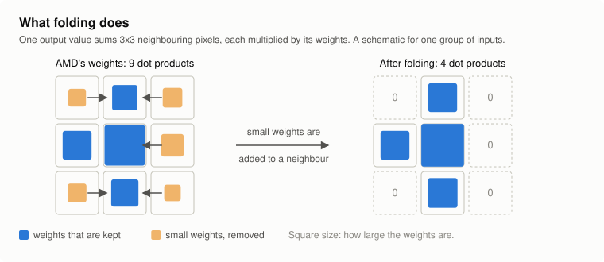
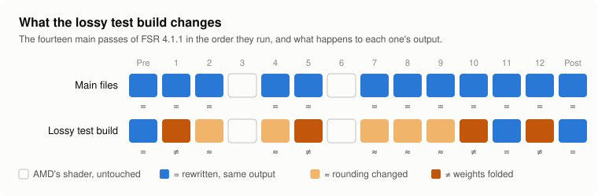
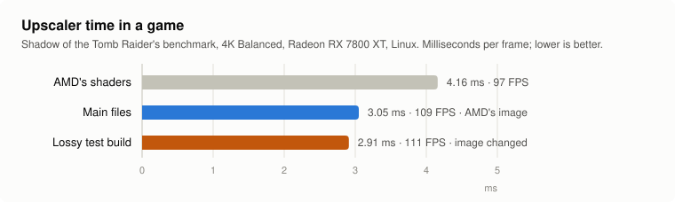
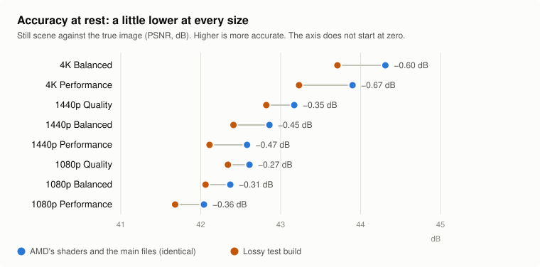
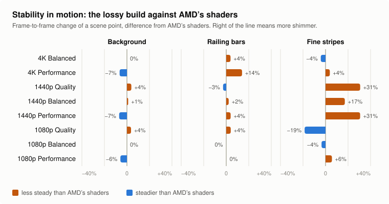

# A lossy track: folding away part of the model's weights

[Back to the research index](../README.md) · [Exact and lossy builds compared](../../docs/exact-vs-lossy.md)

Everything this repository ships keeps AMD's image byte for byte. This page is about an
experiment that does not: doing less arithmetic in the model passes, and looking for the settings
that cost the least. The figures are made by [`img/make_figures.py`](img/make_figures.py). **None of it is in the main files.** Since 2026-10-05 the result is
available as a separate, opt-in test build; see [the last section](#the-opt-in-test-build-2026-10-05).

> **Not in the released builds any more (since `dll-2026-10-09`).** The lossy DLL now runs AMD's model unchanged and only skips it on
> every other frame ([frame skip](../frame-skip)): with the model running half as often, folding saved about 0.07 ms per frame
> (1% of the frame rate in Shadow of the Tomb Raider at 4K) and cost about 0.35 dB in a still picture. The page stays as the record
> of the experiment; the tools still work.

> **WARNING: the test build changes the image.** It is not the same as the main DLL, the prebuilt
> folder or AMD's DLL, all of which produce the same image byte for byte.

It builds on two things: the measurement of a [community shader set](../community-lossy-set), which
showed that some model passes can lose weights without a measurable cost, and the
[motion test](../pruning#motion-test), which gives figures to tune against.

## The tool

`wfold.py <K> < passN.spvasm > out.spvasm` works on a model pass as vkd3d-proton translates it.

- Six of the twelve model passes (1, 2, 4, 5, 10, 12) carry their weights as constants. Each has
  one 3x3 convolution, and in it every output channel is a sum of 36 dot products: 9 taps times
  4 "weight words" (the int8 weights for four input channels).
- The tool drops the K words with the smallest weights from every output channel and adds each
  dropped word's weights to the nearest tap that is kept for the same four input channels
  (*folding*). Neighbouring pixels are similar, so the sum changes little, and the layer's
  response to a flat area is unchanged. One tap is always kept for each group of input channels.
- The compiler then removes the dot products whose weights are zero.

<picture>
  <source media="(prefers-color-scheme: dark)" srcset="img/folding-dark.svg">
  
</picture>

`wfold.py info < passN.spvasm` prints the layers it finds. The folding idea is from VALKKKS's notes;
this is an independent implementation. Folding 23 of 36 words in pass 12 reproduces the behaviour
of that set's pass 12 in the motion test (background change 0.103 against 0.105, 48.7 dB against
48.6 dB from AMD's frames), so the two do the same thing.

## What folding alone saves

Radeon RX 7800 XT, 4K, standalone benchmark, real weights:

| Pass | Words folded of 36 | AMD | Folded | Saved | The community set's version of the pass |
|---|---|---|---|---|---|
| 1 | 4 | 0.295 ms | 0.281 ms | 0.014 ms | 0.241 ms |
| 10 | 18 | 0.141 ms | 0.125 ms | 0.016 ms | 0.107 ms |
| 5 | 18 | 0.141 ms | 0.124 ms | 0.017 ms | 0.111 ms |
| 12 | 23 | 0.296 ms | 0.217 ms | 0.079 ms | 0.173 ms |

Folding accounts for about half of what the community set gains in these passes. The rest comes
from its other changes to the arithmetic (rounding and the integer forms of the output scaling),
which are not reproduced here.

## Pass 12: how much can go

The moving scene; AMD's shaders score 30.53 dB for the whole frame against the true image, and a
frame-to-frame change of 0.079 (background), 0.106 (block texture), 2.04 (fine stripes) and
0.913 (railing bars).

| Words folded of 36 | Saved | Whole frame | Change: background | texture | stripes | railing | Against AMD's frames |
|---|---|---|---|---|---|---|---|
| 8 | 0.025 ms | 30.44 dB | 0.081 | 0.114 | 2.16 | 0.942 | 53.0 dB |
| 12 | 0.040 ms | 30.33 dB | 0.087 | 0.115 | 2.28 | 0.936 | 51.7 dB |
| 16 | 0.055 ms | 30.32 dB | 0.087 | 0.113 | 2.13 | 0.958 | 51.4 dB |
| 20 | 0.067 ms | 30.58 dB | 0.089 | 0.111 | 1.91 | 0.983 | 50.3 dB |
| 23 | 0.077 ms | 30.59 dB | 0.103 | 0.106 | 1.85 | 1.011 | 48.7 dB |

The background gets less stable in steps: slightly up to 20 words, sharply at 23.

## Combinations

| Set | Saved | Whole frame | Change: background | texture | stripes | railing | Against AMD's frames |
|---|---|---|---|---|---|---|---|
| AMD's shaders | | 30.53 dB | 0.079 | 0.106 | 2.04 | 0.913 | |
| Passes 1 (4), 10 (18), 5 (18) | 0.047 ms | 30.84 dB | 0.069 | 0.098 | 1.99 | 0.888 | 49.7 dB |
| the same plus pass 12 (16) | 0.102 ms | 30.63 dB | 0.072 | 0.103 | 1.93 | 0.934 | 49.3 dB |
| the same plus pass 12 (20) | 0.114 ms | 30.70 dB | 0.079 | 0.105 | 1.96 | 0.947 | 47.6 dB |

- With passes 1, 10 and 5 folded, no figure is worse than AMD's.
- Adding pass 12 at 16 or 20 words keeps the background at AMD's level (the other passes offset
  it) and raises the railing's change by 2 to 4%. That is 0.10 to 0.11 ms, about 3.5% of FSR 4's
  time at 4K on this card.

## The rest of the arithmetic: rounding and output scaling

Added 2026-10-05. Two more tools, for the code between and after the layers.

**`wround.py` (not bit-exact).** Between layers a pass divides each sum by a power of two and
rounds halves to the even neighbour, `(x + (h - 1) + ((x >> n) & 1)) >> n`. The tool makes it
`(x + h) >> n`, halves up: two instructions fewer per value. The result differs by one step, and
only for sums that are exactly halfway. It applies to ten of the twelve passes (48 to 80 values
each in the six passes with constant weights).

**`model_tail.py` (bit-exact).** Six passes (1, 2, 9, 10, 11, 12) end by combining two integers in
floating point for each output value: `int16(RoundEven((float(a) * 2^-6 + float(b) * 2^-12) * 64))`.
Every floating-point step there is exact, because the numbers are small integers scaled by powers
of two, so the same value can be computed in integers: `n = 64a + b`, then
`(n + 31 + ((n >> 6) & 1)) >> 6`. The output is byte-identical to AMD's in the standalone
benchmark, with the real weights and with random ones, on random inputs. This one could go into
the exact files; it is small. (`model_tail.py up` rounds halves up instead, which is not exact.)

Time saved per pass, RX 7800 XT at 4K:

| Pass | Rounding (`wround.py`) | Integer output scaling (`model_tail.py`, exact) |
|---|---|---|
| 1 | 0.007 ms | 0.006 ms |
| 2 | 0.007 ms | 0.006 ms |
| 4 | 0.004 ms | |
| 5 | 0.003 ms | |
| 7, 8, 9 | 0.006 ms together | 0.002 ms (pass 9) |
| 10 | 0.004 ms | 0.003 ms |
| 12 | 0.007 ms | 0.004 ms |
| Total | 0.038 ms | 0.021 ms |

## Everything together

Nine passes: folding in passes 1 (4 words), 10 (18), 5 (18) and 12 (20); the rounding change in
all nine; the integer output scaling where it applies. Pass 11 keeps this repository's exact
rewrite.

| | AMD's shaders | Combined set |
|---|---|---|
| Time of the nine passes, RX 7800 XT at 4K | 1.72 ms | 1.55 ms (0.17 ms less, 5.6% of FSR 4's whole time) |
| Moving scene, whole frame against the true image | 30.53 dB | 30.70 dB |
| Frame-to-frame change: background | 0.079 | 0.079 |
| block texture | 0.106 | 0.105 |
| fine stripes | 2.04 | 1.95 |
| railing bars | 0.913 | 0.948 |
| Still scene, 32 frames, against the true image | 44.31 dB | 43.71 dB |
| Against AMD's frames | | 47.6 dB moving, 56.7 dB still |

The rounding change and the integer scaling add time saved without moving the quality figures:
they are the same as for folding alone. The cost that can be measured is 0.6 dB in the still
scene and 4% more frame-to-frame change on the railing.

For comparison, the community set's version of pass 1 saves 0.054 ms and this one 0.026 ms. The
difference is finer rewriting of the same code (the rounding constant folded into the bias, the
ReLU merged into the clamp, values extracted as bytes), not another idea.

## Finer rewrites, and a bit-exact by-product

Added 2026-10-05. `model_clamp.py` rewrites how a pass turns its sums into int8 values, four at a time.
AMD's code rounds, shifts, then clamps a vector of four to -128..127. Clamping before the shift
gives the same number; in layers with a ReLU the ReLU becomes the clamp's lower bound; and when
the shift is by 8 bits, the result is simply byte 1 of the clamped value, so the shift goes too.
It works on AMD's rounding as well as on `wround.py`'s, and in both cases its output is identical
to its input's.

That makes two of the four tools bit-exact: `model_clamp.py` and `model_tail.py`. Applied alone to nine
model passes (1, 2, 4, 5, 7, 8, 9, 10, 12):

| Check | Result |
|---|---|
| Standalone benchmark, each pass, real and random weights | identical to AMD's |
| AMD's whole pipeline, random inputs, 1440p-to-4K, 720p-to-1440p, 1080p-to-4K | identical to AMD's |
| AMD's whole pipeline, the moving scene, 8 frames | identical to AMD's |
| Time, RX 7800 XT at 4K | 0.048 ms less (1.6% of FSR 4's time) |

So this part does not belong to the lossy track at all: it is a small exact gain that could be
added to the shipped files. It has only been built for the pass versions used at 1440p-to-4K-class
output, and only as SPIR-V.

The lossy set with these rewrites added (`wfold.py`, `wround.py`, `model_clamp.py`, `model_tail.py`):

| | Saved, RX 7800 XT at 4K | Output |
|---|---|---|
| Exact rewrites only | 0.048 ms | identical to AMD's |
| Lossy set as in the previous section | 0.174 ms | as measured above |
| Lossy set with the finer rewrites | 0.202 ms (6.5% of FSR 4's time) | identical to the previous lossy set |

Per pass, the lossy set now saves 0.034 ms in pass 1 (the community set: 0.054 ms), 0.090 ms in
pass 12, 0.023 ms each in passes 5 and 10, and 0.016 ms in pass 2.

## How far each pass can go

Added 2026-10-05: one pass at a time with more words folded (plus the rounding change and the
exact rewrites), in the moving scene. AMD: whole frame 30.53 dB; change 0.079 (background), 0.106
(texture), 2.04 (stripes), 0.913 (railing).

| Pass | Words folded | Time of the pass (AMD) | Whole frame | Background | Texture | Stripes | Railing | Verdict |
|---|---|---|---|---|---|---|---|---|
| 1 | 4 | 0.262 ms (0.295) | see the sets above | | | | | used |
| 1 | 8 | 0.247 ms | 30.65 dB | 0.107 | 0.070 | 2.18 | 0.973 | background +35%: no |
| 1 | 12 | | 30.84 dB | 0.096 | 0.043 | 2.97 | 0.915 | stripes +46%: no |
| 2 | 4 | | 30.48 dB | 0.106 | 0.110 | 2.17 | 0.978 | background +34%: no |
| 2 | 8 | | 30.12 dB | 0.112 | 0.101 | 2.28 | 0.958 | no |
| 4 | 8 | 0.128 ms (0.141) | 30.47 dB | 0.080 | 0.109 | 2.17 | 0.947 | mild: a candidate |
| 4 | 16 | 0.121 ms | 30.11 dB | 0.079 | 0.107 | 2.52 | 0.997 | stripes +23%: no |
| 5 | 18 | 0.118 ms (0.141) | see the sets above | | | | | used |
| 5 | 24 | 0.112 ms | 30.04 dB | 0.083 | 0.121 | 4.07 | 0.909 | stripes doubled: no |
| 10 | 18 | 0.119 ms (0.141) | see the sets above | | | | | used |
| 10 | 24 | 0.111 ms | 30.41 dB | 0.074 | 0.107 | 2.20 | 0.926 | mild: a candidate |
| 10 | 28 | 0.107 ms | 30.18 dB | 0.077 | 0.105 | 2.53 | 0.894 | stripes +24%: no |

- The settings already in use (pass 1 at 4, pass 5 at 18, pass 10 at 18, pass 12 at 20) sit just
  below where each pass starts to show: one step more costs a region 20 to 100% more change.
- **Pass 2 does not tolerate folding at all** in this test, even at 4 words. It keeps only the
  rounding change.
- Two mild additions exist: pass 4 at 8 words and pass 10 at 24 instead of 18.

With both additions (set 3):

| | Saved against AMD, RX 7800 XT at 4K | Whole frame | Background | Texture | Stripes | Railing |
|---|---|---|---|---|---|---|
| AMD's shaders | | 30.53 dB | 0.079 | 0.106 | 2.04 | 0.913 |
| Exact rewrites (shipped) | 0.048 ms | identical | | | | |
| Lossy set 2 | 0.202 ms | 30.70 dB | 0.079 | 0.105 | 1.95 | 0.948 |
| Lossy set 3 | 0.221 ms | 30.54 dB | 0.081 | 0.108 | 2.10 | 0.961 |

Set 3 buys 0.019 ms more than set 2 and gives up a little everywhere (every region 2 to 5% above
AMD's). Set 2 is the better stopping point: the remaining passes have nothing cheap left.

## What these figures do and do not mean

- **The image is not AMD's.** About 48 to 50 dB from it: small, everywhere.
- **"Not worse on these figures" is not "not worse".** A lower frame-to-frame change can simply
  mean a softer image. The whole-frame error against the true image does not show that here, but
  it is one synthetic scene at one speed.
- **Timings are from one RDNA3 card.** The motivation is RDNA2 at 1440p and below, where the exact
  rewrites gain little; the relative saving there is not measured.

## Not done yet

- Folding the rounding constant into the bias, the one finer rewrite not done.
- The prepass: a faster, not bit-exact prepass with no measurable effect exists in that set; an
  implementation of its own is needed here.
- Every version of the passes (three output-size classes, two models) and the DLL's shader
  format. The tool has only been run on the versions used at 1440p-to-4K output.
- More scenes, ideally frames captured from a game.

## Looking for more: the postpass and the smaller layers (2026-10-06)

Two places the lossy set does not touch were tried, to see whether it could be made faster. Both
cost more than they save. Same tests as above, at 4K Balanced, each added on top of set 2.

**The postpass's own 3x3 convolution** (`wfold_post.py`). The postpass starts with a 3x3
convolution over the model's 16-channel output: 576 of its 960 dot products. It is the largest
single block of arithmetic the lossy set leaves alone.

| Words folded of 36 | Postpass time, RX 7800 XT | Background change | Texture | Stripes | Railing | Still scene |
|---|---|---|---|---|---|---|
| none (set 2) | 0.670 ms | 0.079 | 0.105 | 1.95 | 0.948 | 43.71 dB |
| 9 | 0.661 ms | 0.136 (+72%) | 0.118 | 2.03 | 1.005 | 43.74 dB |
| 18 | 0.636 ms | 0.207 (+162%) | 0.118 | 1.93 | 1.050 | 43.34 dB |
| 24 | 0.617 ms | 0.333 (+321%) | 0.203 | 4.65 | 1.097 | 42.25 dB |

Even the mildest setting makes the background 72% less steady for 0.009 ms. Folded on its own,
with every other shader exact, 18 words gives a background change of 0.252. **The postpass does
not tolerate folding.** This is probably where the background shimmer of the
[community set](../community-lossy-set) came from: it removes weights in the postpass too.

**The smaller layers of pass 5.** Besides its 3x3 convolution, pass 5 has 16 layers of two taps
and 8 of four taps, 1,024 of its 1,600 weight words. Folding half of each:

| Folded in pass 5 | Pass time (AMD 0.141 ms) | Background change | Stripes | Railing | Just-uncovered areas | Still scene |
|---|---|---|---|---|---|---|
| 3x3 only (set 2) | 0.117 ms | 0.079 | 1.95 | 0.948 | | 43.71 dB |
| plus the two-tap layers | 0.100 ms | 0.033 | 1.44 | 0.597 | 32.5 dB (AMD 34.5) | 43.64 dB |
| plus the four-tap layers | 0.102 ms | 0.072 | 3.87 (+90%) | 0.822 | | 42.41 dB |
| plus both | 0.086 ms | 0.037 | 3.90 | 0.484 | | 43.44 dB |

- **The four-tap layers do not fold:** the fine stripes become 90% less steady and the still
  scene loses 1.3 dB.
- **The two-tap layers look steadier, but the picture is less accurate in motion:** 2 dB worse
  where the moving objects have just uncovered the background, 1.9 dB worse on the railing,
  1.4 dB on the background. Lower frame-to-frame change with lower accuracy means the image
  follows the scene less closely, the kind of error that shows as trails behind moving things.
  Not used.

So set 2 stands. What it leaves unfolded is the arithmetic the image depends on most, and the
passes whose weights are not constants in the shader (3 and 6 to 9). Going faster from here means
accepting a visible cost.

## The five passes that fetch their weights (2026-10-06)

Model passes 3 and 6 to 9 read their weights from a buffer while they run, so the folding tools,
which change constants, have nothing to work on. They looked like the one sizeable area left: on
an RX 7800 XT at 4K they take 0.05, 0.05, 0.12, 0.12 and 0.18 ms, and passes 7 and 8 looked four
to five times slower per dot product than the passes with constant weights. They are not.

- **Passes 7 and 8 are loops with large trip counts.** Each has three convolutions written as
  loops whose end is `gl_WorkGroupID.z + 7`, `+ 31` and `+ 15`; the z component is always zero,
  so they run 8, 32 and 16 times, with 144, 64 and 128 dot products per round. That is 5,248 dot
  products per thread, not the few hundred the shader text suggests, at 1.7e-13 seconds each.
  Pass 1, with constant weights and no loops, runs at 1.6e-13. **They are already as efficient
  as the fastest passes.**
- **Unrolling changes nothing.** The inner loops are unrolled by the driver's compiler already
  (unrolling them in the shader gives the same 1,165 instructions and the same time), and a
  compiler hint to unroll the outer ones has no effect. Since the time is the arithmetic, there
  is nothing for unrolling to remove.
- **Constant weights change nothing either** where they can be tested fairly: passes 3 and 6 are
  written out without loops, and replacing every fetched weight by a constant takes them from
  0.052 to 0.051 ms and from 0.050 to 0.045 ms. (The same probe on passes 7 and 8 is not valid:
  with the same constants in every round the compiler computes one round and reuses it.)
- **What folding could save there is small.** Only the first convolution of passes 7 and 8 is
  3x3: 1,152 of the 5,248 dot products. Folding half of it would save about a tenth of each pass,
  0.01 ms, and would first need each model's weights built into the shader with a check for which
  model is running, since both models share these shaders.

So this area holds no exact gain and almost no lossy one. The time of these passes is
multiplications that the image needs.

## The opt-in test build (2026-10-05)

> **Since release `dll-2026-10-06` the test builds also skip the model on every other frame**
> ([frame skip](../frame-skip)): 2.09 ms and 122 FPS in the benchmark below, against 2.91 ms and
> 111 FPS for the lossy set alone. That adds its own cost: more shimmer on fine detail (reduced
> by a correction since release `dll-2026-10-06.2`), a loss in motion and alternating frame
> times; see that page. The figures in this section are for the lossy set alone, as attached to
> releases `dll-2026-10-05.3` and `.4`.

> **WARNING: this build changes the image.** It is not the same as this repository's main DLL or
> prebuilt folder, and not the same as AMD's DLL. Those three produce the same image, byte for
> byte. This one produces a different, slightly less accurate picture in exchange for speed. If
> you want AMD's image, do not use it.

Lossy set 2 from above, attached to the
[release `dll-2026-10-07`](https://github.com/zgauthier2000/fsr4-shader-performance-overrides/releases/tag/dll-2026-10-07):

| File | What it is | Use |
|---|---|---|
| `test-lossy.zip` | the main DLL for desktop RX 7000 cards with the lossy model passes; shows as `4.1.1-r3-lossy-cyboman` | replaces `amd_fidelityfx_upscaler_dx12.dll` 4.1.1.2740, like the main DLL |
| `test-lossy-rdna2.zip` | `test-rdna2.zip` (RX 6000) with the lossy model passes; shows as `4.1.1-r2-lossy-cyboman` | as above |
| `test-lossy-rdna2-compact.zip` | `test-rdna2-compact.zip` (RDNA2 and Steam Deck) with the lossy model passes; shows as `4.1.1-r2c-lossy-cyboman` | as above |
| `test-lossy-igpu.zip` | `test-igpu.zip` (RDNA3 integrated GPUs) with the lossy model passes; shows as `4.1.1-ig-lossy-cyboman` | as above |
| `test-lossy-linux.zip` | a Linux override folder, `fsr4-lossy-overrides` | `VKD3D_SHADER_OVERRIDE='Z:/path/to/fsr4-lossy-overrides' %command%`, with AMD's original DLL |

Do not use the DLL on RX 9000 (RDNA4) cards. The Linux folder was built on an RX 7800 XT with
GE-Proton 11-7 and has the same limits as the [prebuilt folder](../../docs/linux.md).

<picture>
  <source media="(prefers-color-scheme: dark)" srcset="img/what-is-lossy-dark.svg">
  
</picture>

**What is in it.** The exact files, with 27 model-pass shaders replaced: passes 1, 2, 4, 5, 7, 8,
9, 10 and 12 of the normal model, for the three output-size classes. Weights are folded in passes
1 (4 words of 36), 5 (18), 10 (18) and 12 (20); the rounding change is in all nine. The postpass,
the prepass and pass 11 are the exact versions. **Ultra Performance is not lossy** apart from the
rounding change in three passes it shares: it uses a different model, and the settings were not
tuned for it.

**The two builds are the same thing.** `wfold_dxil.py` and `wround_dxil.py` are the DXIL forms of
the two tools and make the same choices. The DLL's output is byte-identical to the Linux folder's
at six sizes (4K, 1440p and 1080p output, normal and Ultra Performance model), under Proton on an
RX 7800 XT. `build_lossy_dxil.sh` builds the DXIL set from AMD's shaders.

**In a game.** Shadow of the Tomb Raider's benchmark, 4K Balanced, RX 7800 XT, Linux launch option:

| | Upscaler time | Average FPS | Frames rendered |
|---|---|---|---|
| AMD's shaders | 4.16 ms | 97 | |
| Main files (exact) | 3.05 ms | 109 | 16884 |
| Lossy test build | 2.91 ms | 111 | 17148 |

<picture>
  <source media="(prefers-color-scheme: dark)" srcset="img/upscaler-time-dark.svg">
  
</picture>

That is 0.14 ms less than the exact files (4.6%). No difference was visible in that run. It is
one game at one size.

**At other output sizes.** The still scene and the moving scene, scaled to each output size so
that lower resolutions have finer detail per pixel. Each cell is AMD's shaders, then the lossy
set. "Change" is the frame-to-frame change of a scene point (lower is steadier).

<picture>
  <source media="(prefers-color-scheme: dark)" srcset="img/still-accuracy-dark.svg">
  
</picture>

<picture>
  <source media="(prefers-color-scheme: dark)" srcset="img/motion-change-dark.svg">
  
</picture>

The same figures as a table:

| Output, preset | Still scene against the true image | Change: background | Change: railing bars | Change: fine stripes |
|---|---|---|---|---|
| 4K Balanced | 44.31, 43.71 dB | 0.079, 0.079 | 0.913, 0.948 (+4%) | 2.04, 1.95 (-4%) |
| 4K Performance | 43.90, 43.23 dB | 0.092, 0.086 | 0.549, 0.626 (+14%) | 1.78, 1.85 (+4%) |
| 1440p Quality | 43.17, 42.82 dB | 0.077, 0.080 | 1.252, 1.217 (-3%) | 1.23, 1.60 (+31%) |
| 1440p Balanced | 42.86, 42.41 dB | 0.091, 0.092 | 1.572, 1.606 (+2%) | 1.52, 1.78 (+17%) |
| 1440p Performance | 42.58, 42.11 dB | 0.101, 0.094 | 1.528, 1.588 (+4%) | 1.56, 2.04 (+31%) |
| 1080p Quality | 42.61, 42.34 dB | 0.083, 0.086 | 1.227, 1.276 (+4%) | 2.71, 2.20 (-19%) |
| 1080p Balanced | 42.37, 42.06 dB | 0.096, 0.096 | 1.577, 1.573 (0%) | 2.09, 2.02 (-4%) |
| 1080p Performance | 42.04, 41.68 dB | 0.103, 0.097 | 1.403, 1.406 (0%) | 1.78, 1.88 (+6%) |

- **Still image:** 0.3 to 0.7 dB less accurate at every size, and no worse at lower resolutions.
- **Background and ordinary texture in motion:** within a few percent of AMD's everywhere.
- **Thin bars:** within 4%, except 4K Performance (14% less steady).
- **Fine stripes at 1440p output:** 17 to 31% less steady on all three presets. The stripes are a
  harsh pattern that AMD's shaders also reproduce badly, and at 1080p Quality the lossy set is the
  steadier one, so single figures are noisy; three presets agreeing is not.

**What to report.** The upscaler time with the main files and with this build at the same spot,
and whether you can see a difference, with GPU, game, output resolution and preset. The places to
look are fine repeating patterns in motion (grilles, fences, fabric, distant brickwork), most of
all at 1440p output.

**The builds for other GPUs** (added later on 2026-10-05) are the exact build for that GPU with
the same 27 lossy shaders; the GPU-specific parts (the postpass, pass 11) are unchanged. On an
RX 7800 XT all three give output byte-identical to the desktop RDNA3 lossy DLL at four sizes. None
has been run on the hardware it is for, and the settings were tuned on an RX 7800 XT at 4K, so
neither the gain nor the visible cost is known there. `build_lossy_dxil.sh` takes the exact set
to start from as its second argument. Compare each with its exact build: `test-rdna2.zip`,
`test-rdna2-compact.zip` or `test-igpu.zip`.

**First tester report (2026-10-05): RX 6750 XT, Windows 11, Wuthering Waves, 1707x961 to
2560x1440 (Quality), one reading each at the same spot.**

| | Exact build | Lossy build | Difference |
|---|---|---|---|
| RDNA2 | 2.51 ms, 106.6 FPS | 2.45 ms, 104.2 FPS | 0.06 ms (2%) |
| RDNA2 compact | 2.52 ms, 106.1 FPS | 2.50 ms, 106.9 FPS | 0.02 ms (1%) |

That is 1 to 2% of the upscaler time, about the spread of single readings, and the frame rate
does not follow it. On the RX 7800 XT at 4K the same shaders saved 4.6%. So on this RDNA2 card at
1440p output the lossy build gives next to nothing in exchange for a changed image: use the exact
build there. Reports at 4K output on RDNA2, where the exact builds gained most, are still wanted.
