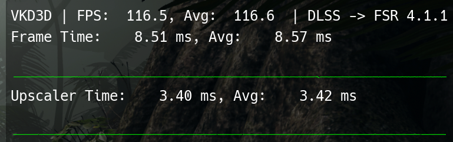
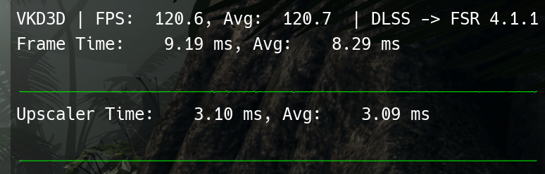

# The phased postpass

The second version of the postpass rewrite, added in October 2026. It produces the same output,
byte for byte, and makes FSR 4.1.1 noticeably cheaper again.

## What changed

FSR 4's postpass writes three images, and on RDNA3 its scattered one-pixel stores are slow. The
first rewrite collected the whole 32x32 block of all three images in workgroup memory (40 KB) and
wrote it out in solid rows. That fixed the stores, but 40 KB per workgroup left room for only 4
waves per SIMD, too few to hide memory latency.

The phased version keeps the computed values in registers and writes the three images one after
another, each through a single 16 KB buffer. With 16 KB per workgroup, 16 waves run per SIMD.

## In a game

Shadow of the Tomb Raider, 4K output, DLSS Balanced (routed to FSR 4.1.1 by OptiScaler), frame
rate uncapped, standing at the same spot. Radeon RX 7800 XT, Mesa 26.2.3 (RADV), Proton.

| Shaders | Upscaler time | Frame rate |
|---|---|---|
| AMD's original | 4.16 ms | |
| First rewrite (postpass and pass 11) | 3.42 ms | 116.6 FPS |
| **Phased postpass and pass 11** | **3.09 ms** | **120.7 FPS** |

- The phased postpass saves 0.33 ms over the first rewrite (−9.6%), and the frame rate rises 3.5%.
- Against AMD's shaders, the upscaler time is now 1.07 ms (26%) lower.
- AMD's 4.16 ms is from the [built-in benchmark runs](../shadow-of-the-tomb-raider) with the same
  settings; the two other rows were read at the same spot in the game, one after the other.

First rewrite:

Phased postpass:

## Where FSR 4's time goes in that game

Measured just before the phased version, by replacing parts of FSR 4 with empty shaders (same
game, settings and spot; first rewrite in place):

| Part | Time |
|---|---|
| Model passes (12) | 1.86 ms |
| Postpass (first rewrite) | 0.96 ms |
| Prepass | 0.44 ms |
| OptiScaler and dispatch overhead | 0.12 ms |
| Two small shaders and gaps | 0.04 ms |
| **Total** | **3.42 ms** |

The postpass was the largest single shader left, which is what led to the phased version.

## In a standalone benchmark

The postpass alone, on the same GPU, at 4K output (the same shaders as in the game, driven with
pseudo-random inputs):

| Postpass | Time | Waves per SIMD | Workgroup memory |
|---|---|---|---|
| AMD's original | 2.06 ms | 24 | none |
| First rewrite | 0.83 ms | 4 | 40 KB |
| **Phased** | **0.60 ms** | **16** | **16 KB** |

At 1440p output the phased postpass takes 0.29 ms (AMD's: 1.03 ms). Its output was compared byte
for byte with AMD's at 4K, 1440p and 1080p output, and was identical in all three.

Smaller buffers (8 KB or 4 KB, writing half or a quarter of the block at a time) were no faster:
with the values held in registers, 96 registers per lane are what limit the number of waves now.

## Windows add-on

The DXIL version for the [ReShade add-on](../../windows) got the same change: its two float
images go through 12 KB of shared memory one at a time instead of 24 KB at once (the
half-precision image is written directly, as before). Run through vkd3d-proton on the same GPU,
its postpass went from 0.72 ms to 0.67 ms at 4K (AMD's: 2.1 ms), and the upscaled image stayed
byte-for-byte identical to AMD's in all seven configurations of
[`windows/test/run_matrix.sh`](../../windows/test/run_matrix.sh). It has still not been run on
Windows itself.
