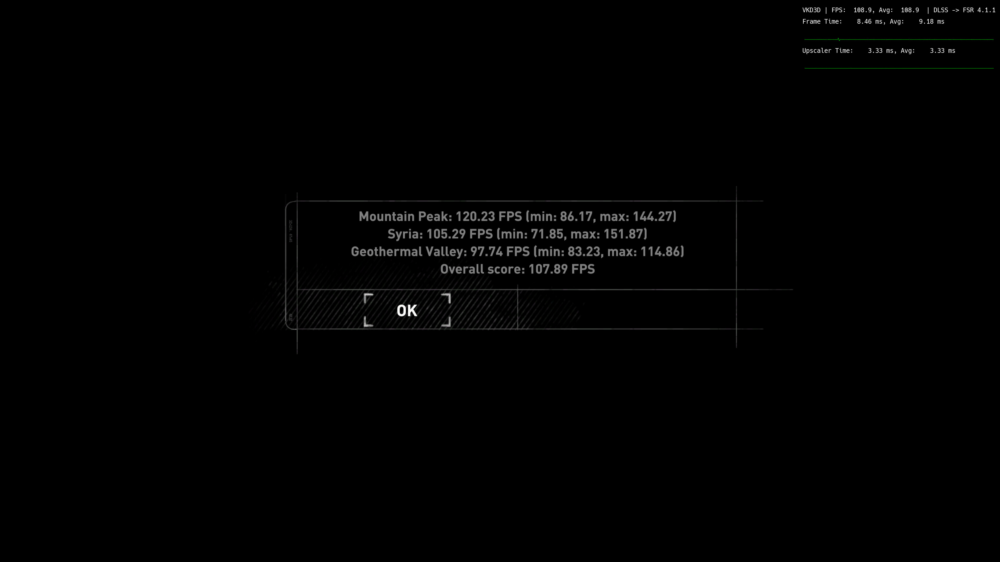

# Rise of the Tomb Raider: built-in benchmark

The game's own benchmark, run once without and once with the overrides, at 4K and at 1440p output.
It runs three scenes (Mountain Peak, Syria, Geothermal Valley) and reports an overall score.

## Setup

- **GPU:** Radeon RX 7800 XT on Mesa (RADV), Linux, through Proton.
- **CPU:** AMD Ryzen 7 7700X.
- **Upscaler:** FSR 4.1.1 with the INT8 model through OptiScaler; the overlay reads
  "DLSS -> FSR 4.1.1".
- **Settings:** FSR 4.1.1 Balanced; all other settings identical between the runs.
- **Overrides:** the shader overrides from this repository, loaded via `VKD3D_SHADER_OVERRIDE`.
  The runs below marked "with overrides" used the first version of the postpass rewrite; a later
  4K run with the phased postpass is [further down](#4k-with-the-phased-postpass).

## Results

Frames per second, average (minimum, maximum), as the game reports them:

| | 4K original | 4K with overrides | 1440p original | 1440p with overrides |
|---|---|---|---|---|
| Mountain Peak | 106.91 (78.76, 144.63) | 120.23 (86.17, 144.27) | 213.24 (118.98, 300.51) | 230.60 (161.14, 282.11) |
| Syria | 96.05 (71.81, 131.93) | 105.29 (71.85, 151.87) | 179.94 (75.53, 207.28) | 190.06 (73.44, 237.42) |
| Geothermal Valley | 89.57 (76.54, 104.75) | 97.74 (83.23, 114.86) | 165.50 (137.14, 199.66) | 176.79 (123.85, 221.18) |
| **Overall score** | **97.59** | **107.89** | **186.58** | **199.56** |
| OptiScaler upscaler time (average) | 4.30 ms | 3.33 ms (−22.6%) | 1.79 ms | 1.49 ms (−16.8%) |

The upscaler time is OptiScaler's overlay as shown on the results screen; it was not recorded
during the benchmark run itself.

## What it shows

| | 4K | 1440p |
|---|---|---|
| Overall score | +10.6% | +7.0% |
| Mountain Peak | +12.5% | +8.1% |
| Syria | +9.6% | +5.6% |
| Geothermal Valley | +9.1% | +6.8% |
| Frame time saved, from the overall score | 0.98 ms | 0.35 ms |
| Upscaler time | −0.97 ms (−22.6%) | −0.30 ms (−16.8%) |

- **Every scene is faster at both resolutions.**
- **The frame time saved matches the upscaler time saved:** 0.98 ms against 0.97 ms at 4K, and
  0.35 ms against 0.30 ms at 1440p. The gain comes from the faster upscaler and reaches the frame
  rate almost completely.
- **The minimums move less consistently** (Syria's barely changes, and two 1440p minimums are
  lower). Minimums are single worst frames, often loading or scene cuts, and vary a lot between
  runs; the averages are the figures to go by.

These are single runs of each configuration, so small differences are within run-to-run variation;
the averages here move well beyond it.

## 4K with the phased postpass

Run on 2026-10-03 after the [phased postpass](../phased-postpass) was added, with the same
settings, through the same launch option (phased postpass and pass 11). One run.

| | 4K original | 4K, first rewrite | **4K, phased postpass** |
|---|---|---|---|
| Mountain Peak | 106.91 (78.76, 144.63) | 120.23 (86.17, 144.27) | **121.88 (67.95, 191.15)** |
| Syria | 96.05 (71.81, 131.93) | 105.29 (71.85, 151.87) | **102.53 (36.33, 144.19)** |
| Geothermal Valley | 89.57 (76.54, 104.75) | 97.74 (83.23, 114.86) | **100.40 (80.60, 117.31)** |
| **Overall score** | **97.59** | **107.89** | **108.60** |
| OptiScaler upscaler time (average) | 4.30 ms | 3.33 ms (−22.6%) | **3.02 ms (−29.8%)** |

- **Against AMD's shaders:** upscaler time −1.28 ms (−29.8%), overall score +11.3%.
- **Against the first rewrite:** upscaler time −0.31 ms (−9.3%), but the overall score only +0.7%.
  Mountain Peak (+1.4%) and Geothermal Valley (+2.7%, 0.27 ms per frame, about the upscaler saving)
  are faster; Syria is 2.6% slower, and its minimum of 36.33 FPS points to a hitch during that
  scene, which pulls its average and the overall score down. A single run cannot separate that
  from the shader change; the upscaler time is the cleaner comparison.

## Screenshots

The four results screens, unedited apart from conversion to JPEG.

4K, original shaders:

4K, with the overrides:

1440p, original shaders:

1440p, with the overrides:

