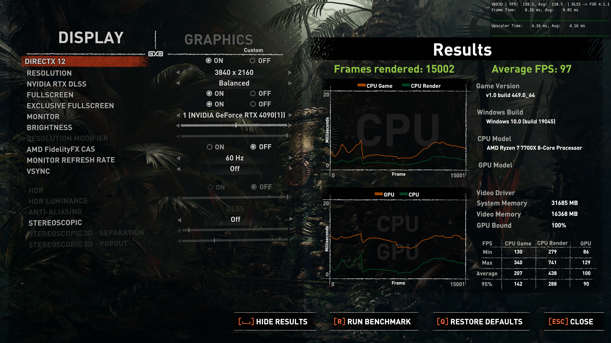
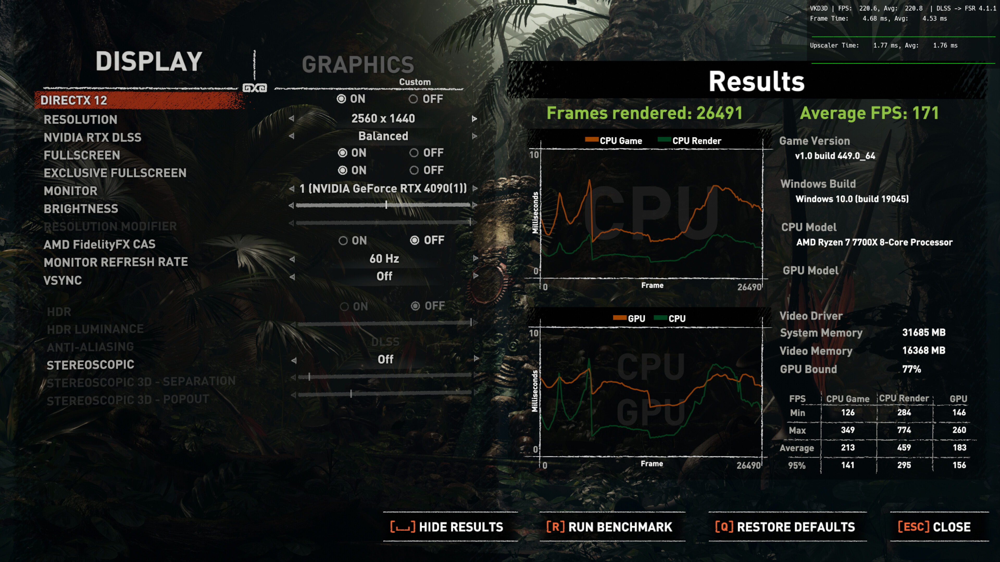
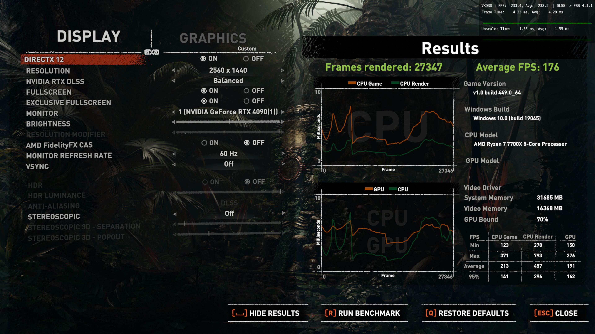

# Shadow of the Tomb Raider: built-in benchmark

The game's own benchmark, run once without and once with the overrides, at 4K and at 1440p output.

## Setup

- **GPU:** Radeon RX 7800 XT on Mesa (RADV), Linux, through Proton.
- **CPU:** AMD Ryzen 7 7700X. 32 GB system memory.
- **Upscaler:** the game's DLSS option, routed by OptiScaler to FSR 4.1.1 with the INT8 model (the
  overlay reads "DLSS -> FSR 4.1.1"). The game shows the GPU as an "NVIDIA GeForce RTX 4090" and the
  OS as Windows 10 because of that setup; both are spoofed.
- **Settings:** DirectX 12, DLSS (here FSR 4.1.1) Balanced, exclusive fullscreen, VSync off, AMD
  FidelityFX CAS off, HDR off, the game's "Custom" graphics preset.
- **Overrides:** `prebuilt/` from this repository via `VKD3D_SHADER_OVERRIDE`, i.e. the postpass
  rewrite (this game's variant, `4d657fb0eed077d6`) and the pass 11 change.

## Results

| | 4K original | 4K with overrides | 1440p original | 1440p with overrides |
|---|---|---|---|---|
| Average FPS | 97 | 104 | 171 | 176 |
| Frames rendered | 15,002 | 16,168 | 26,491 | 27,347 |
| GPU bound | 100% | 100% | 77% | 70% |
| GPU FPS: average | 100 | 108 | 183 | 191 |
| GPU FPS: minimum | 86 | 92 | 146 | 150 |
| GPU FPS: maximum | 129 | 139 | 260 | 276 |
| GPU FPS: 95th percentile | 90 | 96 | 156 | 162 |
| CPU game FPS: average | 207 | 210 | 213 | 213 |
| CPU render FPS: average | 438 | 452 | 459 | 457 |
| OptiScaler upscaler time (average) | 4.16 ms | 3.47 ms (−16.6%) | 1.76 ms | 1.55 ms (−11.9%) |

The upscaler time is OptiScaler's overlay as shown on the results screen, which keeps rendering
the scene behind it; it was not recorded during the benchmark run itself.

## What it shows

| | 4K | 1440p |
|---|---|---|
| Average FPS | +7.2% | +2.9% |
| GPU FPS, average | +8.0% | +4.4% |
| Frame time saved, from average FPS | 0.69 ms | 0.17 ms |
| Frame time saved, from GPU FPS | 0.74 ms | 0.23 ms |
| Upscaler time | −0.69 ms (−16.6%) | −0.21 ms (−11.9%) |

- **At 4K the game is entirely GPU-bound,** and the frame time saved (0.69 ms from the average
  FPS) matches the upscaler time saved (0.69 ms) exactly. The whole gain comes from the faster
  upscaler, and all of it reaches the frame rate.
- **At 1440p the game is partly CPU-bound** (GPU bound 77% and 70%), so less of the 0.21 ms
  upscaler saving turns into frames: 0.17 ms from the average FPS, 0.23 ms from the GPU-only FPS.
- **The CPU figures barely move,** as expected: the change is GPU-side only.

These are single runs of each configuration, so differences of a frame or two per second are
within normal run-to-run variation; the 4K result is well outside it.

## Screenshots

The four results screens, unedited apart from conversion to JPEG.

4K, original shaders:

4K, with the overrides:

1440p, original shaders:

1440p, with the overrides:

