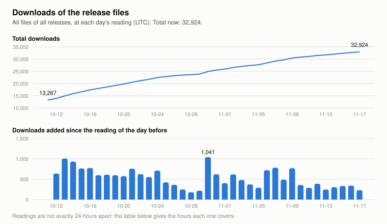

# Downloads of the release files

**Total downloads: 34,211**

Updated 2026-11-21 13:26 UTC; counted since 2026-10-11 22:32 UTC. Files that were replaced before then are not in it. Since counting began: 20,944 downloads in 40.6 days, 516 per 24 hours on average.

<picture>
  <source media="(prefers-color-scheme: dark)" srcset="downloads-dark.svg">
  
</picture>

## Per day

One line per day (UTC), from that day's last reading. "Added" is what came in since the last reading of the day before; the readings are not exactly 24 hours apart, so the hours each one covers are given.

| Day | Read at | Total | Added | Hours covered | Added: DLLs, desktop | Added: DLLs, integrated | Added: Windows kit | Added: Linux kit | Added: reference frames |
|---|---|---|---|---|---|---|---|---|---|
| 2026-11-21 | 13:26 | 34,211 | 306 | 23.5 | 164 | 75 | 9 | 2 | 0 | 0 |
| 2026-11-20 | 13:58 | 33,905 | 316 | 23.6 | 179 | 62 | 4 | 3 | 0 | 3 |
| 2026-11-19 | 14:24 | 33,589 | 429 | 24.5 | 270 | 59 | 9 | 10 | 0 | 3 |
| 2026-11-18 | 13:55 | 33,160 | 236 | 23.6 | 103 | 60 | 8 | 10 | 1 | 3 |
| 2026-11-17 | 14:21 | 32,924 | 230 | 24.8 | 84 | 59 | 6 | 11 | 0 | 12 |
| 2026-11-16 | 13:36 | 32,694 | 342 | 24.9 | 117 | 124 | 20 | 16 | 2 | 0 |
| 2026-11-15 | 12:42 | 32,352 | 334 | 24.6 | 103 | 94 | 31 | 19 | 0 | 0 |
| 2026-11-14 | 12:09 | 32,018 | 304 | 23.1 | 119 | 100 | 11 | 4 | 8 | 0 |
| 2026-11-13 | 13:04 | 31,714 | 246 | 23.3 | 78 | 105 | 17 | 0 | 0 | 0 |
| 2026-11-12 | 13:44 | 31,468 | 389 | 25.1 | 104 | 120 | 30 | 23 | 0 | 0 |
| 2026-11-11 | 12:41 | 31,079 | 287 | 23.2 | 99 | 138 | 7 | 5 | 0 | 0 |
| 2026-11-10 | 13:26 | 30,792 | 357 | 23.6 | 99 | 202 | 12 | 4 | 0 | 0 |
| 2026-11-09 | 13:52 | 30,435 | 770 | 26.0 | 295 | 171 | 66 | 28 | 0 | 0 |
| 2026-11-08 | 11:54 | 29,665 | 489 | 24.2 | 221 | 135 | 16 | 4 | 0 | 0 |
| 2026-11-07 | 11:42 | 29,176 | 783 | 22.8 | 280 | 262 | 14 | 18 | 0 | 0 |
| 2026-11-06 | 12:55 | 28,393 | 721 | 23.8 | 283 | 207 | 45 | 18 | 0 | 0 |
| 2026-11-05 | 13:10 | 27,672 | 291 | 24.2 | 116 | 73 | 28 | 17 | 0 | 0 |
| 2026-11-04 | 12:58 | 27,381 | 373 | 24.2 | 130 | 74 | 49 | 25 | 0 | 0 |
| 2026-11-03 | 12:45 | 27,008 | 481 | 23.3 | 198 | 108 | 86 | 56 | 0 | 0 |
| 2026-11-02 | 13:28 | 26,527 | 618 | 25.6 | 312 | 189 | 92 | 0 | 0 | 0 |
| 2026-11-01 | 11:49 | 25,909 | 402 | 24.9 | 208 | 109 | 72 | 0 | 0 | 0 |
| 2026-10-31 | 10:54 | 25,507 | 621 | 23.5 | 317 | 157 | 112 | 0 | 0 | 0 |
| 2026-10-30 | 11:23 | 24,886 | 1,041 | 23.9 | 508 | 283 | 111 | 10 | 0 | 0 |
| 2026-10-29 | 11:29 | 23,845 | 218 | 24.2 | 97 | 36 | 73 | 0 | 0 | 0 |
| 2026-10-28 | 11:19 | 23,627 | 180 | 24.8 | 90 | 52 | 23 | 0 | 0 | 0 |
| 2026-10-27 | 10:31 | 23,447 | 249 | 23.4 | 136 | 81 | 24 | 0 | 0 | 0 |
| 2026-10-26 | 11:04 | 23,198 | 363 | 25.3 | 180 | 104 | 53 | 0 | 0 | 0 |
| 2026-10-25 | 09:47 | 22,835 | 423 | 24.3 | 196 | 146 | 68 | 0 | 0 | 0 |
| 2026-10-24 | 09:31 | 22,412 | 711 | 23.5 | 356 | 266 | 27 | 0 | 0 | 0 |
| 2026-10-23 | 10:01 | 21,701 | 553 | 23.9 | 331 | 130 | 36 | 1 | 0 | 0 |
| 2026-10-22 | 10:09 | 21,148 | 624 | 24.1 | 382 | 153 | 48 | 0 | 0 | 0 |
| 2026-10-21 | 10:06 | 20,524 | 758 | 24.1 | 495 | 154 | 54 | 0 | 0 | 0 |
| 2026-10-20 | 10:01 | 19,766 | 574 | 23.3 | 403 | 86 | 69 | 0 | 0 | 0 |
| 2026-10-19 | 10:44 | 19,192 | 599 | 25.1 | 335 | 118 | 125 | 0 | 0 | 0 |
| 2026-10-18 | 09:35 | 18,593 | 611 | 24.3 | 411 | 114 | 68 | 0 | 0 | 0 |
| 2026-10-17 | 09:19 | 17,982 | 599 | 23.6 | 439 | 99 | 45 | 0 | 0 | 0 |
| 2026-10-16 | 09:46 | 17,383 | 774 | 23.9 | 498 | 158 | 87 | 0 | 0 | 0 |
| 2026-10-15 | 09:52 | 16,609 | 764 | 23.7 | 506 | 159 | 52 | 13 | 0 | 0 |
| 2026-10-14 | 10:10 | 15,845 | 931 | 21.2 | 611 | 190 | 93 | 17 | 0 | 0 |
| 2026-10-13 | 12:59 | 14,914 | 1,008 | 23.9 | 714 | 163 | 94 | 20 | 0 | 0 |
| 2026-10-12 | 13:08 | 13,906 | 639 | 14.6 | 450 | 112 | 55 | 8 | 0 | 0 |
| 2026-10-11 | 22:32 | 13,267 | counting began | | | | | | |

The five columns on the right do not add up to "Added": checksum files and other small files are downloaded too.

## By kind and by release

| Kind of download | Downloads | Of these, in files since replaced |
|---|---|---|
| DLLs: desktop cards and other | 22,751 | 0 |
| DLLs: integrated graphics | 6,545 | 0 |
| Music | 21 | 0 |
| Reference frames | 11 | 0 |
| Timing kit: Linux | 344 | 0 |
| Timing kit: Windows | 1,955 | 0 |

| Archive, by graphics (since `dll-2026-10-22`, .zip and .7z together) | Downloads |
|---|---|
| RX 7000 (rx7000) | 2,333 |
| RX 6000 (rx6000) | 2,812 |
| Integrated RDNA 3, GeForce, Arc, others (igpu rdna3) | 1,856 |
| Steam Deck, 680M, older integrated (igpu rdna2) | 1,654 |

| Release | Downloads | Of these, in files since replaced |
|---|---|---|
| `music-2026-11-14` | 75 | 0 |
| `timing-kit-2026-11-14` | 398 | 0 |
| `reference-scenes-1` | 16 | 0 |
| `timing-kit-2026-11-11` | 237 | 0 |
| `timing-kit-2026-11-06` | 265 | 0 |
| `dll-2026-11-05` | 3,851 | 0 |
| `timing-kit-2026-11-03` | 305 | 0 |
| `timing-kit-2026-11-02.14` | 80 | 0 |
| `timing-kit-2026-11-02.9` | 16 | 0 |
| `timing-kit-2026-11-02.8` | 28 | 0 |
| `timing-kit-2026-11-02.7` | 9 | 0 |
| `timing-kit-2026-11-02.6` | 6 | 0 |
| `timing-kit-2026-11-02.5` | 27 | 0 |
| `timing-kit-2026-11-02.4` | 16 | 0 |
| `timing-kit-2026-11-02.3` | 13 | 0 |
| `timing-kit-2026-11-02.2` | 13 | 0 |
| `timing-kit-2026-11-02.13` | 15 | 0 |
| `timing-kit-2026-11-02.12` | 10 | 0 |
| `timing-kit-2026-11-02.11` | 16 | 0 |
| `timing-kit-2026-11-02.10` | 10 | 0 |
| `timing-kit-2026-11-02` | 16 | 0 |
| `timing-kit-2026-11-01.6` | 25 | 0 |
| `timing-kit-2026-11-01.5` | 25 | 0 |
| `timing-kit-2026-11-01.4` | 21 | 0 |
| `timing-kit-2026-11-01.3` | 9 | 0 |
| `timing-kit-2026-11-01.2` | 9 | 0 |
| `timing-kit-2026-11-01` | 17 | 0 |
| `timing-kit-2026-10-31.2` | 30 | 0 |
| `dll-2026-11-01` | 1,290 | 0 |
| `timing-kit-2026-10-31` | 46 | 0 |
| `timing-kit-2026-10-30.9` | 35 | 0 |
| `timing-kit-2026-10-30.8` | 19 | 0 |
| `timing-kit-2026-10-30.7` | 13 | 0 |
| `timing-kit-2026-10-30.6` | 12 | 0 |
| `timing-kit-2026-10-30.5` | 10 | 0 |
| `timing-kit-2026-10-30.4` | 17 | 0 |
| `timing-kit-2026-10-30.3` | 12 | 0 |
| `timing-kit-2026-10-30.2` | 16 | 0 |
| `timing-kit-2026-10-30` | 17 | 0 |
| `timing-kit-2026-10-29.2` | 60 | 0 |
| `timing-kit-2026-10-29` | 38 | 0 |
| `dll-2026-10-29` | 1,470 | 0 |
| `timing-kit-2026-10-28.2` | 58 | 0 |
| `timing-kit-2026-10-28` | 22 | 0 |
| `timing-kit-2026-10-25.2` | 85 | 0 |
| `timing-kit-2026-10-25` | 14 | 0 |
| `timing-kit-2026-10-24` | 73 | 0 |
| `timing-kit-2026-10-22` | 77 | 0 |
| `dll-2026-10-22` | 2,780 | 0 |
| `timing-kit-2026-10-19` | 149 | 0 |
| `dll-2026-10-19` | 1,801 | 0 |
| `timing-kit-2026-10-18.3` | 88 | 0 |
| `timing-kit-2026-10-18.2` | 38 | 0 |
| `timing-kit-2026-10-18` | 57 | 0 |
| `timing-kit-2026-10-15.3` | 143 | 0 |
| `timing-kit-2026-10-15.2` | 26 | 0 |
| `timing-kit-2026-10-15` | 74 | 0 |
| `dll-2026-10-15` | 2,025 | 0 |
| `timing-kit-2026-10-14` | 72 | 0 |
| `dll-2026-10-14` | 736 | 0 |
| `timing-kit-2026-10-13.2` | 93 | 0 |
| `timing-kit-2026-10-13` | 60 | 0 |
| `dll-2026-10-13.2` | 578 | 0 |
| `dll-2026-10-13` | 358 | 0 |
| `timing-kit-2026-10-12.6` | 60 | 0 |
| `timing-kit-2026-10-12.5` | 14 | 0 |
| `timing-kit-2026-10-12.4` | 43 | 0 |
| `timing-kit-2026-10-12.3` | 87 | 0 |
| `dll-2026-10-12.2` | 379 | 0 |
| `dll-2026-10-12` | 313 | 0 |
| `dll-2026-10-11.7` | 647 | 0 |
| `dll-2026-10-11.6` | 74 | 0 |
| `dll-2026-10-11.5` | 327 | 0 |
| `dll-2026-10-11.4` | 427 | 0 |
| `dll-2026-10-11.3` | 492 | 0 |
| `dll-2026-10-11.2` | 198 | 0 |
| `dll-2026-10-11` | 116 | 0 |
| `dll-2026-10-10` | 606 | 0 |
| `dll-2026-10-09` | 767 | 0 |
| `dll-2026-10-07` | 6,094 | 0 |
| `dll-2026-10-06.6` | 4,171 | 0 |
| `dll-2026-10-06.5` | 87 | 0 |
| `dll-2026-10-06.4` | 43 | 0 |
| `dll-2026-10-06.3` | 74 | 0 |
| `dll-2026-10-06.2` | 88 | 0 |
| `dll-2026-10-06` | 62 | 0 |
| `dll-2026-10-05.4` | 125 | 0 |
| `dll-2026-10-05.3` | 120 | 0 |
| `dll-2026-10-05.2` | 74 | 0 |
| `dll-2026-10-05` | 72 | 0 |
| `timing-kit-2026-10-05` | 30 | 0 |
| `dll-2026-10-04.5` | 155 | 0 |
| `dll-2026-10-04.4` | 23 | 0 |
| `dll-2026-10-04.3` | 102 | 0 |
| `dll-2026-10-04.2` | 109 | 0 |
| `dll-2026-10-04` | 50 | 0 |
| `dll-2026-10-03` | 162 | 0 |

All files: 34,211. `downloads.csv` has a line for every day a file's count changed; `runs.csv` has the totals of every run.
