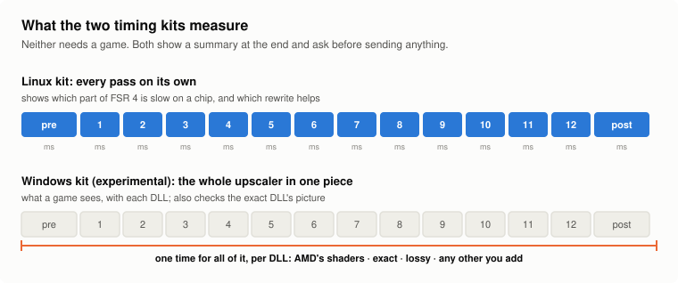

# Timing kit: FSR 4.1.1's shaders, pass by pass, on your GPU

[Back to the front page](../README.md)

A folder you download and run on Linux. It times each of FSR 4.1.1's shader passes on your GPU
with AMD's shaders and with this repository's rewrites, the model's 12 passes in sequence as a game runs them, and the
[lossy version's](../research/frame-skip) postpass on a frame that skips the model, and writes the readings to a results folder. No game, no OptiScaler and no DLL are involved.

## In short

<picture>
  <source media="(prefers-color-scheme: dark)" srcset="../docs/img/explain-kits-dark.svg">
  
</picture>

- **What a timing kit is:** a small download that measures how long FSR 4 takes on your graphics chip, with AMD's shaders
  and with this project's, without a game. It installs nothing and changes nothing.
- **Why it exists:** the project is developed on one graphics card. What it does on every other chip is only known from
  what people measure and send in.
- **Which one:** on Windows, [the Windows kit](#windows-experimental) (experimental): double-click and wait five minutes.
  On Linux or a Steam Deck in desktop mode, the Linux kit described below: one command, about 20 minutes, or two minutes
  for the short run.
- **What happens to the result:** you see a short summary and are asked whether to send it. Only that summary is sent.

**Linux kit version 2026-10-09.1** (download again if you have an earlier one): the shaders of the current release, the 12
model passes also timed in sequence, a whole-frame figure, an estimate for the lossy build's skipped frames, a warning when
a run looks unlike what games do, and one optional question about what a game showed. [Earlier versions](#earlier-versions-of-the-linux-kit).

## Why

Tester reports so far are one number per build: the upscaler time a game's overlay shows. That
says whether a build is faster, not which pass made it so. This measures every pass separately,
on the same inputs on every machine, so results from different GPUs can be compared.

## Windows (experimental)

[`fsr4-timing-kit-windows.zip`](https://github.com/zgauthier2000/fsr4-shader-performance-overrides/releases/download/timing-kit-2026-10-05/fsr4-timing-kit-windows.zip) (110 MB) is a different program for the same purpose. Unpack it, close games and
browsers, and double-click `fsr4time.exe`; it takes about five minutes.

- **What it times:** whole upscale calls, as a game makes them, through AMD's FidelityFX API on Direct3D 12, with each DLL in
  its `dlls` folder: AMD's shaders (the reference), this project's exact and lossy DLLs, and the two for integrated graphics.
  1080p, 1440p and 4K output, picture still and camera moving. For a lossy DLL the frame that runs the model and the skipped
  frame are given apart. Put another FSR 4.1.1 DLL into a new folder under `dlls` to time it as well.
- **What it checks:** it takes a fingerprint of each DLL's picture from the still scene and names the first DLL that gave the
  same picture, byte for byte. The exact DLLs must match AMD's shaders; the lossy ones differ. **RX 6000 cards under Windows
  are the exception:** AMD's own shaders show ghosting there, so the exact DLLs are expected to differ from them and to match
  the second reference instead, AMD's shaders with only the last shader's dot products split into two steps. A third
  reference carries all three changes of the community's 4.1.1b fix for those cards, rebuilt here from AMD's shaders.
- **Other makes of graphics card:** nothing in the kit is specific to Radeon, and the DLLs should run on any graphics chip whose driver supports DirectX 12 with Shader Model 6.6.
  People run them on GeForce and Intel Arc graphics as well, and no timing from such a card exists yet. A run there shows whether the rewrites, which were made for
  Radeon chips, help or cost time, and whether the exact DLL's picture is AMD's on that driver too.
- **Experimental:** it has been run under Proton on one RX 7800 XT only (4K: 4.7 to 4.9 ms with AMD's shaders, 3.17 ms exact,
  2.37 ms lossy; exact: same picture). It has not run on Windows yet. The program is not signed, so Windows warns about it;
  the source is [`windows/fsr4time.c`](windows/fsr4time.c), with the command that builds it at its top.
- At the end it shows a summary, saves it next to the program and asks whether to send it. Not for RX 9000 cards.

## What you need

- Linux with an AMD GPU on the standard Mesa (RADV) driver. Any Linux gaming setup has this, and
  so does a Steam Deck in desktop mode.
- On a Windows machine: a live Linux USB stick (for example CachyOS). Boot from it, and nothing is
  written to the machine's disk. Put the kit on the same stick (with Ventoy) or on a second one.

Nothing is installed, nothing on the machine is changed, and no root access is needed.

## Run it

Unpack the archive, open a terminal in the folder and type:

    bash run.sh

That runs the full set, about 20 minutes on an RX 7800 XT:

- every pass (prepass, model passes 1 to 12, postpass) at 1080p, 1440p and 4K output, AMD's
  against the rewrites;
- the postpass comparison: AMD's postpass, the shipped rewrite, the candidate rewrites and AMD's
  with its stores removed, and the RDNA2 dot-product test described above;
- the pass 11 and postpass versions, the store probes and compiler statistics.

Other ways to run it:

| Command | What it runs | Time on an RX 7800 XT |
|---|---|---|
| `bash run.sh postpass` | only the postpass comparison and the dot-product test | about 2 minutes |
| `bash run.sh quick` | every pass at the three sizes and the postpass comparison, without the versions and probes | about 12 minutes |
| `bash run.sh traffic` | the full set, plus a capture of memory traffic with a bundled driver build | about 25 minutes |

Slower GPUs take longer; an integrated GPU may take several times as long. Plug a laptop into the
wall and close games and browsers first.

## Sending the results

At the end the script prints a short summary and asks whether to send it.

- **Answer Y** and the summary is posted to the project's Discord results channel. No account is
  needed. What is sent is exactly what was printed: the GPU, driver and kernel versions, the CPU
  model, the amount of memory, and the timings. Nothing else leaves the machine, and the machine's
  name is not recorded.
- **Answer N** and nothing is sent.
- The script also prints a link that opens a pre-filled issue on this repository with the same
  summary, for those who prefer GitHub (it needs an account; nothing is sent until you press
  "Submit new issue").

Everything is also kept in `results/<machine>-<date>/` inside the folder: the full output, plus
`summary.txt` and `submit-link.txt`. `python3 submit.py results/<folder> --discord` sends an
earlier run's summary.

## What it measures

- **Each pass** (prepass, model passes 1 to 12, postpass) at 1080p, 1440p and 4K output: AMD's
  shader and the exact rewrite. Since kit 2026-10-09.1 also the 12 model passes in sequence, a whole-frame figure put
  together from prepass, sequence and postpass (the postpass read in both orders), and two probes of the lossy postpass on
  a skipped frame (estimates: every frame is treated as skipped, on made-up buffers).
- **Four versions of model pass 11 and eight of the postpass,** to see which suits a GPU. The
  integrated-GPU and RDNA2 builds differ from the main one in exactly these two places.
- **The postpass on its own** at each size: AMD's, the shipped rewrite, the no-stores floor and
  any candidate versions, with how each compiles.
- **Probes with the stores removed,** which show how much of a pass's time goes to writing.
- **Compiler statistics** for a few shaders as your GPU's driver compiles them: registers, waves
  per SIMD, instruction counts.
- **Memory traffic** (only with `traffic`): megabytes read and write requests per pass, from the
  GPU's own counters. This step uses the driver build in `mesa/` and may not work everywhere; if
  it fails, the rest of the results are still good.

## Reading the output

- Times are per run of one pass, in milliseconds, as a median over repeated bursts.
- **They are not game times.** Each pass runs alone on made-up inputs, which ranks versions
  reliably but reads higher than in a game (on an RX 7800 XT the twelve model passes add up to
  2.03 ms here and to 1.86 ms in Shadow of the Tomb Raider).
- `IDENTICAL to reference` means a version wrote the same bytes as AMD's shader in that run.
- `SUSPECT RUN` in the summary means writes to memory were far slower than on other machines with the same kind of GPU
  (AMD's postpass more than six times as long as the same code without its stores). Several RX 6600 runs were in that
  state, and games on those cards do not show it; such readings are kept apart.
- At the end the script asks, optionally, for OptiScaler's upscaler time in a game with AMD's file and with this
  project's. The kit's back-to-back timing does not always match a game (it predicted 6% at 1080p on an RX 7800 XT where
  the game showed about 1%), so that one line is what ties a report to real use.

## Earlier versions of the Linux kit

**Version 2026-10-06.3** (download again if you have an earlier one).

- **`bash run.sh` on its own now runs the full set** (about 20 minutes on a desktop card), so one
  run gives every pass at three sizes as well as the postpass comparison. The two-minute postpass
  test is now `bash run.sh postpass`, and the memory-traffic capture stays optional
  (`bash run.sh traffic`).

Since 2026-10-06.2:

- **Three new postpass candidates replace the two earlier ones,** which the first RDNA2 results
  showed do not help. All three give AMD's output byte for byte:
  - `taps`: AMD's own postpass with its nine neighborhood reads made branch-free and nothing
    else, for the sizes where the rewrite loses to AMD's (1080p and 1440p on an RX 6800 XT);
  - `shipped_taps`: the shipped rewrite with the same branch-free reads, the recipe a tester
    described for their own fastest exact postpass on an RX 6700M;
  - `direct_taps`: the same on top of the leaner "direct trim" version.
- The summary names any candidate whose output differs from AMD's, per size.

Since 2026-10-06.1:

- **A test for RX 6000-series (RDNA2) GPUs: two forms of the dot product.** FSR 4's model is
  mostly int8 dot products. On RDNA2, Mesa compiles nearly all of them as `v_dot4c_i32_i8`, a
  two-operand instruction that adds onto its own result (768 of the 832 in model pass 1), because
  that encoding is shorter. A community member reports that the three-operand `v_dot4_i32_i8` is
  faster on that hardware. The kit's bundled driver build can keep the three-operand form
  (`AC_NO_DOT4C=1`), and the default run now times model passes 1 and 12 and the postpass both
  ways, with the same shaders and the same driver. On other GPUs the two are the same code. If the
  claim holds it applies to every model pass, and the place to fix it is the driver.

- **A second candidate postpass** ("direct trim": the first candidate with leaner flush code) is
  timed alongside the first.
- (2026-10-06.2 only: `bash run.sh` on its own ran the short postpass test. Since 2026-10-06.3
  that is `bash run.sh postpass`.)
- **It carries a candidate postpass for the smaller GPUs, and a quick way to time it.** On RX 6000
  cards, the Steam Machine, the Steam Deck and integrated GPUs the shipped postpass runs with
  fewer threads at once than AMD's (12 waves per SIMD against 16), because it holds more values
  in registers. The candidate ("direct") puts one of the three images into workgroup memory as
  soon as each pixel is computed, so it needs fewer registers and compiles at 16 waves there. Its
  output is byte-for-byte AMD's. On an RX 7800 XT it is exactly as fast as the shipped one; whether
  it is faster on the smaller GPUs is what needs measuring:
  **`bash run.sh postpass`** (under a minute on a desktop card) times it against AMD's and the
  shipped version at 1080p, 1440p and 4K.

Since 2026-10-05.6, which applied what the first three machines' results showed:

- **A closer look at the postpass,** the pass where GPUs differ most. At 1080p, 1440p and 4K it
  times AMD's postpass several times, the shipped rewrite, and AMD's with its stores removed
  (the floor a rewrite can reach), and reports how they compile on your GPU.
  `bash run.sh postpass` runs only this.
- **Steadier postpass readings.** The first runs after a change of shader are no longer counted,
  the script checks before starting whether something else is using the GPU, and the summary
  shows the range when AMD's postpass does not repeat.
- **Room for candidate shaders.** Versions placed in `shaders/<set>/candidates/` are timed against
  AMD's automatically, so new rewrites can be tried on testers' GPUs without a new script.
- **The memory-traffic step works on any CPU** (it was wrongly limited to CPUs with AVX-512).
- Since 2026-10-05.5: **the summary flags unsteady postpass readings.** AMD's postpass does not always give a steady
  time at 4K, most of all when something else is using the GPU, so close games, browsers and
  video before a run.
- Since 2026-10-05.4: **times 1440p output as well** as 1080p and 4K. FSR 4 uses the same shader versions at 1440p
  as at 4K, so this shows how the same code behaves on a smaller picture; it is the size where
  the RX 6000 game reports are least clear.
- Since 2026-10-05.3: **fixes "CPU ISA level is lower than required".** The first two archives only started on CPUs
  with AVX-512 (Ryzen 7000 and newer); the first tester, on a Ryzen 5000 laptop, hit this. The
  programs now run on any 64-bit CPU.
- **On a machine with two GPUs the discrete one is tested,** and the summary names the GPU that
  was actually used. `KIT_GPU=integrated bash run.sh` tests the integrated one instead.
- Since 2026-10-05.2: the prepass and postpass of the 1080p and 4K sets run on real inputs (in
  the first archive they ran on blank ones, so their times were wrong), and the results can be
  sent at the end.

**Status: new and lightly tested.** It has run on five machines: a Radeon RX 7800 XT, a Steam
Machine (Navi 33, SteamOS), a laptop RX 6700M, an RX 6800 XT and an RX 6600 (where its readings
are not usable yet). It has not yet run on an integrated GPU or a Steam Deck. Expect rough edges and
please report them.

Download: [`fsr4-timing-kit.tar.gz`](https://github.com/zgauthier2000/fsr4-shader-performance-overrides/releases/tag/timing-kit-2026-10-05) (9 MB).

Results received so far: [RESULTS.md](RESULTS.md).

## What is in the archive, and here

| In the archive | |
|---|---|
| `bin/` | the three benchmark programs, built from `src/` |
| `shaders/` | the shader sets and versions listed above, as SPIR-V |
| `mesa/` | a Mesa RADV build that prints the GPU's memory counters (the change is in [`mesa-tiling-override.patch`](../research/postpass-and-prepass/mesa-tiling-override.patch)) |
| `run.sh`, `submit.py`, `README.txt`, `NOTICE.txt` | the script, the summary and sending step, short instructions, license notice |

This folder of the repository has `run.sh`, `NOTICE.txt` and `src/` (`bench.c` for the postpass,
`mbench.c` for the model passes, `pbench2.c` for the prepass). To build the programs:

    gcc -std=gnu11 -O2 -march=x86-64 src/bench.c -o bin/bench -lvulkan -lm       # likewise mbench and pbench2

The shaders are not in the repository. AMD's are what vkd3d-proton writes with
`VKD3D_SHADER_DUMP_PATH` for a 720p-to-1080p and a 1440p-to-4K run; the exact versions are the
matching files of [`prebuilt/`](../prebuilt). The prepass and postpass files need `prep.py` (it moves their input images to the slot the benchmark binds; without it they run on blank inputs); the lossy ones come from
[`research/lossy`](../research/lossy); the pass 11 versions from `zconst.py` and
`pass11_stores.py`.
